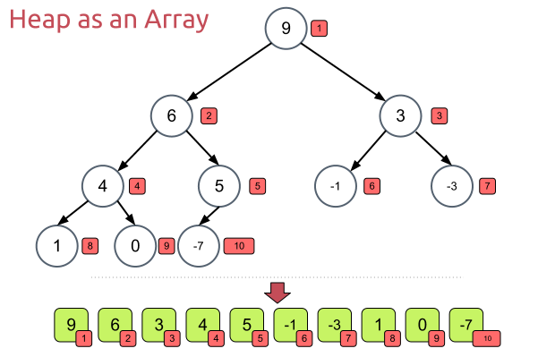
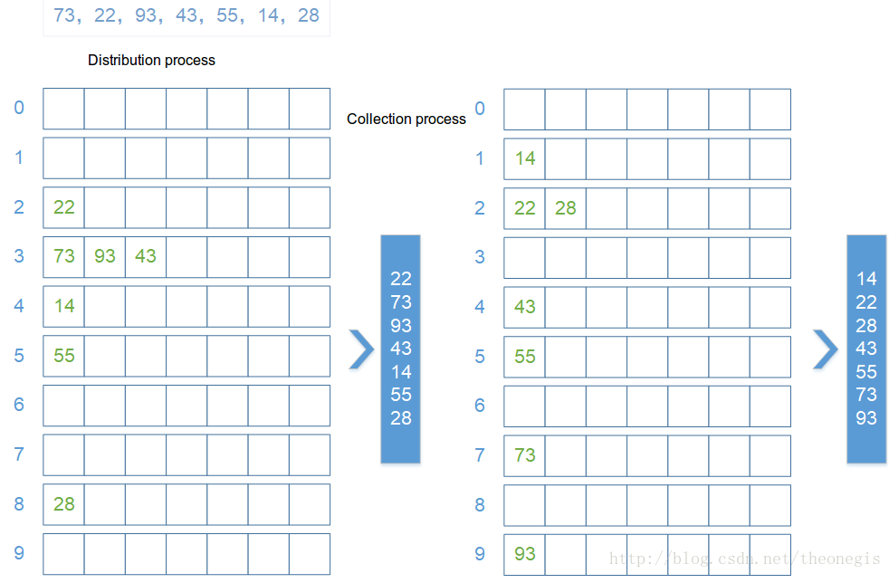

# Sorting

Đầu tiên chúng ta sẽ tạo ra 1 mảng dữ liệu test như sau:

```java
// Sort the original data  
private static final int [] NUMBERS =
{ 49 ,  38 ,  65 ,  97 ,  76 ,  13 ,  27 ,  78 ,  34 ,  12 ,  64 ,  5 ,  4 ,  62 ,  99 ,  98 ,  54 ,  56 ,  17 ,  18 ,  23 ,  34 ,  15 ,  35 ,  25 ,  53 ,  51 };
```

## Bubble sort (sắp xếp bằng cách đổi chỗ)

Phương pháp này sẽ duyệt danh sách nhiều lần, trong mỗi lần duyệt sẽ lần lượt so sánh cặp nút thứ `i` và thứ `i+1` và đổi chỗ hai nút này nếu chúng không đúng thứ tự. Sau đây là code cài đặt giải thuật bubble sort.

```java
public static void  bubbleSort ( int [] array) {
    int  temp =  0 ;  
    for  ( int  i =  0 ; i <array.length -  1 ; i ++) {  
        for  ( int  j =  0 ; j <array.length -  1  - i; j ++) {  
            if  (array [j]> array [j +  1 ]) {  
                temp = array [j];  
                array [j] = array [j +  1 ];  
                array [j +  1 ] = temp;  
            }  
        }  
    }  
    System.out.println (Arrays.toString (array) +  "bubbleSort" );  
}
```

## Simple selection sort

Ý tưởng thuật toán selection sort là: Chọn phần tử nhỏ nhất trong `n` phần tử ban đầu, đưa phần tử này về vị trí đúng là đầu tiên của dãy hiện hành. Sau đó không quan tâm đến nó nữa, xem dãy hiện hành chỉ còn `n-1` phần tử của dãy ban đầu, bắt đầu từ vị trí thứ `2`. Lặp lại quá trình trên cho dãy hiện hành đến khi dãy hiện hành chỉ còn 1 phần tử. Dãy ban đầu có n phần tử, vậy tóm tắt ý tưởng thuật toán là thực hiện `n-1` lượt việc đưa phần tử nhỏ nhất trong dãy hiện hành về vị trí đúng ở đầu dãy.

```java
public static void selectSort(int[] array) {
    int position;
    for (int i=0; i<array.length-1; i++) {
        position = i;
        temp = array[i];
        for (int j=i+1; j<array.length; j++) {
            if (array[j] < temp) {
                temp = array[j];
                position = j;
            }
        }
        array[position] = array[i];
        array[i] = temp;
    }
    System.out.println(Array.toString(array) + "select sort");
}
```

## Simple insertion sort

<p align="center">
    
</p>

Insertion sort là một thuật toán sắp xếp đơn giản, nó tạo ra mảng được sắp xếp cuối cùng một phần tử một lúc. Nó kém hiệu quả đối với mảng dữ liệu lớn so với các thuật toán sắp xếp khác.

Ưu điểm của Insertion Sort:

- Giải thuật đơn giản, dễ implement
- Nó rất hiệu quả cho các bộ dữ liệu nhỏ.
- Tính ổn định cao

```java
public static void  insertSort ( int [] array) {
     for  ( int  i =  1 ; i <array.length; i ++) {
         // Chon mot gia tri de insert
         int  temp = array [i];  
         int  j = i;  
         while(j>=0 && array[j-1] > temp) {
             array[j] = array[j-1];
             j--;
         }
         array[j] = temp;
     }  
     System.out.println (Arrays.toString (array) +  "insertSort" );  
 }  
```

## Shell sort


<p align="center">
    
</p>

Shell sort còn được gọi là sắp xếp tăng hẹp, nó là một **insertion sort**. Là một thuật toán bổ sung cho **insertion sort**.

Ý tưởng thuật toán:

Mỗi row được group bởi các step gap (interval), mỗi group sử dụng insertion sort để sắp xếp, khi step gap giảm các group chứa được nhiều record hơn. Khi giá trị của gap được giảm xuống còn 1 toàn bộ dữ liệu được kết hợp thành một group để tạo thành một bộ dữ liệu đã được sắp xếp.

```C
/* function to sort arr using shellSort */
int shellSort(int arr[], int n) 
{ 
    // Start with a big gap, then reduce the gap 
    for (int gap = n/2; gap > 0; gap /= 2) 
    { 
        // Do a gapped insertion sort for this gap size. 
        // The first gap elements a[0..gap-1] are already in gapped order 
        // keep adding one more element until the entire array is 
        // gap sorted  
        for (int i = gap; i < n; i += 1) 
        { 
            // add a[i] to the elements that have been gap sorted 
            // save a[i] in temp and make a hole at position i 
            int temp = arr[i]; 
  
            // shift earlier gap-sorted elements up until the correct  
            // location for a[i] is found 
            int j;             
            for (j = i; j >= gap && arr[j - gap] > temp; j -= gap) 
                arr[j] = arr[j - gap]; 
              
            //  put temp (the original a[i]) in its correct location 
            arr[j] = temp; 
        } 
    } 
    return 0; 
} 
```

## Quick Sort — Sắp xếp nhanh

Quick sort là phương pháp đổi chỗ từng phần (partition exchange), đây là phương pháp rất hiệu quả, rất thông dụng..

Nội dung của phương pháp này như sau:
Thuật toán sẽ thực hiện chia mảng thành các mảng con dựa vào pivot đã chọn. Việc lựa chọn pivot ảnh hưởng rất nhiều tới tốc độ sắp xếp. Nhưng máy tính lại không thể biết khi nào thì nên chọn theo cách nào. Dưới đây là một số cách để chọn pivot thường được sử dụng:

- Luôn chọn phần tử đầu tiên của mảng.
- Luôn chọn phần tử cuối cùng của mảng. (Được sử dụng trong bài viết này)
- Chọn một phần tử random.
- Chọn một phần tử có giá trị nằm giữa mảng(median element).

Mấu chốt chính của thuật toán sắp xếp quick sort là việc phân đoạn dãy số (Xem hàm `partition()`). Mục tiêu của công việc này là: Cho một mảng và một phần tử `x` là `pivot`. Đặt x vào đúng vị trí của mảng đã sắp xếp. Di chuyển tất cả các phần tử của mảng mà nhỏ hơn `x` sang bên trái vị trí của `x`, và di chuyển tất cả các phần tử của mảng mà lớn hơn `x` sang bên phải vị trí của `x`.

Khi đó ta sẽ có 2 mảng con: mảng bên trai của `x` và mảng bên phải của `x`. Tiếp tục công việc với mỗi mảng con (chọn `pivot`, phân đoạn) cho tới khi mảng được sắp xếp.

Đặt `pivot` là phần tử cuối cùng của dãy số arr. Chúng ta bắt đầu từ phần tử trái nhất của dãy số có chỉ số là `left`, và phần tử phải nhất của dãy số có chỉ số là `right -1` (bỏ qua phần tử `pivot`). Chừng nào `left` < `right` mà `arr[left]` > `pivot` và `arr[right]` < `pivot` thì đổi chỗ hai phần tử `left` và `right`. Sau cùng, ta đổi chỗ hai phần tử `left` và `pivot` cho nhau.

```C
int partition (int arr[], int low, int high)
{
    int pivot = arr[high];    // pivot
    int left = low;
    int right = high - 1;
    while(true){
        while(left <= right && arr[left] < pivot) left++; // Tìm phần tử >= arr[pivot]
        while(right >= left && arr[right] > pivot) right--; // Tìm phần tử <= arr[pivot]
        if (left >= right) break; // Đã duyệt xong thì thoát vòng lặp
        swap(&arr[left], &arr[right]); // Nếu chưa xong, đổi chỗ.
        left++; // Vì left hiện tại đã xét, nên cần tăng
        right--; // Vì right hiện tại đã xét, nên cần giảm
    }
    swap(&arr[left], &arr[high]);
    return left; // Trả về chỉ số sẽ dùng để chia đổi mảng
}

void quickSort(int arr[], int low, int high)
{
    if (low < high)
    {
        /* pi là chỉ số nơi phần tử này đã đứng đúng vị trí
         và là phần tử chia mảng làm 2 mảng con trái & phải */
        int pi = partition(arr, low, high);
 
        // Gọi đệ quy sắp xếp 2 mảng con trái và phải
        quickSort(arr, low, pi - 1);
        quickSort(arr, pi + 1, high);
    }
}
```

## Heap Sort

<p align="center">
    
</p>

Giải thuật Heapsort còn được gọi là giải thuật vun đống, nó có thể được xem như bản cải tiến của Selection sort khi chia các phần tử thành 2 mảng con, 1 mảng các phần tử đã được sắp xếp và mảng còn lại các phần tử chưa được sắp xếp. Trong mảng chưa được sắp xếp, các phần tử lớn nhất sẽ được tách ra và đưa vào mảng đã được sắp xếp. Điều cải tiến ở Heapsort so với Selection sort ở việc sử dụng cấu trúc dữ liệu heap thay vì tìm kiếm tuyến tính (linear-time search) như Selection sort để tìm ra phần tử lớn nhất.

Heapsort là thuật toán in-place, nghĩa là không cần thêm bất cứ cấu trúc dữ liệu phụ trợ trong quá trình chạy thuật toán. Tuy nhiên, giải thuật này không có độ ổn định (stability).

### Giai đoạn 1

Từ dãy dữ liệu input, ta sẽ sắp xếp chúng thành một heap (dạng cấu trúc cây nhị phân). Heap này có thể là Min-heap (nút gốc có giá trị bé nhất) hoặc Max-heap (nút gốc có giá trị lớn nhất), trong bài viết này, ta sẽ sử dụng Max-heap với một số yêu cầu thỏa mãn sau:

- Nút cha sẽ luôn lớn hơn tất cả các nút con, nút gốc của heap sẽ là phần tử lớn nhất.
- Heap được tạo thành phải là một cây nhị phân đầy đủ, tức ngoại trừ các nút lá, ở cùng một cấp độ các nút nhánh không được thiếu.

### Giai đoạn 2

Giai đoạn này gồm các thao tác được lặp đi lặp lại cho đến khi mảng dữ liệu được toàn tất sắp xếp:

- Đưa phần tử lớn nhất của heap được tạo vào mảng kết quả, mảng này sẽ chứa các phần tử đã được sắp xếp.
- Sắp xếp lại heap sau khi loại bỏ nút gốc (có giá trị lớn nhất) để tìm phần tử có giá trị lớn nhất tiếp theo.
- Thực hiện lại thao tác 1 cho đến khi các phần tử của heap đều được đưa vào mảng kết quả.
Như thế, mảng kết quả sẽ chứa các phần tử được sắp xếp giảm dần.

### Hiện thực Heapsort

Hàm CreateHeap sẽ tạo heap từ dữ liệu đưa vào là mảng và kích thước mảng. Sử dụng vòng lặp tính từ vị trí giữa mảng, CreateHeap sẽ lặp và sắp xếp các phần tử để tạo nên heap thỏa mãn các tính chất cần thiết bằng hàm Heapify.

```C
void CreateHeap(int *_array, int _length)
{
	int offset, heapSize;
	heapSize = _length - 1;
 
	for (offset = (_length / 2); offset >= 0; offset--)
	{
		Heapify(_array, offset, heapSize);
	}
}
```

Hàm Heapify sẽ kiểm tra nút trái, nút phải và nút ngay tại vị trí offset để tìm ra nút có giá trị lớn nhất. Trong trường hợp nút có giá trị lớn nhất không phải nút ở vị trí offset, hàm sẽ đổi giá trị 2 nút này và tiếp tục đệ quy Heapify từ vị trí nút có giá trị lớn nhất để đi đến các nhánh tiếp theo để đảm bảo nút cha sẽ luôn có giá trị lớn hơn các nút con.

```C
void Heapify(int *_array, int _offset, int _heapSize)
{
	int leftNode, rightNode, largest, temp;
	leftNode = 2 * _offset;
	rightNode = 2 * _offset + 1;
	
	if (leftNode <= _heapSize && _array[leftNode] > _array[_offset])
	{
		largest = leftNode;
	}
	else
	{
		largest = _offset;
	}
 
	if (_array[rightNode] > _array[largest] && rightNode <= _heapSize)
	{
		largest = rightNode;
	}
	
	if (largest != _offset)
	{
		temp = _array[_offset];
		_array[_offset] = _array[largest];
		_array[largest] = temp;
		Heapify(_array, largest, _heapSize);
	}
}
```

Cuối cùng, hàm HeapSort sẽ nhận dữ liệu vào là mảng và kích thước, sử dụng vòng lặp từ vị trí `_length - 1` để tiến hành hoán đối giá trị các phần tử. Sau mỗi vòng lặp hàm sẽ giảm `heapSize` xuống 1 và sắp xếp lại heap.

```C
void HeapSort(int *_array, int _length)
{
	CreateHeap(_array, _length);
 
	int heapSize, offset, temp;
	heapSize = _length - 1;
	
	for (offset = heapSize; offset >= 0; offset--)
	{
		temp = _array[0];
		_array[0] = _array[heapSize];
		_array[heapSize] = temp;
 
		heapSize--;
 
		Heapify(_array, 0, heapSize);
	}
 
	for (offset = 0; offset < _length; offset++)
	{
		cout << " " << _array[offset];
	}
}
```

## Merge sort

Giống như Quick sort, Merge sort là một thuật toán chia để trị. Thuật toán này chia mảng cần sắp xếp thành 2 nửa. Tiếp tục lặp lại việc này ở các nửa mảng đã chia. Sau cùng gộp các nửa đó thành mảng đã sắp xếp. Hàm merge() được sử dụng để gộp hai nửa mảng. Hàm merge(arr, l, m, r) là tiến trình quan trọng nhất sẽ gộp hai nửa mảng thành 1 mảng sắp xếp, các nửa mảng là arr[l…m] và arr[m+1…r] sau khi gộp sẽ thành một mảng duy nhất đã sắp xếp.

```C
void merge(int arr[], int l, int m, int r)
{
    int i, j, k;
    int n1 = m - l + 1;
    int n2 =  r - m;
 
    /* Tạo các mảng tạm */
    int L[n1], R[n2];
 
    /* Copy dữ liệu sang các mảng tạm */
    for (i = 0; i < n1; i++)
        L[i] = arr[l + i];
    for (j = 0; j < n2; j++)
        R[j] = arr[m + 1+ j];
 
    /* Gộp hai mảng tạm vừa rồi vào mảng arr*/
    i = 0; // Khởi tạo chỉ số bắt đầu của mảng con đầu tiên
    j = 0; // Khởi tạo chỉ số bắt đầu của mảng con thứ hai
    k = l; // IKhởi tạo chỉ số bắt đầu của mảng lưu kết quả
    while (i < n1 && j < n2)
    {
        if (L[i] <= R[j])
        {
            arr[k] = L[i];
            i++;
        }
        else
        {
            arr[k] = R[j];
            j++;
        }
        k++;
    }
 
    /* Copy các phần tử còn lại của mảng L vào arr nếu có */
    while (i < n1)
    {
        arr[k] = L[i];
        i++;
        k++;
    }
 
    /* Copy các phần tử còn lại của mảng R vào arr nếu có */
    while (j < n2)
    {
        arr[k] = R[j];
        j++;
        k++;
    }
}
 
/* l là chỉ số trái và r là chỉ số phải của mảng cần được sắp xếp */
void mergeSort(int arr[], int l, int r)
{
    if (l < r)
    {
        // Tương tự (l+r)/2, nhưng cách này tránh tràn số khi l và r lớn
        int m = l+(r-l)/2;
 
        // Gọi hàm đệ quy tiếp tục chia đôi từng nửa mảng
        mergeSort(arr, l, m);
        mergeSort(arr, m+1, r);
 
        merge(arr, l, m, r);
    }
}
```

## Radix sort

<p align="center">
    
</p>

Radix Sort — Một thuật toán sắp xếp theo phương pháp cơ số không quan tâm đến việc so sánh giá trị của các phần tử như các thuật toán sắp xếp khác như Bubble sort, Selection sort, … Radix Sort sử dụng cách thức phân loại các con số trong dãy và thứ tự phân loại con con số này để tạo ra thứ tự cho các phần tử. Đây là cách tiếp cận khác so với các phương pháp sắp xếp khác.

```java
public static void  radixSort ( int [] array) {
    int  max = array [ 0 ];  
    for  ( int  i =  1 ; i <array.length; i ++) {  
        if  (array [i]> max) {  
            max = array [i];  
        }  
    }  
    int  time =  0 ;  
    while  (max>  0 ) {  
        max / =  10 ;  
        time ++  
    }  
  
  
    ArrayList <ArrayList <Integer >> queue =  new  ArrayList <> ();  
    for  ( int  i =  0 ; i <  10 ; i ++) {  
        ArrayList <Integer> queue1 =  new  ArrayList <> ();  
        queue.add (queue1);  
    }  
  
  
    for  ( int  i =  0 ; i <time; i ++) {  
        for  ( int  anArray: array) {  
            int  x = anArray% ( int ) Math.pow ( 10 , i +  1 ) / ( int ) Math.pow ( 10 , i);  
            ArrayList <Integer> queue2 = queue.get (x);  
            queue2.add (anArray);  
            queue.set (x, queue2);  
        }  
        int  count =  0 ; 
        for  ( int  k =  0 ; k <  10 ; k ++) {  
            while  (queue.get (k) .size ()>  0 ) {  
                ArrayList <Integer> queue3 = queue.get (k);  
                array [count] = queue3.get ( 0 );  
                queue3.remove ( 0 );  
                count ++;  
            }  
        }  
    }  
    System.out.println (Arrays.toString (array) +  "radixSort" );  
}
```