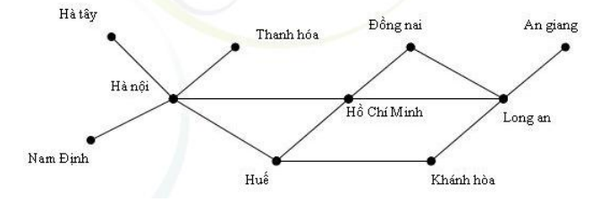
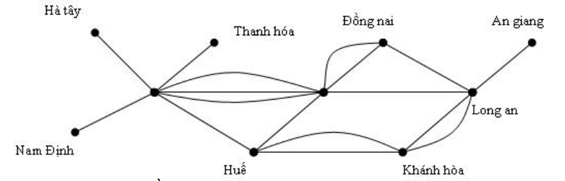
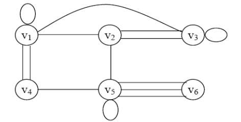
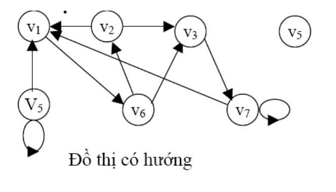
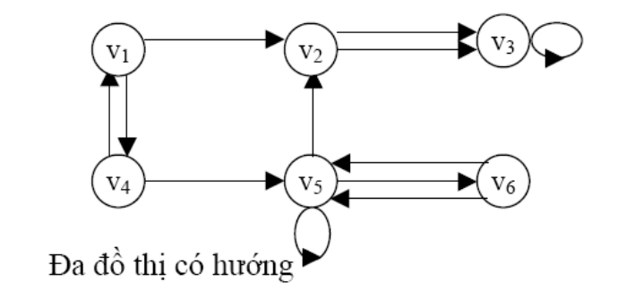
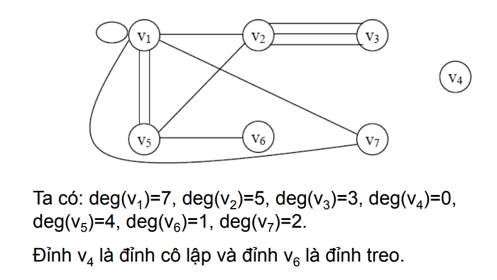
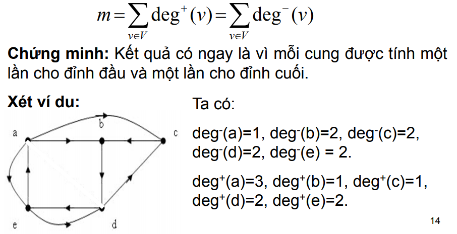

# KHÁI NIỆM ĐỒ THỊ

## Đơn đồ thị

Đơn đồ thị vô hướng G = (V,E) bao gồm V là tập các đỉnh khác
rỗng, và E là tập các cặp không có thứ tự gồm hai phần tử khác
nhau của V gọi là các cạnh.

    

## Đa đồ thị

Đa đồ thị vô hướng G= (V, E) bao gồm V là tập các đỉnh khác rỗng, và
E là tập các cặp không có thứ tự gồm hai phần tử khác nhau của V gọi là
các cạnh. Hai cạnh e1 và e2 được gọi là cạnh lặp (bội hay song song) nếu
chúng cùng tương ứng với một cặp đỉnh.

Mỗi đơn đồ thị là đa đồ thị, nhưng không phải đa đồ thị nào cũng là đơn
đồ thị, vì trong đa đồ thị có thể có hai (hoặc nhiều hơn) cạnh nối một cặp
đỉnh nào đó.

    

## Giả đồ thị

Giả đồ thị vô hướng G = (V, E) bao gồm V là tập các đỉnh khác rỗng
và E là tập các cặp không có thứ tự gồm hai phần tử (không nhất thiết
phải khác nhau) của V gọi là cạnh.

Với v Є V, nếu (v,v) Є E thì ta nói có một khuyên tại đỉnh v.

    

__**Nhận xét**__: giả đồ thị là loại đồ thị vô hướng tổng quát nhất vì nó có thể
chứa các khuyên và các cạnh lặp. Đa đồ thị là loại đồ thị vô hướng có
thể chứa cạnh bội nhưng không thể có các khuyên, còn đơn đồ thị là loại
đồ thị vô hướng không chứa cạnh bội hoặc các khuyên.

## Đơn đồ thị có hướng

Đơn đồ thị có hướng G = (V, E) bao gồm V là tập các đỉnh
khác rỗng và E là tập các cặp có thứ tự gồm hai phần tử
khác nhau của V gọi là các cung.

    

## Đa đồ thị có hướng

Đa đồ thị có hướng G = (V, E) bao gồm V là tập các đỉnh
khác rỗng và E là tập các cặp có thứ tự gồm hai phần tử
khác nhau của V gọi là các cung. Hai cung e1, e2 tương ứng
với cùng một cặp đỉnh được gọi là cung lặp.

    

## BẬC CỦA ĐỈNH

### Định nghĩa 1

Hai đỉnh u và v trong đồ thị (vô hướng) G=(V,E) được gọi
là liền kề nếu (u,v) Є E. Nếu e = (u,v) thì e gọi là cạnh liên
thuộc với các đỉnh u và v. Cạnh e cũng được gọi là cạnh nối
các đỉnh u và v. Các đỉnh u và v gọi là các điểm đầu mút của
cạnh e.

### Định nghĩa 2

Bậc của đỉnh v trong đồ thị G=(V,E), ký hiệu deg(v), là số
các cạnh liên thuộc với nó, riêng khuyên tại một đỉnh được
tính hai lần cho bậc của nó.

Đỉnh v gọi là **đỉnh treo** nếu deg(v)=1 và gọi là **đỉnh cô lập**
nếu deg(v)=0

    

### Định lý 1

Giả sử G = (V, E) là đồ thị vô hướng với
m cạnh. Khi đó tổng bậc của tất cả các đỉnh bằng
hai lần số cạnh.

### Hệ quả

Trong đồ thị vô hướng, số đỉnh bậc lẻ
(nghĩa là có bậc là số lẻ) là một số chẵn.

### Định nghĩa 3

Nếu e = (u, v) là cung của đồ thị có hướng G thì ta
nói hai đỉnh u và v là kề nhau, và nói cung (u, v) nối
đỉnh u với đỉnh v hoặc cũng nói cung này là đi ra khỏi
đỉnh u và vào đỉnh v. Đỉnh u(v) sẽ được gọi là đỉnh đầu
(cuối) của cung (u,v).

### Định nghĩa 4

Ta gọi bán bậc ra (bán bậc vào) của đỉnh v trong đồ
thị có hướng là số cung của đồ thị đi ra khỏi nó (đi vào
nó) và ký hiệu là deg+(v) (deg-
(v))

### Định lý 2

Cho G =(V, E) là một đồ thị có hướng. Khi đó:

    

