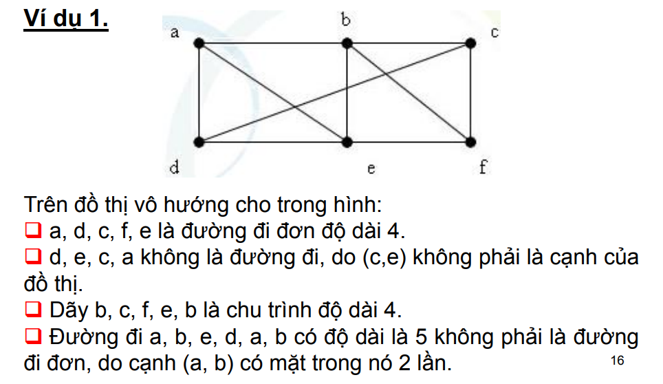
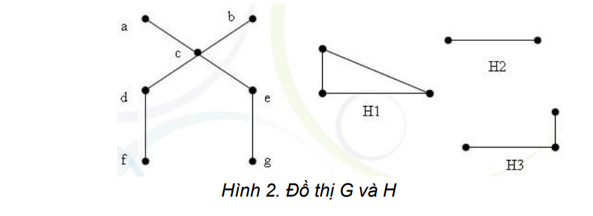
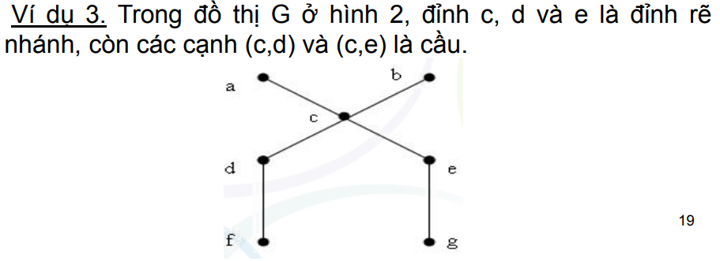
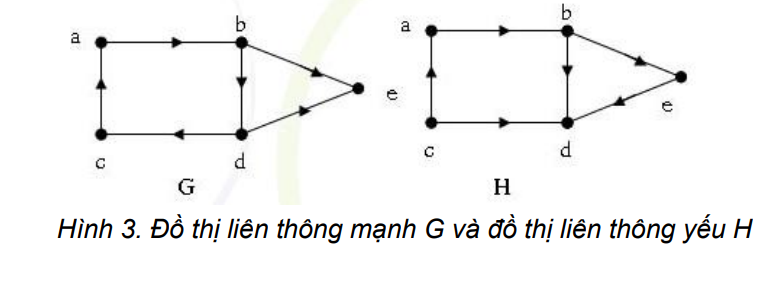

# KHÁI NIỆM ĐỒ THỊ

## Đơn đồ thị

Đơn đồ thị vô hướng G = (V,E) bao gồm V là tập các đỉnh khác
rỗng, và E là tập các cặp không có thứ tự gồm hai phần tử khác
nhau của V gọi là các cạnh.

    

## Đa đồ thị

Đa đồ thị vô hướng G= (V, E) bao gồm V là tập các đỉnh khác rỗng, và
E là tập các cặp không có thứ tự gồm hai phần tử khác nhau của V gọi là
các cạnh. Hai cạnh e1 và e2 được gọi là cạnh lặp (bội hay song song) nếu
chúng cùng tương ứng với một cặp đỉnh.

Mỗi đơn đồ thị là đa đồ thị, nhưng không phải đa đồ thị nào cũng là đơn
đồ thị, vì trong đa đồ thị có thể có hai (hoặc nhiều hơn) cạnh nối một cặp
đỉnh nào đó.

    

## Giả đồ thị

Giả đồ thị vô hướng G = (V, E) bao gồm V là tập các đỉnh khác rỗng
và E là tập các cặp không có thứ tự gồm hai phần tử (không nhất thiết
phải khác nhau) của V gọi là cạnh.

Với v Є V, nếu (v,v) Є E thì ta nói có một khuyên tại đỉnh v.

    

__**Nhận xét**__: giả đồ thị là loại đồ thị vô hướng tổng quát nhất vì nó có thể
chứa các khuyên và các cạnh lặp. Đa đồ thị là loại đồ thị vô hướng có
thể chứa cạnh bội nhưng không thể có các khuyên, còn đơn đồ thị là loại
đồ thị vô hướng không chứa cạnh bội hoặc các khuyên.

## Đơn đồ thị có hướng

Đơn đồ thị có hướng G = (V, E) bao gồm V là tập các đỉnh
khác rỗng và E là tập các cặp có thứ tự gồm hai phần tử
khác nhau của V gọi là các cung.

    

## Đa đồ thị có hướng

Đa đồ thị có hướng G = (V, E) bao gồm V là tập các đỉnh
khác rỗng và E là tập các cặp có thứ tự gồm hai phần tử
khác nhau của V gọi là các cung. Hai cung e1, e2 tương ứng
với cùng một cặp đỉnh được gọi là cung lặp.

    

## BẬC CỦA ĐỈNH

### Định nghĩa 1

Hai đỉnh u và v trong đồ thị (vô hướng) G=(V,E) được gọi
là liền kề nếu (u,v) Є E. Nếu e = (u,v) thì e gọi là cạnh liên
thuộc với các đỉnh u và v. Cạnh e cũng được gọi là cạnh nối
các đỉnh u và v. Các đỉnh u và v gọi là các điểm đầu mút của
cạnh e.

### Định nghĩa 2

Bậc của đỉnh v trong đồ thị G=(V,E), ký hiệu deg(v), là số
các cạnh liên thuộc với nó, riêng khuyên tại một đỉnh được
tính hai lần cho bậc của nó.

Đỉnh v gọi là **đỉnh treo** nếu deg(v)=1 và gọi là **đỉnh cô lập**
nếu deg(v)=0

    

### Định lý 1

Giả sử G = (V, E) là đồ thị vô hướng với
m cạnh. Khi đó tổng bậc của tất cả các đỉnh bằng
hai lần số cạnh.

### Hệ quả

Trong đồ thị vô hướng, số đỉnh bậc lẻ
(nghĩa là có bậc là số lẻ) là một số chẵn.

### Định nghĩa 3

Nếu e = (u, v) là cung của đồ thị có hướng G thì ta
nói hai đỉnh u và v là kề nhau, và nói cung (u, v) nối
đỉnh u với đỉnh v hoặc cũng nói cung này là đi ra khỏi
đỉnh u và vào đỉnh v. Đỉnh u(v) sẽ được gọi là đỉnh đầu
(cuối) của cung (u,v).

### Định nghĩa 4

Ta gọi bán bậc ra (bán bậc vào) của đỉnh v trong đồ
thị có hướng là số cung của đồ thị đi ra khỏi nó (đi vào
nó) và ký hiệu là deg+(v) (deg-
(v))

### Định lý 2

Cho G =(V, E) là một đồ thị có hướng. Khi đó:

    

##  ĐƯỜNG ĐI. CHU TRÌNH. ĐỒ THỊ LIÊN THÔNG

### Định nghĩa 1 (Đường đi)

Đường đi độ dài n từ đỉnh u đến đỉnh v, trong đó n là số
nguyên dương, trên đồ thị vô hướng G = (V, E) là dãy x0, x1,…,
xn-1, xn; trong đó u = x0, v = xn, (xi , xi+1) thuộc E, i = 0, 1, 2,…, n-1.
Đường đi nói trên còn có thể biểu diễn dưới dạng dãy các
cạnh: (x0, x1), (x1, x2), …, (xn-1, xn)

- Đỉnh u gọi là đỉnh đầu, còn đỉnh v gọi là đỉnh cuối của đường đi.
- Đường đi có đỉnh đầu trùng với đỉnh cuối (tức là u = v) được gọi là chu trình.
- Đường đi hay chu trình được gọi là đơn nếu như không có cạnh nào bị lặp lại.

    

### Định nghĩa 2. (Liên thông)

Đồ thị vô hướng G = (V, E) được gọi là **liên thông** nếu luôn tìm
được đường đi giữa hai đỉnh bất kỳ của nó.

    

Đồ thị G là liên thông, còn đồ thị H là không liên thông. 

### Định nghĩa 3.

Ta gọi đồ thị con của đồ thị G = (V, E) là đồ thị H = (W, F),
trong đó W thuộc V và F thuộc E.
Trong trường hợp đồ thị là không liên thông, nó sẽ rã ra thành
một số đồ thị con liên thông không có đỉnh chung. Những đồ
thị con liên thông như vậy ta sẽ gọi là các **thành phần liên
thông** của đồ thị.

Ví dụ 2. Đồ thị H trong hình 2 gồm 3 thành phần liên thông
H1, H2, H3.

### Định nghĩa 4.

- Đỉnh v được gọi là **đỉnh rẽ nhánh** nếu việc loại bỏ v cùng với
các cạnh liên thuộc với nó khỏi đồ thị làm tăng số thành phần
liên thông của đồ thị.

- Cạnh e được gọi là **cầu** nếu việc loại bỏ nó khỏi đồ thị làm
tăng số thành phần liên thông của đồ thị.

    

### Định nghĩa 5.

Đồ thị có hướng G = (V, A) được gọi là liên thông mạnh nếu
luôn tìm được đường đi giữa hai đỉnh bất kỳ của nó

### Định nghĩa 6.

Đồ thị có hướng G = (V, A) được gọi là liên thông yếu nếu
đồ thị vô hướng tương ứng với nó là vô hướng liên thông.

    

## ĐƠN ĐỒ THỊ ĐẶC BIỆT

**Đồ thị đầy đủ**: Đồ thị đầy đủ n đỉnh, ký hiệu là Kn, là đơn đồ
thị mà hai đỉnh phân biệt bất kỳ của nó luôn liền kề.

Như vậy, Kn có n(n −1)/2 cạnh và
mỗi đỉnh của Kn có bậc là n−1.

**Đồ thị vòng**: Đơn đồ thị n đỉnh v1, v2, ..., vn (n≥3) và n cạnh
(v1,v2), (v2,v3), ..., (vn-1,vn), (vn,v1) được gọi là đồ thị vòng, ký
hiệu là Cn. Như vậy, mỗi đỉnh của Cn có bậc là 2.

**Đồ thị bánh xe**: Từ đồ thị vòng Cn, thêm vào đỉnh vn+1 và
các cạnh (vn+1,v1), (vn+1,v2), ..., (vn+1,vn), ta nhận được đơn
đồ thị gọi là đồ thị bánh xe, ký hiệu là Wn.
Như vậy, Wn có n+1 đỉnh, 2n cạnh,
một đỉnh bậc n và n đỉnh bậc 3.

