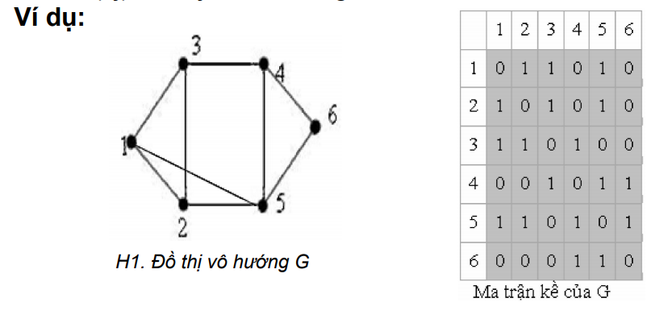
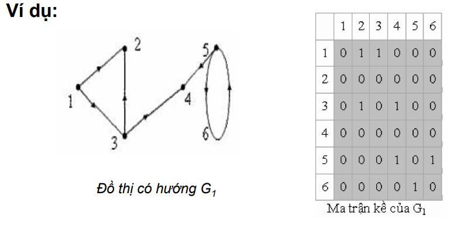
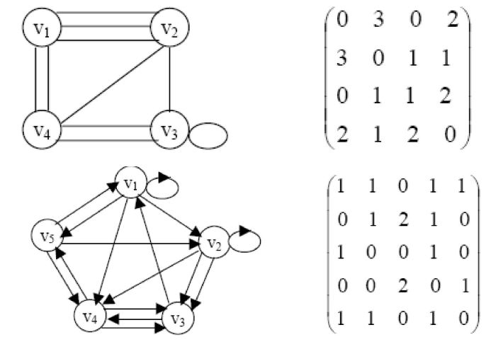
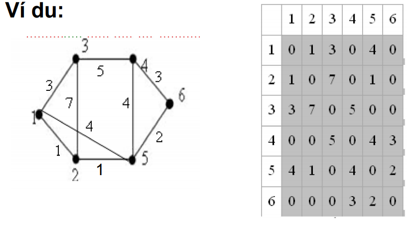
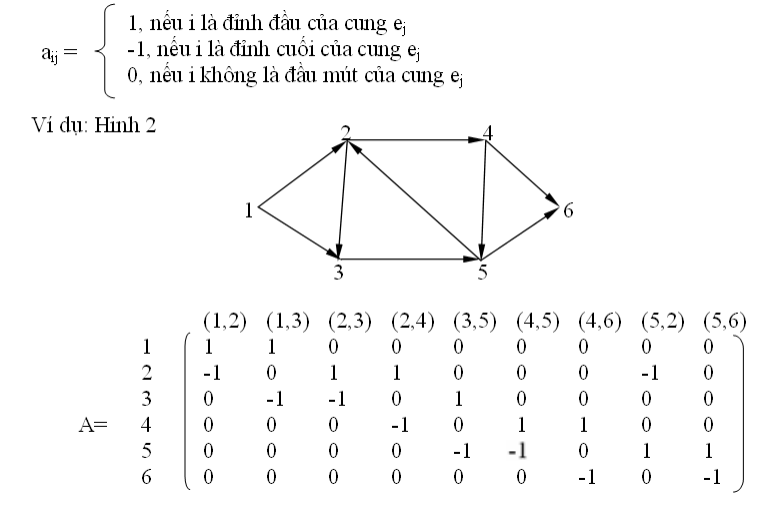

# BIỂU DIỄN ĐỒ THỊ TRÊN MÁY TÍNH

## Ma trận kề, ma trận trọng số

Xét đơn đồ thị G=(V,E)

**Ma trận kề:**

Ma trận A={ai,j : i,j=1, 2,. . . ,n} với ai,j=0, nếu (i,j) không thuộc E và ai,j=1,
nếu (i,j) Є E, i, j=1, 2,. . .,n gọi là ma trận kề của đồ thị G.

    
    

### Tính chất của ma trận kề của đồ thị vô hướng

- Tính đối xứng: a[i,j]=a[j,i], i,j=1,2,. . .,n
- Tổng các phần từ trên dòng i (cột j) bằng bậc của đỉnh i
(đỉnh j)

### Tính chất của ma trận kề của đồ thị có hướng

- Không có tính đối xứng
- Tổng các phần từ trên dòng i bằng bán bậc ra của đỉnh i
(deg+(i)) và tổng các phần từ trên cột j bằng bán bậc vào
của đỉnh j (deg(-
j)).

**Xét ví dụ 2:**

    

## Ma trận trọng số:

Đồ thị có trọng số là đồ thị mà mỗi cạnh (i,j) có một giá trị c(i,j)
gọi là trọng số của cạnh.
Để biểu diễn đồ thị ta sử dụng ma trận trọng số C= {c[i,j],
i,j=1, 2,. . .,n}
với c[i,j]= c(i,j) nếu (i,j) Є E và c[i,j]=alpha nếu (i,j) không thuộc E
trong đó số alpha có thể được đặt bằng một trong các giá trị sau:
0, +INFINITY, -INFINITY.

    

**Ưu điểm** lớn nhất của phương pháp biểu diễn đồ thị bằng
ma trận kề (hoặc ma trận trọng số) là để trả lời câu hỏi: Hai
đỉnh u,v có kề nhau trên đồ thị hay không, chúng ta chỉ
phải thực hiện một phép so sánh.

**Nhược điểm** lớn nhất của phương pháp này là: không phụ
thuộc vào số cạnh của đồ thị, ta luôn phải sử dụng n2 đơn
vị bộ nhớ để lưu trữ ma trận kề của nó

## Ma trận liên thuộc đỉnh-cạnh:

Xét G=(V, E) là đơn đồ thị có hướng. Ma trận liên thuộc đỉnh-cạnh có dạng:

    

## Danh sách cạnh (cung)

- Trong trường hợp đồ thị thưa (đồ thị có số cạnh m thoả
mãn bất đẳng thức: m<6n) biểu diễn đồ thị dưới dạng d/s
cạnh.
Lưu trữ danh sách tất cả các cạnh (cung) của đồ thị.
- Một cạnh (cung) e=(x,y) của đồ thị tương ứng với hai biến
Dau[e], Cuoi[e].
- Để lưu trữ đồ thị ta cần sử dụng 2m đơn vị bộ nhớ.

**Nhược điểm**: để tìm các đỉnh kề với một đỉnh cho trước
phải làm m phép so sánh (khi duyệt qua danh sách tất cả các
cạnh của đồ thị).
+ Trong trường hợp đồ thị có trọng số ta cần thêm m đơn vị
bộ nhớ để lưu trữ trọng số của các cạnh.

