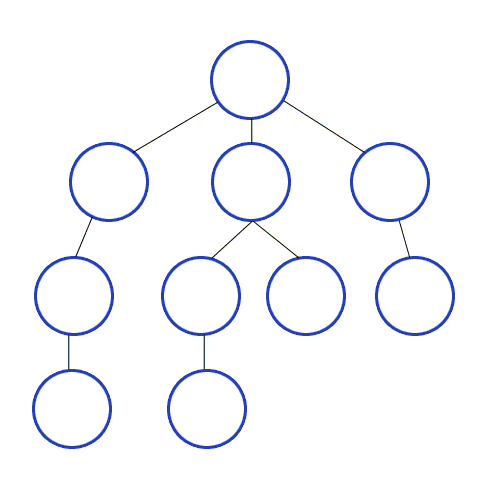
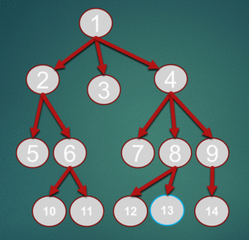

# CÁC THUẬT TOÁN TÌM KIẾM TRÊN ĐỒ THỊ

## Duyệt đồ thị theo chiều sâu(DFS Depth First Search)

- Từ đỉnh v1 nào đó chưa thăm, thăm v1, rồi
tìm đỉnh v2 (chưa thăm) kề với v1, thăm v2…
Thuật toán lặp lại việc thăm cho tới khi tất cả
các đỉnh đều được thăm.
- Nếu tại một đỉnh v_i nào đó, không còn đỉnh
nào kề với v_i là chưa thăm thì quay trở lại tiếp
tục tìm đỉnh kề chưa thăm khác của v_i-1.

```
Procedure DFS(v); (*tim kiem theo chieu sau bat dau tu dinh v; cac bien Chuaxet, Ke la bien toan cuc*)
Begin
Tham_dinh(v); Chuaxet[v]:=false;
For u Є Ke(v) do
If Chuaxet[u] then DFS(u);
End; (*dinh v da duyet xong*)
```

Khi đó, tìm kiếm theo chiều sâu trên đồ thị được thực hiện
nhờ thuật toán sau:

```
Begin
(*Khoi tao tat ca cac dinh cua do thi*)
for v Є V do Chuaxet[v]:=true;
for v Є V do
If Chuaxet[v] then DFS(v);
End.
```

**Tư tưởng thuật toán có thể trình bày như sau**: Từ một đỉnh S ban đầu ta sẽ có các đỉnh kề là x, từ đỉnh x ta sẽ có các đỉnh kề là y, và nó cũng thuộc nhánh s-x-y… Chúng ta thăm các nhánh đó theo chiều sâu (thăm đến khi không còn đỉnh kề chưa duyệt). Điều đó gợi cho chúng ta viết một thủ tục đệ quy DFS(u) để mô tả việc duyệt từ đỉnh u sang đỉnh kề v chưa được thăm.

<p align="center">
    
</p>

```java
// Recursive DFS
	public  void dfs(Node node)
	{
		System.out.print(node.data + " ");
		List neighbours=node.getNeighbours();
        	node.visited=true;
		for (int i = 0; i < neighbours.size(); i++) {
			Node n=neighbours.get(i);
			if(n!=null && !n.visited)
			{
				dfs(n);
			}
		}
	}
```

## Duyệt đồ thị theo chiều rộng (BFS Breadth First Search)

- Từ đỉnh v nào đó chưa thăm, thăm v, cất tất cả các
đỉnh u (chưa thăm) kề với v vào hàng đợi. Lấy từ
hàng đợi một đỉnh u, thăm u, rồi lại cất tất cả các
đỉnh t (chưa thăm) kề với u vào hàng đợi…
Thuật toán lặp lại việc thăm cho tới khi hàng đợi
rỗng.
- Nếu tại một đỉnh x nào đó, không còn đỉnh nào kề
với x là chưa thăm thì quay trở lại tiếp tục tìm đỉnh
kề chưa thăm khác của y (y là đỉnh trước khi đến x).

```

Procedure BFS(v);(*BFS bat dau tu dinh v, cac bien Chuaxet, Ke la bien cuc bo*)
Begin QUEUE:=Ø; QUEUE <- v; (*ket qua nap vao QUEUE*)
Chuaxet[v]:=false;
While QUEUE <> Ø do
Begin
p <- QUEUE; (*lay p tu QUEUE:*) Tham_dinh(p);
For u Є Ke(v) do
If Chuaxet[u] then
Begin QUEUE <- u; Chuaxet[u]:=false; End;
End; End;
```

<p align="center">
    
</p>

```python
# Python3 Program to print BFS traversal 
# from a given source vertex. BFS(int s) 
# traverses vertices reachable from s. 
from collections import defaultdict 
  
# This class represents a directed graph 
# using adjacency list representation 
class Graph: 
  
    # Constructor 
    def __init__(self): 
  
        # default dictionary to store graph 
        self.graph = defaultdict(list) 
  
    # function to add an edge to graph 
    def addEdge(self,u,v): 
        self.graph[u].append(v) 
  
    # Function to print a BFS of graph 
    def BFS(self, s): 
  
        # Mark all the vertices as not visited 
        visited = [False] * (len(self.graph)) 
  
        # Create a queue for BFS 
        queue = [] 
  
        # Mark the source node as  
        # visited and enqueue it 
        queue.append(s) 
        visited[s] = True
  
        while queue: 
  
            # Dequeue a vertex from  
            # queue and print it 
            s = queue.pop(0) 
            print (s, end = " ") 
  
            # Get all adjacent vertices of the 
            # dequeued vertex s. If a adjacent 
            # has not been visited, then mark it 
            # visited and enqueue it 
            for i in self.graph[s]: 
                if visited[i] == False: 
                    queue.append(i) 
                    visited[i] = True
  
# Driver code 
  
# Create a graph given in 
# the above diagram 
g = Graph() 
g.addEdge(0, 1) 
g.addEdge(0, 2) 
g.addEdge(1, 2) 
g.addEdge(2, 0) 
g.addEdge(2, 3) 
g.addEdge(3, 3) 
  
print ("Following is Breadth First Traversal"
                  " (starting from vertex 2)") 
g.BFS(2) 
```

## Tìm đường đi và kiểm tra tính liên thông

### Bài toán tìm đường đi giữa hai đỉnh

Giả sử s và t là hai đỉnh nào đó của đồ thị. Hãy tìm đường đi
từ s đến t.

**Ý tưởng:**
- Gọi thủ tục DFS(s) hoặc (BFS(s)) để thăm tất cả các đỉnh
thuộc cùng một thành phần liên thông với s.
- Nếu sau khi thực hiện xong thủ tục mà Chuaxet[t]=true thì
không có đường đi từ s đến t,
ngược lại thì có đường đi từ s đến t.
- Để ghi nhận đường đi, ta dùng thêm biến Truoc[v] để ghi
nhận đỉnh đi trước đỉnh v trong đường đi từ s đến v.

Khi đó, thủ tục DFS(v) cần sửa câu lệnh if trong nó như sau:

```
If Chuaxet[u] then
Begin
Truoc[u]:=v;
DFS(u);
End;
```

Thủ tục BFS(v) cần sửa đổi câu lện if trong nó như sau:

```
If Chuaxet [u] then
Begin
QUEUE <- u;
Chuaxet[u]:=false;
Truoc[u]:=p;
End;
```

### Tìm các thành phần liên thông của đồ thị

Hãy cho biết đồ thị gồm bao nhiêu thành phần liên thông
và từng thành phần liên thông của nó là gồm những
đỉnh nào.
+ Do thủ tục DFS(v) (BFS(s)) cho phép thăm tất cả các
đỉnh thuộc cùng một thành phần liên thông với s, nên số
thành phần liên thông của đồ thị bằng số lần gọi đến thủ
tục này.
+ Vấn đề còn lại là cách ghi nhận các đỉnh trong từng
thành phần liên thông.
Ta dùng thêm biến Index[v] để ghi nhận chỉ số của thành
phần liên thông chứa đỉnh v, và biến Inconnect để đếm
số thành phần liên thông (khởi tạo giá trị 0).

+ Thủ tục Tham_dinh(v) trong các thủ tục DFS(v) và BFS(v) có nhiệm vụ
gán: Index[v]:=Inconnect;
+ Câu lệnh if trong các chương trình chính gọi đến các thủ tục này cần
được sửa lại như sau:

```
Inconnect:=0;
If Chuaxet[v] then
Begin
Inconnect:=Inconnect+1;
DFS(v); (*BFS(v)*)
End;
```

+ Kết thúc vòng lặp thứ hai trong chương trình chính, Inconnect trả về số
thành phần liên thông của đồ thị, biến mảng Index[v], v Є V cho phép
liệt kê các đỉnh thuộc cùng một thành phần liên thông.

