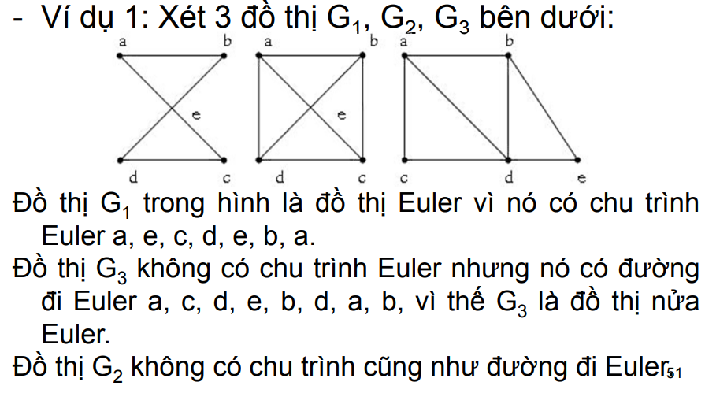
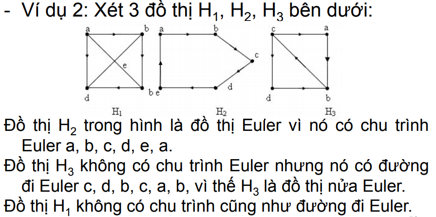

# Đồ thị EULER

- Đường đi qua mỗi cạnh của đồ thị đúng một
lần được gọi là đường đi Euler.
- Chu trình qua mỗi cạnh của đồ thị đúng một
lần được gọi là chu trình Euler.
- Đồ thị được gọi là đồ thị Euler nếu nó có chu
trình Euler, và gọi là đồ thị nửa Euler nếu nó có
đường đi Euler
- Nhận xét: mọi đồ thị Euler luôn là nửa Euler,
nhưng điều ngược lại không luôn đúng.

    

    

## Định lý 1 (Euler)

G là đồ thị vô hướng liên
thông. G là đồ thị Euler <=> mọi đỉnh của G đều
có bậc chẵn.

- Nếu bậc của mỗi đỉnh của đồ thị G
không nhỏ hơn 2 thì G chứa chu trình.

- Đồ thị vô hướng liên thông G là nửa
Euler khi và chỉ khi nó có không quá 2 đỉnh bậc
lẻ.

# Đồ thị HAMILTON

- Đường đi qua tất cả các đỉnh của đồ thị mỗi
đỉnh đúng một lần được gọi là đường đi
Hamilton.

- Chu trình bắt đầu từ một đỉnh v nào đó qua tất
cả các đỉnh còn lại mỗi đỉnh đúng một lần rồi
quay trở về v được gọi là chu trình Hamilton.

- Đồ thị G được gọi là đồ thị Hamilton nếu nó
chứa chu trình Hamilton và gọi là đồ thị nửa
Hamilton nếu nó có đường đi Hamilton.

## Định lý

- Định lý 1: (Dirak 1952). Đơn đồ thị vô hướng G
với n>2 đỉnh, mỗi đỉnh có bậc không nhỏ hơn
n/2 là đồ thị Hamilton.

- Định lý 2: Nếu G là đồ thị phân đôi với hai tập
đỉnh là V1, V2 có số đỉnh cùng bằng n (n ≥ 2)
và bậc của mỗi đỉnh lớn hơn n/2 thì G là một
đồ thị Hamilton.

- Định lý 3: Giả sử G là đồ có hướng liên thông
với n đỉnh. Nếu deg+(v)≥n/2, deg–(v) ≥ n/2, Với mọi v
thì G là Hamilton.

