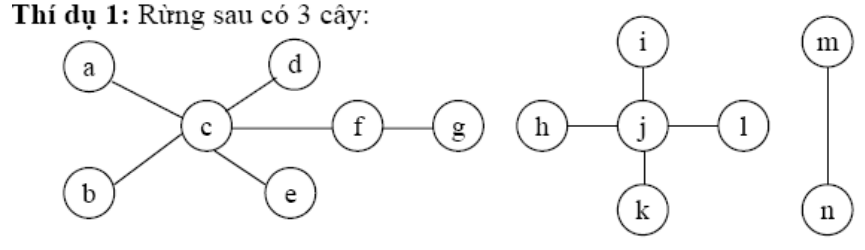
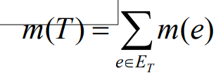
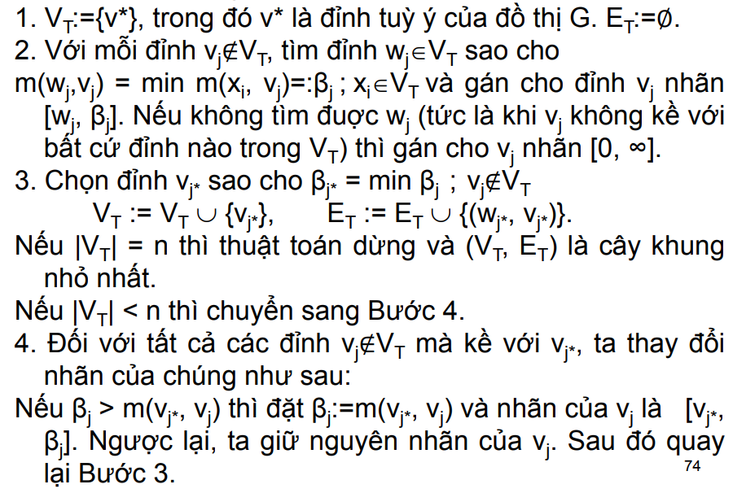
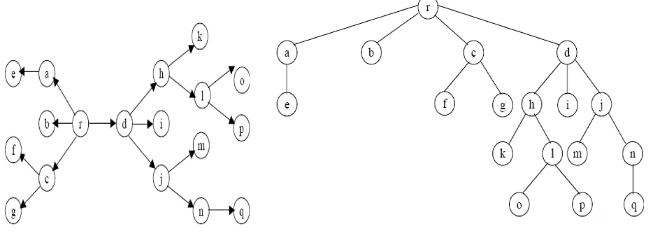

# CÂY VÀ CÂY KHUNG CỦA ĐỒ THỊ

## Định nghĩa

Cây là một đồ thị vô hướng liên thông, không
chứa chu trình và có ít nhất hai đỉnh.
Một đồ thị vô hướng không chứa chu trình và có
ít nhất hai đỉnh gọi là một rừng.
Trong một rừng, mỗi thành phần liên thông là
một cây.

    

## Định lý

Cho T là một đồ thị có n ≥ 2 đỉnh. Các
điều sau là tương đương:

- T là một cây.
- T liên thông và có n−1 cạnh.
- T không chứa chu trình và có n−1 cạnh.
- T liên thông và mỗi cạnh là cầu.
- Giữa hai đỉnh phân biệt bất kỳ của T luôn có
duy nhất một đường đi đơn.
- T không chứa chu trình nhưng khi thêm một
cạnh mới thì có được một chu trình duy nhất

## Cây khung và bài toán tìm cây khung nhỏ nhất

### Định nghĩa 

Trong đồ thị liên thông G, nếu ta
loại bỏ cạnh nằm trên chu trình nào đó thì ta
sẽ được đồ thị vẫn là liên thông. Nếu cứ loại
bỏ các cạnh ở các chu trình khác cho đến khi
nào đồ thị không còn chu trình (vẫn liên thông)
thì ta thu được một cây nối các đỉnh của G.
Cây đó gọi là **cây khung** hay **cây bao trùm** của
đồ thị G.

### Bài toán được phát biểu như sau

Cho G=(V,E) là đồ thị vô hướng liên thông có
trọng số, mỗi cạnh e thuộc E có trọng số m(e)≥0.
Giả sử T=(VT,ET) là cây khung của đồ thị G
(VT=V). Ta gọi độ dài m(T) của cây khung T là
tổng trọng số của các cạnh của nó:

    

Bài toán đặt ra là trong số tất cả các cây khung
của đồ thị G, hãy tìm cây khung có độ dài nhỏ
nhất.
Cây khung như vậy được gọi là cây khung nhỏ
nhất của đồ thị.
Bài toán được gọi là “bài toán tìm **cây khung
nhỏ nhất**”.

Hai mô hình thực tế tiêu biểu:
* Bài toán xây dựng hệ thống đường sắt.
* Bài toán nối mạng máy tính.

### Thuật toán Kruskal

Thuật toán sẽ xây dựng
tập cạnh ET của cây khung nhỏ nhất T=(VT,ET)
theo từng bước:
1. Bắt đầu từ đồ thị rỗng T có n đỉnh.
2. Sắp xếp các cạnh của G theo thứ tự không giảm
của trọng số.
3. Bắt đầu từ cạnh đầu tiên của dãy này, thêm dần
các cạnh của dãy đã được xếp vào T theo nguyên
tắc cạnh thêm vào không được tạo thành chu
trình trong T.
4. Lặp lại Bước 3 cho đến khi nào số cạnh trong T
bằng n−1, ta thu được cây khung nhỏ nhất cần
tìm.

    

### Thuật toán Prim

còn được gọi là phương
pháp lân cận gần nhất.

    

## Cây có gốc

Cây có hướng là đồ thị có hướng mà đồ
thị vô hướng nền của nó là một cây.
Cây có gốc là một cây có hướng, trong đó có một
đỉnh đặc biệt, gọi là gốc, từ gốc có đường đi đến
mọi đỉnh khác của cây.
Trong cây có gốc thì gốc r có bán bậc vào bằng 0,
còn tất cả các đỉnh khác đều có bậc vào bằng 1.
Một cây có gốc thường được vẽ với gốc r ở trên
cùng và cây phát triển từ trên xuống, gốc r gọi là
đỉnh mức 0. Các đỉnh kề với r được xếp ở phía
dưới và gọi là đỉnh mức 1. Đỉnh ngay dưới đỉnh
mức 1 là đỉnh mức 2, ...

    

### Định nghĩa: 

Cho cây T có gốc r=v0. Giả sử v0, v1, ..., vn-1, vn
là một đường đi trong T. Ta gọi:
- v_i+1 là con của v_i và v_i là cha của v_i+1.
- v0, v1, ..., vn-1 là các tổ tiên của vn và vn là dòng dõi của v0,
v1, ..., vn-1.
- Đỉnh treo vn là đỉnh không có con; đỉnh treo cũng gọi là lá
hay đỉnh ngoài; một đỉnh không phải lá là một đỉnh trong.

Một cây có gốc T được gọi là cây m-phân nếu
mỗi đỉnh của T có nhiều nhất là m con. Với m=2, ta có
một cây nhị phân.
Trong một cây nhị phân, mỗi con được chỉ rõ là con bên trái
hay con bên phải;
Cây có gốc T được gọi là một cây m-phân đầy đủ nếu mỗi
đỉnh trong của T đều có m con.
