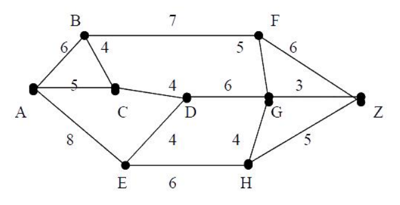
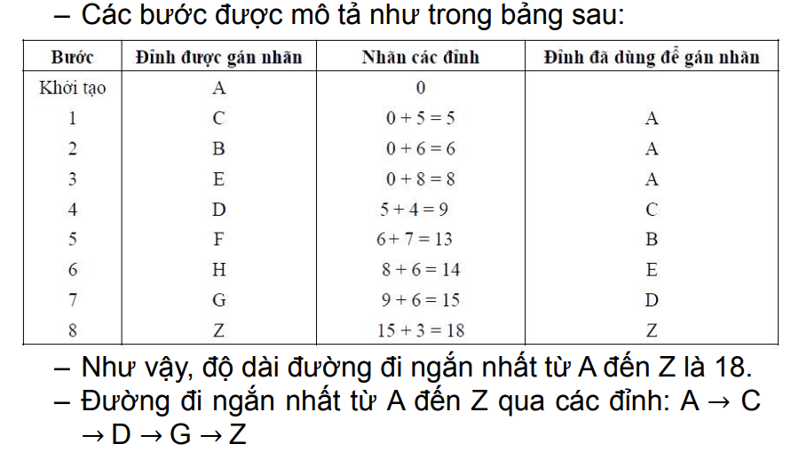

# TÌM ĐƯỜNG ĐI NGẮN NHẤT

## Giới thiệu về bài toán

- Xét đồ thị G =< V, E > với V = n, E = m.
- Với mỗi cạnh u, v ∈ E, có một giá trị trọng số
A u, v .
- Đặt A u, v = ∞ nếu u, v ∉ E.
- Nếu dãy v0, v1,..., vk là một đường đi trên G thì
- ∑ A[vi−1, vi] chạy từ k đến i-1
- được gọi là độ dài của đường đi.
- Bài toán: Tìm đường đi ngắn nhất từ đỉnh s đến
đỉnh t của đồ thị G.

## Thuật toán gán nhãn

- Thuật toán được mô tả như sau:
- Từ ma trận trọng số A[u,v], u,v∈V, tìm cận trên
d[v] của khoảng cách từ s đến tất cả các đỉnh
v∈V.
- Nếu thấy d[u] + A[u,v] < d[v] thì d[v] = d[u] + A[u,
v] (làm tốt lên giá trị của d[v])
- Quá trình sẽ kết thúc khi không thể làm “tốt lên”
được nữa.
- Khi đó d[v] sẽ cho ta giá trị ngắn nhất từ đỉnh s
đến đỉnh v.
- Giá trị d[v] được gọi là nhãn của đỉnh v.

Ví dụ về thuật toán: Tìm đường đi ngắn nhất từ A đến Z trong đồ thị G
sau

<p align="center">
    
</p>

**Các bước thực hiện của giải thuật:**
- Bước 1: Gán cho nhãn đỉnh A là 0, d A = 0;
- Bước 2: Chọn cạnh có độ dài nhỏ nhất xuất phát
từ A (cạnh AC), gán nhãn của đỉnh kề C với:
d C = d A + A A, C = 0 + 5 = 5
- Bước 3: Tiếp đó, trong số các cạnh đi từ một đỉnh
có nhãn là A hoặc C tới một đỉnh chưa được gán
nhãn, chọn cạnh sao cho: nhãn của đỉnh + với
trọng số cạnh tương ứng = nhỏ nhất gán cho
nhãn của đỉnh cuối của cạnh
Như vậy, ta lần lượt gán được các nhãn như sau:
- d[B] = 6 vì d[B] <d[C] + A[C,B] = 5 + 4;
- d[E] = 8;
- Tiếp tục làm như vậy cho tới khi đỉnh Z. Nhãn của
Z là độ dài đường đi ngắn nhất từ A đến Z.

<p align="center">
    
</p>

## Thuật toán Dijkstra

- Thuật toán tìm đường đi ngắn nhất từ đỉnh s đến các
đỉnh còn lại được Dijkstra đề nghị áp dụng cho
trường hợp đồ thị có hướng với trọng số không âm.
- Thuật toán được thực hiện trên cơ sở gán tạm thời
cho các đỉnh.
- Nhãn của mỗi đỉnh cho biết cận trên của độ dài
đường đi ngắn nhất tới đỉnh đó.
- Các nhãn này sẽ được biến đổi (tính lại) nhờ một thủ
tục lặp, mà ở mỗi bước lặp một số đỉnh sẽ có nhãn
không thay đổi, nhãn đó chính là độ dài đường đi
ngắn nhất từ s đến đỉnh đó.

```C
void Dijkstra(void)
/*Đầu vào G=(V, E) với n đỉnh có ma trận trọng số A[u,v]≥ 0; s∈V */
/*Đầu ra là khoảng cách nhỏ nhất từ s đến các đỉnh còn lại d[v]: v∈V*/
/*Truoc[v]: ghi lại đỉnh trước v trong đường đi ngắn nhất từ s đến v*/
{
/*Bước 1: Khởi tạo nhãn tạm thời
cho các đỉnh*/
    for ( v∈ V ) {
        d[v] = A[s,v];
        truoc[v]=s;
    }
    d[s]=0;
    T = V\{s};
    /*T là tập đỉnh có nhãn tạm thời*/
    /* Bước lặp */
    while (T != ∅ ) {
        Tìm đỉnh u ∈ T sao cho d[u] = min { d[z] | z∈T};
        T= T\{u};
        /*cố định nhãn đỉnh u*/
        for ( v ∈ T ) {
        /*Gán lại nhãn cho các đỉnh trong T*/
            if (d[v] > d[u] + A[u,v]) {
                d[v] = d[u] + A[u,v];
                truoc[v] =u;
            }
        }
    }
}
```

```C
#include <stdio.h>
#include <conio.h>
#include <stdlib.h>
#define MAX 10
#define vocuc 666
 
//prototype
int Doc_Dothi(char filename[], int [][MAX], int &);
void Xuat_Matran(int [][MAX], int);
int Dijkstra(int [][MAX],int,int );
 
void main(){
    int a[MAX][MAX],n,s;
    char duongdan[30],kt; 
 
    while (1){
    printf("Cho biet duong dan cua do thi bieu dien: ");
    scanf("%s",duongdan);
     
    if (Doc_Dothi(duongdan,a,n)){
        Xuat_Matran(a,n);
        printf("Ban hay chon dinh goc: ");
        scanf("%d",&s);
        if (Dijkstra(a,n,s)==0)
            printf("Do thi xuat phat tu %d khong lien thong !",s);
    }   
    printf("\nBan co muon tiep tuc: nhan mot phim bat ky de tiep tuc!\n");
    printf("Nhan N or n de ket thuc!!!\n");
    scanf("%s",&kt);
    if (kt=='N' || kt=='n')
        break;
    printf("\n");
    }
    getch();        
}
 
//Ham doc do thi => tra ve 1: doc thanh cong, 0:doc that bai
int Doc_Dothi(char filename[], int a[MAX][MAX], int &n) {
    FILE *f;
    f=fopen(filename, "rt");
    if(f==NULL) {
        printf("Loi mo file !!!\n"); 
        printf("co the ban chon duong dan ko dung, vd: e:\\dothi.txt \n\n");
        return 0;   //doc that bai
    }
    fscanf(f,"%d\n",&n);
    for(int i=0;i<n;i++) {
        for(int j=0;j<n;j++)
            fscanf(f,"%d",&a[i][j]);
        fscanf(f,"\n");
    }
    fclose(f);
    return 1;       //doc thanh cong
}
 
 
//Ham xuat ma tran ke
void Xuat_Matran(int a[][MAX], int n) {
    printf("\n");
    for (int i=0;i<n;i++) {
        for (int j=0;j<n;j++)
            printf("%d\t",a[i][j]);
        printf("\n");
    }
    printf("\n");
}
 
//Ham tra ve 0: do thi khong lien thong, tra ve 1: lien thong, [s: dinh xuat phat, dinh goc]
int Dijkstra(int a[][MAX],int n,int s) {
    int Mark[MAX],d[MAX],pr[MAX], k,min,dem;
     
    //Khoi tao theo ly thuyet slide hoc cua cac ban 
    for(int i=0;i<n;i++){
        d[i]=vocuc;         //tu dinh goc s den cac dinh con lai la vocuc
        Mark[i]=0;          //chua co dinh nao dc chon vao cay T
        pr[i]=s;            //s la dinh truoc khi den tat ca dinh i con lai
    }
     
    //khoi tao
    for(int j=0;j<n;j++) {
        if(a[s][j])     //neu co canh noi giua s va j
            d[j]=a[s][j];   //luu lai khoang cach tu s->j vao mang d [d la mang luu lai khoang cach tinh tu s]
    }
     
    d[s]=0;             //khoang cach s->s la 0  [d la mang luu lai khoang cach tinh tu s]
    Mark[s]=1;          //s la dinh dau tien dua vao cay T
     
    dem=n-1;            //chuan bi lap n-1 lan, tuc chon n-1 dinh con lai vao cay T, [n-1: tru ra dinh s da dc chon roi]
    while (dem>0) {          //lan luot chon n-1 dinh dua vao cay T [co n dinh, tru ra dinh s da dua vao cay T truoc do roi]
        min = vocuc;        
        for(int i=0;i<n;i++)           //di tim dinh k, 
            if ((Mark[i]==0) && (d[i]<min)) { //ma k o ngoai cay T, sao cho d[k] la nho nhat
                min = d[i];
                k = i;
            }
        if (min==vocuc){
            printf("Do thi khong lien thong");
            return 0;
        }
        Mark[k]=1;        //Chon dc k dua vao cay T
        for (int j=0;j<n;j++) //Cap nhat lai gia tri
            if ((Mark[j]==0) && (d[k]+a[k][j]<d[j]) && (a[k][j]>0)) {
                d[j]=d[k]+a[k][j];
                pr[j]=k;
            }
        dem--;
    }
 
     
    //In kq: dinh goc xp- > tat ca cac dinh con lai  
    for (int i=0;i<n;i++)
        if (i!=s)       //neu la dinh goc ==> khong in ra man hinh
            if(d[i]==vocuc) //khong co duong di tu s->i
                printf("ko co duong di tu %d->%d\n",s,i);
            else {
                printf("duong di tu %d->%d co do dai la: %d . ",s,i,d[i]);
                printf("Cac dinh di qua la : ");
                int mang[MAX];
                dem=0;
                int tam=pr[i];
                while (tam!=s) {
                    mang[dem]=tam;
                    tam=pr[tam];
                    dem++;
                }
                printf("%d->",s);
                for (int j=dem;j>0;j--)
                    printf("%d->",mang[j-1]);
                printf("%d\n",i);
            }
    return 1;
}
```