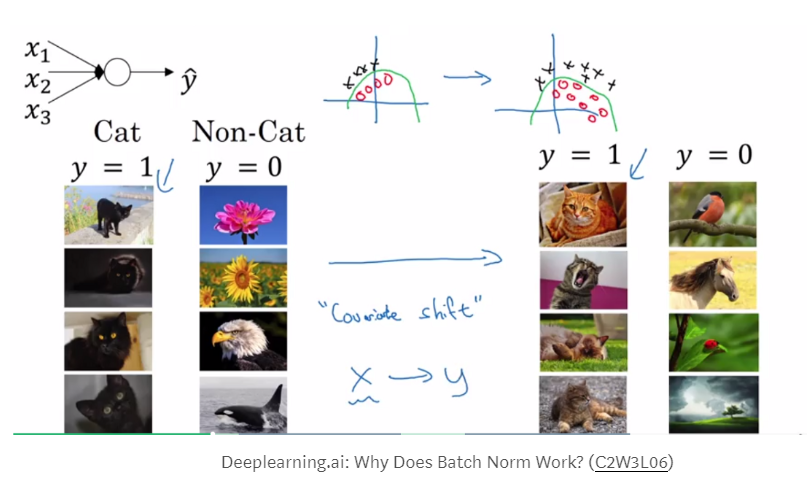

# Batch normalization in Neural Networks
## Why do we use batch normalization?
We normalize the input layer by adjusting and scaling the activations. For example, when we have features from `0` to `1` and some from `1` to `1000`, we should normalize them to speed up learning. If the input layer is benefiting from it, why not do the same thing also for the values in the hidden layers, that are changing all the time, and get 10 times or more improvement in the training speed.

Batch normalization reduces the amount by what the hidden unit values shift around (covariance shift). To explain covariance shift, let’s have a deep network on cat detection. We train our data on only black cats’ images. So, if we now try to apply this network to data with colored cats, it is obvious; we’re not going to do well. The training set and the prediction set are both cats’ images but they differ a little bit. In other words, if an algorithm learned some X to Y mapping, and if the distribution of X changes, then we might need to retrain the learning algorithm by trying to align the distribution of X with the distribution of Y. 

Also, batch normalization allows each layer of a network to learn by itself a little bit more independently of other layers.

<p>
    
</p>

## What is Co-variate Shift / Internal Co-variate Shift
### TL;DR
I understand it simply as distribution of the data. So if my parameters were trained on distribution A, and we give a data (which have different distribution, lets say B). The trained model will not perform very well.

### Covariate Shift
Formally, covariate shift is defined as a change in the distribution of a function’s domain. Informally, it’s when your inputs change on you, and your algorithm can’t deal with it.

For example, let’s say I’m hungry while I’m working. Everyday, Jane brings in Mac ‘n Cheese Hamburgers and Carrot Burgers. Also let’s say that Carrot Burgers look somewhat like Mac ‘n Cheese Burgers. Ted has never been exposed to Mac ‘n Cheese Hamburgers, so yesterday, I took him into the breakroom and point them out by describing them so that he can attempt to learn a function `Ps(Y | X)`, the probability of Y being a Mac ‘n Cheese Burger given the features X. Here X are my descriptions like color, smell, etc. Essentially, I’ve trained Ted on a set of burgers `S = { (X0, Y0), (X1, Y1), … }` to recognize which Y burger to get, based on what Mac ‘n Cheese burgers look like, X.

Today, I’m busy, so I ask Ted to go get me a M&C burger. Since he knows what `P (Y | X)` is (or at least he thinks he does), I’m confident that although I know carrots are good for me, I won’t be eating them for lunch. Trouble is, Jane went to a different store today to pick up Mac ‘n Cheese & Carrot Burgers. Let’s call this set of burgers T, and the burgers in T look different than the original set of burgers S. Naturally Ted’s confused, even though he knows `P (Y | X) = Ps(Y | X) = PT(Y | X)`. Why is he confused? Because Ps(X) ≠ PT(X): the source distribution is different than the target distribution. The ketchup is darker, the buns are lighter, and so on. In short, the feature space of T is drastically different than S, which was what was used in training.

Why does this matter? A great little explanation is here, but the general idea is that we’re not actually learning `P(Y | X)`, but rather, the model of `P(Y | X, θ)`, where `θ` are the parameters of that model. And since often times it’s difficult to specify the right model for a phenomenon (for deep learning, we’re pretty sure it’s never the right model), the distribution of the input, i.e. P(X), is important. To correct for the shift, a fix could be to re-train with points in S by weighting by `PT(X) / Ps(X)`, or the perceived true distribution. This is called importance sampling, which we won’t talk about today.

### Internal Covariate Shift
Within a single training set, covariate shift isn’t that big of a deal for most machine learning algorithms. After all, even if you’re taking subsets/mini-batches, the statistics from batch to batch don’t change very much, provided you’ve randomized access to the dataset. But deep learning, by its very nature, is parameterized in a hierarchical fashion, and therein lies the problem.

At the first layer, you’re typically looking at data from a source S, and statistics from each batch remains somewhat similar during training. The problem is, you’ve got a lot of layers, a gabazillion if you’re Microsoft, 152 to be more precise. Since the output of the first layer feeds the second layer, the second feeds the third, and so on, this is problematic.

Why? Have you ever played the game telephone with cups and strings? Think of this as that, only you can tweak your phone to make it clearer (i.e., tune your parameters). The first guy tells the second guy, “go water the plants”, the second guy tells the third guy, “got water in your pants”, and so on until the last guy hears, “kite bang eat face monkey” or something totally wrong. Let’s say that the problems are entirely systemic and due entirely to faulty red cups. Then, the situation is analogouts to forward propagation.

Now, let’s say we can fix our cups (or get new ones) so that we pass messages better. We tell the last guy the right answer, and he fixes his cup a little bit, and then tests it out by talking to the second-to-last guy through it. The second-to-last guy tells the third-to-last guy to fix something, and all the way back to the first guy. Backpropagation, right?

<p align="cente">
    
    
    
</p>

The trouble is, everybody’s fixing stuff at the same time. So, when one guy tells the next guy stuff, he’s doing it with his new cup, i.e., parameters. And that’s bad because everyone is getting a new phone/cup based on what the guy after him told him…only the message changes because the cups change. To put it another way: your first layer parameters change and so the distribution of the input to your second layer changes. By changing around parameters, you’re intentionally causing something that Szegedy calls “internal covariate shift”. Usually, it’s not a problem with only a few layers; it gets pretty hairy when you’ve got a truly deep neural network.

## What is exponentially weighted averages?
You might notice it is impossible to get the `μ` and `σ` when we want to test on a single example. In this case, we can use exponentially weighted averages to get the final `μ` and `σ` across the mini batches in training. Then the final `μ` and `σ` can be used in dev and test set.

One tricky aspect of batch normalization is getting the mean and standardization of the given data. Naturally we want our model’s prediction to only depend on the given test data (during the testing phase).

To make sure that happens we can take the average of mean and the variance values we got during the training phase. And use those values in the testing phase to perform standardization. (I know that my explanation was horrible, luckily Dr. Andrew NG did an amazing job explaining this. And I added two more videos explaining this matter in detail.)

## Implementing BatchNorm in Neural Net
The main idea of BatchNorm is this: for the current minibatch while training, in each hidden layer, we normalize the activations so that its distribution is Standard Normal (zero mean and one standard deviation). Then, we apply a linear transform to it with learned parameters so that the network could learn what kind of distribution is the best for the layer’s activations.

This in turn will make the gradient flows better as activations saturation is not a problem anymore. Recall that activations saturation kills neurons in case of ReLU and makes gradient vanish or explode in case of sigmoid.

It enables us to be less careful with weights initialization as we don’t need to worry anymore if our weights initialization makes the activations saturated too quickly which in turn make the gradient explode. BatchNorm takes care of that.

The forward propagation of BatchNorm is shown below:
<p align="cente">
    
</p>

We still need to derive the backprop scheme for the BatchNorm layer. Which is given by this:
<p align="cente">
    
</p>

### Trainning
**Forward:**
Forward pass for batch normalization.

During training the sample mean and (uncorrected) sample variance are
computed from minibatch statistics and used to normalize the incoming data.
During training we also keep an exponentially decaying running mean of the
mean and variance of each feature, and these averages are used to normalize
data at test-time.

At each timestep we update the running averages for mean and variance using
an exponential decay based on the momentum parameter:

```running_mean = momentum * running_mean + (1 - momentum) * sample_mean```
```running_var = momentum * running_var + (1 - momentum) * sample_var```

Note that the batch normalization paper suggests a different test-time
behavior: they compute sample mean and variance for each feature using a
large number of training images rather than using a running average. For
this implementation we have chosen to use running averages instead since
they do not require an additional estimation step; the torch7
implementation of batch normalization also uses running averages.

```python
def batchnorm_forward(x, gamma, beta, bn_param):
    mode = bn_param['mode']
    eps = bn_param.get('eps', 1e-5)
    momentum = bn_param.get('momentum', 0.9)

    N, D = x.shape
    running_mean = bn_param.get('running_mean', np.zeros(D, dtype=x.dtype))
    running_var = bn_param.get('running_var', np.zeros(D, dtype=x.dtype))

    out, cache = None, None
    if mode == 'train':
        sample_mean = np.mean(x, axis=0)
        sample_var = 1/N * np.sum((x-sample_mean)**2, axis=0)

        x_ = (x-sample_mean) / np.sqrt(sample_var + eps)

        out = x_ * gamma + beta
        cache = (x, eps, gamma, beta, x_, sample_mean, sample_var)

        running_mean = momentum * running_mean + (1-momentum) * sample_mean
        running_var = momentum * running_var + (1-momentum) * sample_var
    elif mode == 'test':
        x_ = (x - running_mean) / np.sqrt(running_var + eps)
        out = x_ * gamma + beta
    else:
        raise ValueError('Invalid forward batchnorm mode "%s"' % mode)

    # Store the updated running means back into bn_param
    bn_param['running_mean'] = running_mean
    bn_param['running_var'] = running_var

    return out, cache
```

**Backward:**

```python
def batchnorm_backward(dout, cache):
    X, X_norm, mu, var, gamma, beta = cache

    N, D = X.shape

    X_mu = X - mu
    std_inv = 1. / np.sqrt(var + 1e-8)

    dX_norm = dout * gamma
    dvar = np.sum(dX_norm * X_mu, axis=0) * -.5 * std_inv**3
    dmu = np.sum(dX_norm * -std_inv, axis=0) + dvar * np.mean(-2. * X_mu, axis=0)

    dX = (dX_norm * std_inv) + (dvar * 2 * X_mu / N) + (dmu / N)
    dgamma = np.sum(dout * X_norm, axis=0)
    dbeta = np.sum(dout, axis=0)

    return dX, dgamma, dbeta
```

### Giải thích
Giả sử có 4 layers DNN: Layer 1, Layer 2, Layer 3, Layer 4.

Giả sử Batch size = 64.

Tại mỗi layer, feed 64 trainning examples vào input. Tính `Z=X*W`. Tại `Z`, tính `μ` (mean) và `σ` (var) của `Z`, normalize `Z`:

`Z_hat = (Z-μ)/σ`

Z cuối cùng được tính bằng công thức: 

`Z = Z_hat * gamma_i + beta_i`

`gamma` và `beta` tại mỗi layer là khác nhau thường được khởi tạo tương ứng là 1 và 0.

`gamma_i` và `beta_i` là tham số được update qua mỗi lần backward (backpropagation).

Tại mỗi layer, `running_mean` và `running_var` được khởi tạo, trong mỗi lần trainning 2 giá trị này lại được cập nhật theo training batch. `running_mean` và `running_var` tại các layer là riêng biệt. Khi training, `running_mean` và `running_var` được cập nhật theo exponential decay với tham số là `momentum`. Giá trị `sample_mean` và `sample_var` tương ứng là giá trị kỳ vọng và phương sai của training batch.

```running_mean = momentum * running_mean + (1 - momentum) * sample_mean```
```running_var = momentum * running_var + (1 - momentum) * sample_var```

Tại test phase, sau khi tính được `Z`, ta tiến hành tính toán theo công thức như sau tại mỗi layer:

```python
z_ = (z - running_mean) / np.sqrt(running_var + eps)
z = z_ * gamma_i + beta_i
```

**Summary:**
- Layer 1: running_mean_1, running_var_1, gamma_1, beta_1
- Layer 2: running_mean_2, running_var_2, gamma_2, beta_2
- Layer 3: running_mean_3, running_var_3, gamma_3, beta_3
- Layer 4: running_mean_4, running_var_4, gamma_4, beta_4
