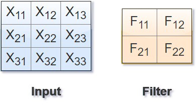
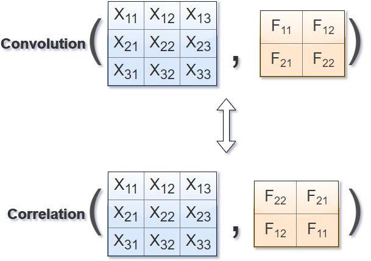
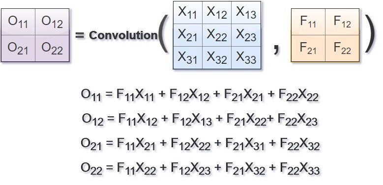
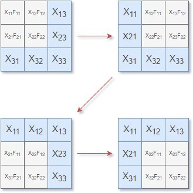
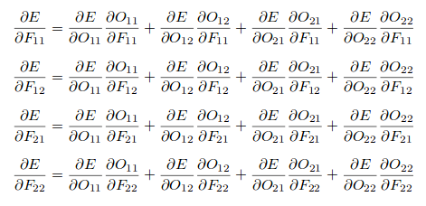
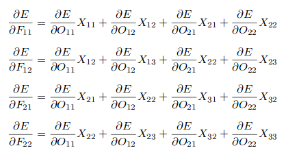
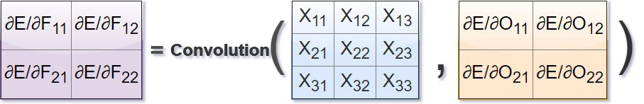
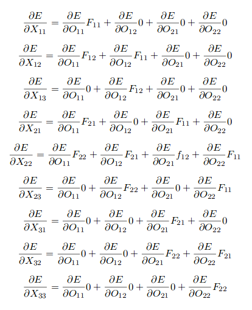
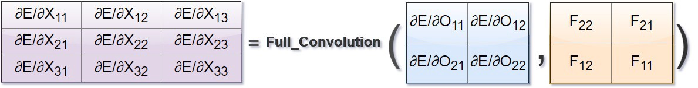
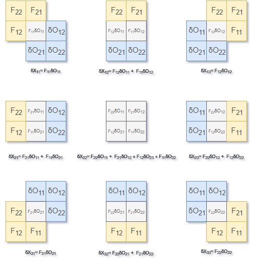

# Phân biệt Convolution và Correlation
Giả sử có một Input và Filter cho CNN như sau:

    

Correlation được tính như sau:

    

Cách tính Convolution cũng giống như correlation với việc xoay filter 180 độ và tính toán giống như correlation với Filter xoay được:

    

# Convolution Forward và Backward
**_Chú ý_: Để đơn giản hoá quá trình tính toán của Input và Filter cho việc tính đạo hàm sau này, ta coi như phép toán convolution là giống correlation**

Tích chập sẽ được tính như sau:

    

Quá trình tính toán có thể được thể hiện như hình dưới:

    

## Tính đạo hàm của loss function theo F

    

và bằng:

    

Ta có thể viết lại đạo hàm theo F của hàm lỗi bằng tích chập như sau:

    

## Tính đạo hàm của loss function theo X
Đạo hàm theo X được tính như sau:

    

Công thức tính đạo hàm ở trên có thể được viết lại bằng một operation gọi là Full_Convolution. Để tính được đạo hàm theo X, ta cần phải quay Filter 180 độ và tính Full_Convolution của filter đã xoay bằng chain rule. Được tính toán như sau:

    

Cụ thể:

    

