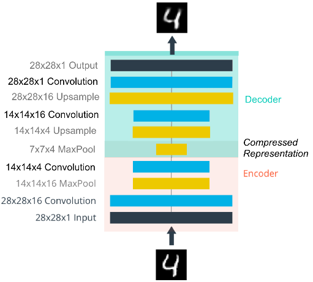
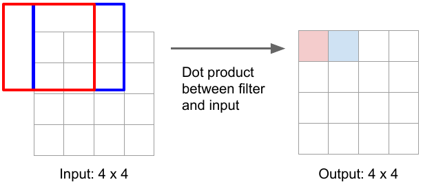
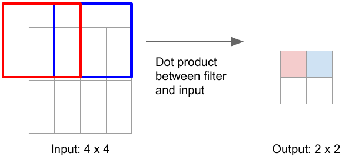
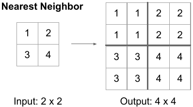
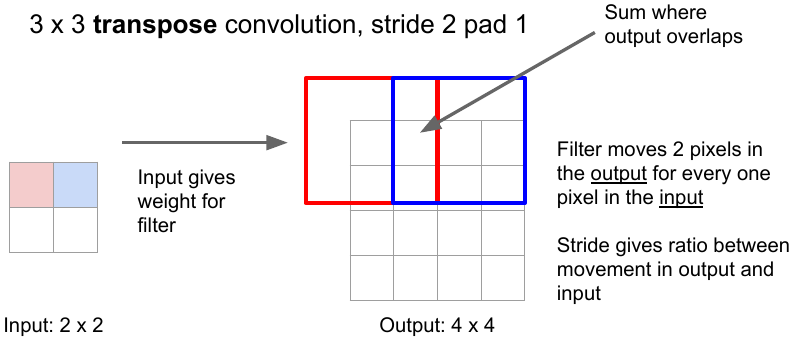

# Downsampling and Upsamping in CNN

In Convolutional autoencoder, the Encoder consists of convolutional layers and pooling layers, which downsamples the input image. The Decoder upsamples the image. The structure of convolutional autoencoder looks like this:

## Downsampling (Convolution)

The normal convolution (without stride) operation gives the same size output image as input image e.g. 3x3 kernel (filter) convolution on 4x4 input image with stride 1 and padding 1 gives the same-size output. 

But strided convolution results in downsampling i.e. reduction in size of input image e.g. 3x3 convolution with stride 2 and padding 1 convert image of size 4x4 to 2x2.

## Upsampling

One of the ways to upsample the compressed image is by **Unpooling** (the reverse of pooling) using Nearest Neighbor or by max unpooling.

Another way is to use **transpose convolution**. The convolution operation with strides results in downsampling. The transpose convolution is reverse of the convolution operation. Here, the kernel is placed over the input image pixels. The pixel values are multiplied successively by the kernel weights to produce the upsampled image. In case of overlapping, the values are summed. The kernel weights in upsampling are learned the same way as in convolutional operation that’s why it’s also called learnable upsampling.

One other way is to use nearest-neighbor upsampling and convolutional layers in Decoder instead of transpose convolutional layers. This method prevents checkerboard artifacts in the images, caused by transpose convolution.