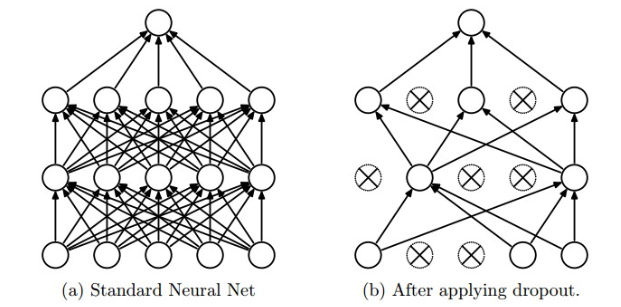

# Dropout
Dropout is an extremely effective, simple and recently introduced regularization technique by Srivastava et al. in Dropout: A Simple Way to Prevent Neural Networks from Overfitting (pdf) that complements the other methods (L1, L2, maxnorm). While training, dropout is implemented by only keeping a neuron active with some probability ***p*** (a hyperparameter), or setting it to zero otherwise.

<p align="center">
    
</p>

Vanilla dropout in an example 3-layer Neural Network would be implemented as follows:

```python
""" Vanilla Dropout: Not recommended implementation (see notes below) """

p = 0.5 # probability of keeping a unit active. higher = less dropout

def train_step(X):
  """ X contains the data """
  
  # forward pass for example 3-layer neural network
  H1 = np.maximum(0, np.dot(W1, X) + b1)
  U1 = np.random.rand(*H1.shape) < p # first dropout mask
  H1 *= U1 # drop!
  H2 = np.maximum(0, np.dot(W2, H1) + b2)
  U2 = np.random.rand(*H2.shape) < p # second dropout mask
  H2 *= U2 # drop!
  out = np.dot(W3, H2) + b3
  
  # backward pass: compute gradients... (not shown)
  # perform parameter update... (not shown)
  
def predict(X):
  # ensembled forward pass
  H1 = np.maximum(0, np.dot(W1, X) + b1) * p # NOTE: scale the activations
  H2 = np.maximum(0, np.dot(W2, H1) + b2) * p # NOTE: scale the activations
  out = np.dot(W3, H2) + b3
```

In the code above, inside the `train_step` function we have performed dropout twice: on the first hidden layer and on the second hidden layer. It is also possible to perform dropout right on the input layer, in which case we would also create a binary mask for the input `X`. The backward pass remains unchanged, but of course has to take into account the generated masks `U1,U2`.

Crucially, note that in the `predict` function we are not dropping anymore, but we are performing a scaling of both hidden layer outputs by **p**. This is important because at test time all neurons see all their inputs, so we want the outputs of neurons at test time to be identical to their expected outputs at training time. For example, in case of **p=0.5**, the neurons must halve their outputs at test time to have the same output as they had during training time (in expectation). To see this, consider an output of a neuron **x** (before dropout). With dropout, the expected output from this neuron will become **px+(1−p)= 0**, because the neuron’s output will be set to zero with probability **1−p**. At test time, when we keep the neuron always active, we must adjust **x→px** to keep the same expected output. It can also be shown that performing this attenuation at test time can be related to the process of iterating over all the possible binary masks (and therefore all the exponentially many sub-networks) and computing their ensemble prediction.

The undesirable property of the scheme presented above is that we must scale the activations by **p** at test time. Since test-time performance is so critical, it is always preferable to use **inverted dropout**, which performs the scaling at train time, leaving the forward pass at test time untouched. Additionally, this has the appealing property that the prediction code can remain untouched when you decide to tweak where you apply dropout, or if at all. Inverted dropout looks as follows:

```python
""" 
Inverted Dropout: Recommended implementation example.
We drop and scale at train time and don't do anything at test time.
"""

p = 0.5 # probability of keeping a unit active. higher = less dropout

def train_step(X):
  # forward pass for example 3-layer neural network
  H1 = np.maximum(0, np.dot(W1, X) + b1)
  U1 = (np.random.rand(*H1.shape) < p) / p # first dropout mask. Notice /p!
  H1 *= U1 # drop!
  H2 = np.maximum(0, np.dot(W2, H1) + b2)
  U2 = (np.random.rand(*H2.shape) < p) / p # second dropout mask. Notice /p!
  H2 *= U2 # drop!
  out = np.dot(W3, H2) + b3
  
  # backward pass: compute gradients... (not shown)
  # perform parameter update... (not shown)
  
def predict(X):
  # ensembled forward pass
  H1 = np.maximum(0, np.dot(W1, X) + b1) # no scaling necessary
  H2 = np.maximum(0, np.dot(W2, H1) + b2)
  out = np.dot(W3, H2) + b3
  ```