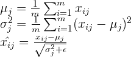
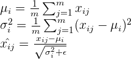

# The limitations of batch normalization
Though batch normalization is an effective tool, it is not without its limitations. The key limitation of batch normalization is that it is **dependent on the mini-batch**.

If you recall, batch normalization computes the mean and variance of each mini-batch and normalizes each feature according to the mini-batch statistics. This means that the mean and variance will differ for each mini-batch. This dependency causes two main problems:

1. It puts a **lower limit on the batch size**

Obviously, batch normalization cannot be used when the batch size is 1, but even slightly larger batch sizes can cause problems. Ideally, we want to use the global mean and variance to normalize the inputs to a layer. However, computing the mean across the entire dataset after each update of the network is far too costly. This is why we *estimate* the mean and variance using mini-batch statistics. The fact that the mean and variance are simply estimates means that they contain a certain amount of error and will vary from mini-batch to mini-batch. Smaller mini-batch sizes increase the variance of these estimates, meaning we have to be extra careful about the batch size when using SGD with batch normalization.

2. It makes batch normalization **difficult to apply to recurrent connections** in recurrent neural network

In a recurrent neural network, the recurrent activations of each time-step will have different statistics. This means that we have to fit a separate batch normalization layer for each time-step. This makes the model more complicated and – more importantly – it forces us to store the statistics for each time-step during training.

 

The lower limit on batch size can be a problem in settings such as online learning (where single examples are processed at individually) and reinforcement learning which is highly sensitive to noise. The difficulty of applying batch normalization to recurrent layers is a huge problem, considering how widely recurrent neural networks are used.

Considering how powerful normalization is, it is unfortunate that batch normalization cannot be used in certain settings. Fortunately, some outstanding researchers have developed alternatives to batch normalization that address these concerns. Weight and layer normalization are approaches to normalization that use statistics that are independent of the mini-batch. Let’s look at them in more detail.

# Layer Normalization
Layer normalization is a method developed by Geoffery Hinton. Compared to weight normalization, layer normalization is slightly harder to grasp intuitively.

To understand layer normalization, recall that a mini-batch consists of multiple examples with the same number of features. Mini-batches are matrices – or tensors if each input is multi-dimensional – where one axis corresponds to the batch and the other axis – or axes – correspond to the feature dimensions.

Batch normalization **normalizes the input features across the batch dimension**. The key feature of layer normalization is that it **normalizes the inputs across the features**.

The equations of batch normalization and layer normalization are deceptively similar:

Batch normalization

Layer normalization

where ***X_i_j*** is the i,j-th element of the input, the first dimension represents the batch and the second represents the feature (I have modified the notation from the original papers to make the contrast clearer).

The difference becomes a bit clearer when we visualize it:

In batch normalization, the statistics are computed across the batch and are the same for each example in the batch. In contrast, in layer normalization, the statistics are computed across each feature and are **independent of other examples**.

This means that layer normalization is not a simple reparameterization of the network, unlike the case of weight normalization and batch normalization, which both have the same expressive power as an unnormalized neural network. A detailed discussion of the differences this creates involves a lot of math and is beyond the scope of this article, so if you are interested please refer to the original paper.

## Advantages
The independence between inputs means that each input has a different normalization operation, allowing arbitrary mini-batch sizes to be used.

The experimental results show that layer normalization performs well for recurrent neural networks.