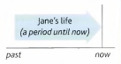
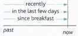

# Present Perfect

Tom is looking for his key. He can’t find it.

He **has lost** his key.

He **has lost** his key = He lost it recently, and he still
doesn't have it.

**Have/has lost** is the present perfect simple:

- I/you/we/they **have** (= I've etc.) + **V_ed** (V3)
- He/she/it **has** (= he's etc.) + **V_ed** (V3)

---
When we say that **'something has happened'**, this is usually new information:

- Ow! **I've cut** my finger.
- The road is closed. **There’s been (there has been)** an accident.

When we use the present perfect, there is a connection with *now*. The action in the past has a result *now*:

- Where's your key?' 'I don't know. **I've lost** it.' (= I don't have it now)
- He told me his name, but **I've forgotten** it. (= I can't remember it now).

---
Difference between gone (to) and been (to):

“Been to” means that you’ve traveled to some place and have already returned.

“Gone to” means that you’ve traveled to some place and haven’t returned yet.

- James is on holiday. He **has gone** to Italy. (= he is there now or on his way there)
- Jane is back home now. She **has been** to Italy. (= she has now come back).

---
You can use the present perfect with **just, already** and **yet**.

**Just** = a short time ago:

- ‘Are you hungry?' ‘No, I've **just had** lunch.'
- Hello. Have you **just arrived**?

We use **already** to say that something happened sooner than expected:

- ‘Don't forget to pay your electricity bill' ‘**I've already paid** it.'
- ‘What time is Mark leaving?' 'He's **already left**.'

**Yet** = until now. Yet shows that the speaker is expecting something to happen. Use **yet** only in questions and negative sentences:

- Has it stopped raining yet?
- I've written the email, but I haven't sent it yet.

---
Study this example conversation:

`Dave: Have you travelled a lot, Jane?`

`Jane : Yes, I've been to lots of places.`

`Dave: Really? Have you ever been to China?`

`Jane: Yes, I've been to China twice.`

`Dave: What about India?`

`Jane: No, I haven't been to India`

When we talk about a period of time that continues from the past until now, we use the *present
perfect* (**have been / have travelled** etc.). Here, Dave and Jane are talking about the places Jane
has visited in her life, which is a period that continues until *now*.

Some more examples:

- **Have** you ever **eaten** caviar?
- We've never **had** a car.
- ‘**Have** you **read** Hamlet?' 'No, I **haven't read** any of Shakespeare's plays.'
- Susan really loves that film. **She's seen** it eight times!
- What a boring film! It's the most boring film **I've ever seen**.

In the following examples too, the speakers are talking about a period that continues until now
(**recently / in the last few days / so far / since breakfast** etc.):

- **Have** you **heard** anything from Brian recently?
- I've **met** a lot of people in the last few days.
- Everything is going well. We **haven't had** any problems
so far.
- I'm hungry. I **haven't eaten** anything since breakfast.
(= from breakfast until now)
- It's good to see you again. We **haven't seen** each other for a long time.

In the same way we use the present perfect with **today / this evening / this year** etc. when these
periods are not finished at the time of speaking

- **I've drunk** four cups of coffee today.
- **Have you had** a holiday this year? today
- I **haven't seen** Tom this morning. Have you?
- Rob **hasn't worked** very hard this term.

---
We say: It’s the (first, second, third, etc.) time something **has happened**. For example:

- Don is having a driving lesson. It’s his first one.
It's the first time he **has driven** a car. (not drives)
(He has never driven a car before.)

- Sarah has lost her passport again. This is the second
time this **has happened**, (not happens)

- Bill is phoning his girlfriend again. That's **the third
time he's phoned** her this evening.