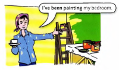
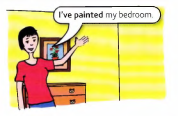

# Present Perfect + Present Perfect Continuous

| Present perfect continuous | Present perfect |
| -------------------------- | --------------- |
|  |  |

## Present perfect continuous

There is paint on Kate's clothes.

She **has been painting** her bedroom.

**Has been painting** is the present perfect
continuous.

We are thinking of the activity, it does not
matter whether it has been finished or not.
In this example, the activity (painting the
bedroom) has not been finished 

## Present perfect

Her bedroom was green. Now it is yellow.

She **has painted** her bedroom.

**Has painted** is the present perfect simple.

Here, the important thing is that something
has been finished. **Has painted** is a completed
action. We are interested in the result of
the activity (the painted bedroom), not the
activity itself.

---

| Present perfect continuous | Present perfect |
| -------------------------- | --------------- |
| My hands are very dirty. I **have been repairing** them | My bike is OK again now. I **have repaired** it. |
| Where have you been? Have you been playing tennis? | Have you ever played tennis? |

---

We use the continuous to say *how long*
(for something that is still happening):

- How long **have** you **been reading** that book?
- Lisa is writing emails. **She’s been writing** emails all morning
- **They've been playing** tennis since 2 o'clock

We use the simple to say how much, *how many
or how many times*:

- How much of that book **have** you **read**?
- Lisa is writing emails. **She's sent** lots of emails this morning.

---

Some verbs (for example, **know/like/believe**) are not normally used in the continuous:

- **I've known** about the problem for a long time, (not I've been knowing)
- How long **have** you **had** that camera? (not have you been having)