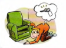
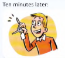
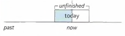
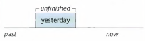

# Present perfect and past simple

**Example**:



Tom is looking for his key. He can't find it.

He **has lost** his key (*present perfect*)

This means that he doesn't have his key now.



Now Tom **has found** his key. He has it now.

**Has** he **lost** his key? - No. He **has found** it.

**Did** he **lose** his key? - Yes, he did.

He **lost** his key (*past simple*)

but now he **has found** it. (*present perfect*)

The present perfect (something **has happened**) is a *present* tense. It always tells us about the
situation now. 'Tom **has lost** his key' = he doesn't have his key *now*

The past simple (something **happened**) tells us only about the *past*. If somebody says Tom **lost** his
key', this doesn't tell us whether he has the key now or not. It tells us only that he lost his key at some
time in the past.

Do not use present perfect if the situation now is different. Compare:

- They **have gone** away. They'll be back on Friday (they are away now)
- They **went** away, but I think they're back at home now (*not* they've gone)
- It **has stopped** rainning now, so we don't need the umbrella (it isn't rainning *now*)
- It **stopped** rainning for a while, but now it's rainning again. (*not* it has stopped)

---

You can use the present perfect for new or recent happenings:

- ‘I've **repaired** the washing machine. It's working OK now.' ‘Oh, that's good.’
- ‘Sally **has had** a baby! It's a boy.' 'That's great news.'

Usually, you can also use the past simple:

- I **repaired** the washing machine. It's working OK now.

Use the past simple (not the present perfect) for things that are not recent or new:

- Mozart **was** a composer. He **wrote** more than 600 pieces of music.
- My mother **grew** up in Italy.

Compare:

- Did you know that somebody **has invented** a new type of washing machine?
- Who **invented** the telephone? (not has invented)

---

We use the present perfect to give new information. But if we continue to talk about it,
we normally use the past simple:

```
A : Ow! I've burnt myself.
B : How did you do that? (not have you done)
A : I picked up a hot dish. (not have picked)
```

```
A : Look! Somebody has spilt something on the sofa.
B : Well, it wasn't me. I didn't do it. (not hasn't been ... haven't done)
```

---

Do not use the present perfect (I have done) when you talk about a finished time (for example,
**yesterday / ten minutes ago / in 2005 / when I was a child**). Use a past tense:

- It **was** very cold **yesterday**, (not has been)
- Paul and Lucy **arrived ten minutes ago**. (not have arrived)
- **Did** you **eat** a lot of sweets **when you were a child**? (not have you eaten)
- I **got** home late **last night**. I **was** very tired and **went** straight to bed.

Use the past to ask **When** ... ? or **What time** ... ?:

- **When did** your friends **arrive**? (not have ... arrived)
-**What time did** you **finish** work?

Compare:

| *Present perfect* | *Past simple* |
| ----------------  | ------------- |
| Tom **has lost** his key. He can't get into the house | Tom **lost** his key **yesterday**. He couldn't get into the house |
| Is Carla here or **has** she **left**? | **When did** Carla **leave**? |

---

Compare:

| *Present perfect* (**have done**) | *Past simple* (**did**) |
| ----------------  | ------------- |
| I **have done** a lot of work **today** | I **did** a lot of work **yesterday** |
| We use the present perfect for a period of time that continue *until now*. For example: **today / this week / since 2007** | We use the past simple for a *finished* time in the past. For example: **yesterday / last week / from 2007 to 2010** |
|  |  |
| It **hasn't rained this week** | It **didn't rain last week** |
| **Have** you **seen** Anna **this morning**? (it's still morning) | **Did** you **see** Anna **this morning** (its now afternoon or evening) |
| **Have** you **seen** Tim **recently**? | **Did** you **see** Tim **on Sunday** |
| I don't know where Lisa is. I **haven't seen** her (I haven't seen her recently) | I **saw** Lisa at the party **on Sunday** |
| We **have been waitting** for an hour (we're still waitting) | We **waited** (*or* were waitting) for an hour. (we're no longer waitting) |
| I **have never played** golf (in my life) | I **didn't play** golf **last summer** |
| (*It's the last day of your holiday*) It **has been** a really good holiday. **I've really** enjoyed it. | (*After you come back from holiday*) It **was** a really good holiday. I really **enjoyed** it. |
