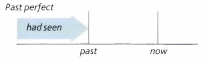

# Past perfect

Sarah went to a party last week. Paul went to the
party too, but they didn't see each other.

Paul left the
party at 10.30 and Sarah arrived at 11 o'clock.

So:

When Sarah arrived at the party, Paul wasn't there.

He **had gone** home.

**Had gone** is the past perfect (simple):

- I/we/they/you/he/she/it + **had** (I'd / He'd etc.) + **V_ed** (V3)

---

The past perfect simple is **had** + *past participle* (**gone/seen/finished** etc).

Sometimes we talk about something that happened in the past:

- Sarah **arrived** at the party.

This is the starting point of the story. Then, if we want to talk about things that happened before this
time, we use the past perfect (**had** ...):

- When Sarah arrived at the party, Paul **had** already **gone** home.

Some ex:

- When we got home last night, we found that somebody **had broken** into the flat.
- Karen didn't want to go to the cinema with us because **she'd already seen** the movie.
- At first I thought **I'd done** the right thing, but I soon realised that **I'd made** a big mistake.
- The man sitting next to me on the plane was very nervous. He **hadn't flown** before.

---

Compare the *present perfect* (**have seen** etc.) and the *past perfect* (**had seen** etc.)

| *Present perfect* | *Past perfect* |
| ----------------  | -------------- |
|  |  |
| Who is that woman? I **have seen** her before, but I can't remember where | I wasn't sure who she was. I **had seen** her before, but I couldn't remember where |
| We aren't hungry. We **have just had** lunch | We weren't hungry. We **had just had** lunch. |

---

Compare the *past simple* (**left, was** etc.) and the *past perfect* (**had left, had been** etc.)

Past simple:

- Was Tom there when you arrived? - Yes, but he **left** soon afterwards.

Past perfect:

- Was Tom there when you arrived? - No. He **had already left**.
