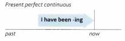
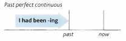

# Past perfect continuous

Yesterday morning I got up and looked out of the window.
The sun was shining, but the ground was very wet.

It **had been raining**.

It **was not raining** when I looked out of the window;
the sun was shining. But it had been raining before.

**Had been V-ing** is the past *perfect continuous*:

- I/we/you/they/he/she/it + **had been** + **V-ing**

---

Example:

- When the boys came into the house, their clothes were dirty, their hair was untidy and one of
them had a black eye. They'd **been fighting**.
- I was very tired when I got home. I'd **been working** hard all day.
- When I went to Madrid a few years ago, I stayed with a friend of mine. She **hadn't been living** there very long, but she knew the city very well

---

You can say that something **had been happening** for a period of time before something else happened:

- We'd **been playing** tennis for about half an hour when it started to rain heavily.
- J Paul went to the doctor last Friday. He **hadn't been feeling** well for some time.

---

|  |  |
| -------------------- | -------------------- |
|I hope the bus comes soon. I've **been waiting** for 20 minutes. (*before now*) | At last the bus came. I'd **been waiting** for 20 minutes, (*before the bus came*) |
| James is out of breath. He **has been running**. | James was out of breath. He **had been running**. |

---

Compare with *past continuous* (**was/were V-ing**):

- It **wasn't raining** when we went out. The sun was shining. But it **had been raining**,
so the ground was wet.
- Katherine **was sitting** in an armchair resting. She was tired because she'd **been working**
very hard.

---

Some verbs (for example, **know** and **like**) are not normally used in the continuous:

- We were good friends. We **had known** each other for years. (not had been knowing)
- I was surprised when Lisa cut her hair. She'd **had** long hair since I first met her.
(not she'd been having)
