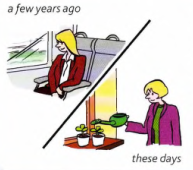
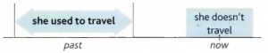

# Used to (do)

Nicola doesn't travel much these days.

She prefer to stay at home.

But she **used to travel** a lot.

She **used to go** away two or three times a year.

She **used to travel** alot ⇒ she travelled a lot often in the past, but she doesn't do this anymore.

---

Something **used to** happen = it happened often in the past, but no longer happens:

- I **used to play** tennis a lot, but I don't play very much now.
- David **used to spend** a lot of money on clothes. These days he can't afford it.
- ‘Do you go to the cinema much?' 'Not now, but **I used to**.' (= I used to go)

We also use **used to** ... for things that were true, but are not true any more:

- This building is now a furniture shop. It **used to be** a cinema.
- I **used to think** Mark was unfriendly, but now t realise he's a very nice person.
- I've started drinking tea recently. I never **used to like** it before.
- Lisa **used to have** very long hair when she was a child.

---

'I **used to do** something' is past. There is no present. You cannot say ‘I use to do'.

To talk about the present, use the present simple (**I do**)

Compare:

| *past* | *present* |
| ------ | --------- |
| he **used to play** | he **plays** |
| we **used to live** | we **live** |
| there **used to be** | there **is** |

- We **used to live** in a small village, but now we **live** in London.w
- There **used to be** four cinemas in the town. Now there **is** only one

---

The normal question form is **did** (you) **use** to ...?

- **Did** you **use to eat** of sweets when you were a child?

The negative form is **didn't use to** ... (**used not to** ... is also possible)

- **I didn't use to like** him (*or* I **used not to like** him)

---

