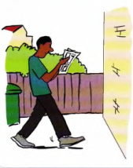
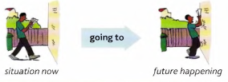

# (I'm) going to (do)

**I am going to do** something = ! have already decided to do it, I intend to do it:

- **‘Are** you **going to eat** anything?’ ‘No, I'm not hungry.'

- `A: I hear Sarah has won some money. What is she going to do with it?`

    `B: She's going to buy a new car.`

- I'm just **going to make** a quick phone call. Can you wait for me?
- This cheese smells horrible. **I'm not going to eat** it.

---

*I am doing* and *I am going to do*

We use **I am doing** (present continuous) when we say what we have *arranged* to do - for example,
arranged to meet somebody, arranged to go somewhere:

- What time are you meeting Ann this evening?
- I'm leaving tomorrow. I've got my plane ticket.

**I am going to do** something = I've decided to do it (but perhaps not *arranged* to do it):

- ‘Your shoes are dirty.' - ‘Yes, I know. I'm **going to clean** them.' (= I've decided to clean
them, but I haven'tarranged to clean them)
- I've decided not to stay here any longer. Tomorrow I'm **going to look** for somewhere
else to stay.

Often the difference is very small and either form is possible.

---

You can also say that ‘something **is going to happen**' in the future. For example:

The man isn't looking where he is going.

He is **going to walk** into the wall.

When we say that ‘something **is going to happen**',
the situation now makes this clear. The man is walking
towards the wall now, so we can see that he is **going to
walk** into it.

Some more examples:

- Look at those black clouds! It's **going to rain**, (the clouds are there now)
- I feel terrible. I think I’m **going to be** sick. (I feel terrible now)
- The economic situation is bad now and things are **going to get** worse.

---

I **was going to do** something = I intended to do it, but didn't do it:

- We **were going to travel** by train, but then we decided to go by car instead.
- Peter **was going to do** the exam, but he changed his mind.
- I **was** just **going to cross** the road when somebody shouted 'Stop!

You can say that ‘something **was going to happen**' (but didn't happen):

- I thought it **was going to rain**, but it didn't.
