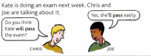

# Will / Shall

We use **will** when we've just decided to do something. When we say **I'll** do something, we announce our decision:

- Oh. I've left the door open. **I'll go** and shut it.
- 'What would you like to drink?' - '**I'll have** an orange juice, please.'
- ‘Did you phone Lucy?' ‘Oh no, I forgot. **I'll phone** her now.

You cannot use the present simple (**I do / I go** etc.) in these sentences:

- **I'll go** and shut the door, (not I go and shut)

We often use **I think I'll** ... and **I don't think I'll** ... :

- I feel a bit hungry. **I think I'll** have something to eat.
- **I don't think I'll** go out tonight. I'm too tired.

---

Do *not* use **will** to talk about what you decided before:

- **I'm going** on holiday next Saturday, (not I'll go)
- **Are** you **working** tomorrow? (not Will you work)

---

We *often* use **will** in these situations:

1. *Offering to do something*:

- That bag looks heavy. **I'll help** you with it. (*not* I help)

2. *Agreeing to do something*:

- 'Can you give Tim this book?' - 'Sure, **I'll give** it to him when I see him this afternoon.'

3. *Promising to do something*:

- Thanks for lending me the money. **I'll pay** you back on Friday.
- **I won't tell** anyone what happened. I promise.

4. *Asking somebody to do something (**Will you** ... ?)*

- **Will you** please turn the music down? I'm trying to concentrate.

You can use **won't** to say that somebody refuses to do something:

- I've tried to give her advice, but she **won't listen**.

- The car **won't start**. (= the car ‘refuses' to start)

---

**Shall I... ? Shall we... ?**

Shall is used mostly in the questions **shall I ... ? / shall we ... ?**

We use **shall I ... ? / shall we ... ?** to ask somebody's opinion (especially in offers or suggestions):

- **Shall I** open the window? (= Do you want me to open the window?)

- I've got no money. What **shall I** do? (= What do you suggest?)

- ‘**Shall we** go?' ‘Just a minute. I'm not ready yet.'

- ‘Where **shall we** have lunch?' 'Let's go to Marino's.'

Compare **shall I ... ?** and **will you ... ?**:

- **Shall I** shut the door? (= Do you want me to shut it?)

- **Will you** shut the door? (= I want you to shut it)

---

We do not use **will** to say what somebody has already arranged or decided to do:

- Diane **is working** next week, (*not* Diane will work)

- **Are** you **going to watch** anything on TV this evening? (*not* Will you watch)

But often, when we talk about the future, we are *not* talking about what somebody has decided to do.

For example:

**She'll pass** does not mean ‘she has
decided to pass'. Joe is saying what
he knows or believes will happen.
He **is predicting** the future.
When we predict a future happening
or situation, we use **will/won't.**

---

Some more examples:

- They’ve been away a long time. When they return, **they'll find** a Lot of changes here.
- ‘Where **will** you **be** this time next year?’ ' **I'll** be in Japan.'
- That plate is hot. If you touch it, **you'll burn** yourself.
- Tom **won't pass** the exam. He hasn't studied hard enough.
- Anna looks completely different now. You **won't recognise** her.
- When **will** you **get** your exam results?

---

We often use **will** (**'ll**) with:

`probably`

`(I'm) sure`

`(I) think`

`(I don't) think`

`I wonder`

Example: 

- **I'll probably** be home Late tonight.
- Don't worry about the exam. I'm **sure** **you'll pass.**
- Do you **think** Sarah **will like** the present we bought her?
- **I don't think** the exam **will** be very difficult.
- **I wonder** what **will** happen.

After **I hope**, we generally use the present (**will** is also possible):

- I hope Kate **passes** the exam, (or I hope Kate **will pass** ...)
- I hope it **doesn't rain** tomorrow.

---

Generally we use will to talk about the future, but sometimes we use will to talk about now.

For example:

- Don't phone Ann now. **She'll be** busy. (= she'll be busy now)

---

**I shall ... / we shall...**

Normally we use **shall** only with **I** and **we**. You can say:

**I shall** *or* **I will (I'll)** / **we shall** *or* **we will (we'll)**

- **I shall** be late this evening, (*or* **I will** be)
- **We shall** probably go to France in June, (*or* **We will** probably go)

The negative of shall is shall not or shan't:

- **I shan't** be here tomorrow, (*or* **I won't be**)

Do not use **shall** with **he/she/it/you/they**:

- She **will** be very angry, (*not* She shall be)