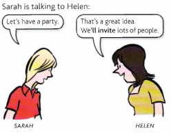
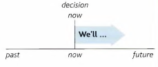
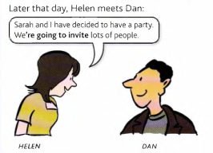
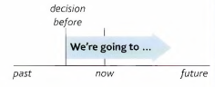

# I'll and I'm going to

Future actions.

The difference between **will** and **(be) going to**

**will ('ll)**: We use **will** to announce a new decision. The party is a new idea.

---

**(be) going to**: We use **(be) going to** when we have *already decided* to do something. Helen had already decided invite a lots of people *before* she spoke to Dan.

Compare:

| **will** | **(be) going to** |
| -------- | ----------------- |
| 'Gary phoned while you were out.' ‘OK. **I'll call** him back. | 'Gary phoned while you were out.’ 'Yes, I know. **I'm going to call** him back. |
| 'Anna is in hospital.' 'Oh really? I didn't know. **I'll go** and visit her. | ‘Anna is in hospital.' ‘Yes, I know. **I'm going to visit** her this evening |

---

Future happenings and situations (predicting the future)

We use both **will** and **going to** to predict future happenings and situations. So you can say:

- 【I think the weather **will be** nice later】 *or*
【I think the weather **is going to** be nice later.】

- 【Those shoes are well-made. **They'll last** a long time.】 *or*
【Those shoes are well-made. **They're going to last** a long time.】

When we say something **is going to** happen, we know this from the situation now. What is happening
*now* shows that something is going to happen in the future. For example:

- Look at those black clouds. It's **going to rain**, (*not* It will rain)

    (We can see that it **is going to rain** from the clouds that are in the sky *now*.)

- I feel terrible. I think **I'm going to be** sick, (*not* I think I'll be sick)

    (I think *I'm going to be sick* because I feel terrible *now*.)

Do not use **will** in this type of situation.
