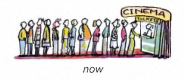
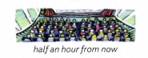
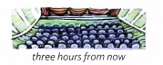

# Will be doing / Will have done

Example:

These people are standing in a queue to get into the cinema.

Half an hour from now, the cinema will be full. Everyone **will be watching** the film

Three hours from now, the cinema will be empty.

The film **will have finished**.

Everyone **will have gone** home.

---

**I will be doing** something (*future continuous*) = I will be in the middle of doing it:

- This time next week I'll be on holiday. **I'll be lying** on the beach or **swimming** in the sea.

- You have no chance of getting the job. **You'll be wasting** your time if you apply for it.

Compare **will be (do)ing** and **will (do)**:

- Don't phone between 7 and 8. **We'll be having** dinner.

- Let's wait for Liz to arrive and then **we'll have** dinner.

Compare **will be -ing** with other continuous forms:

- At 10 o'clock yesterday, Sally *was* in her office. She **was working**, (*past*)

- It's 10 o'clock now. She *is* in her office. She **is working**, (*present*)

- At 10 o'clock tomorrow, she *will* be in her office. She **will be working**.

---

We also use will be -ing to talk about complete actions in the future.

For example:

- The government **will be making** a statement
about the crisis later today.

- **Will** you **be going** away this summer?

- Later in the programme, **I'll be talking** to the
Minister of Education ...

- Our best player is injured and **won't be playing**
in the game on Saturday.

In these examples **will be -ing** is similar to **(be) going to** ...

---

We use **will have (done)** (*future perfect*) to say that something will already be complete before a time
in the future. For example:

- Sally always leaves for work at 8.30 in the morning. She won't be at home at 9 o'clock -
**she'll have gone** to work.

- We're late. The film **will already have started** by the time we get to the cinema.

Compare **will have (done)** with other perfect forms:

- Ted and Amy **have been married** for 24 years. (*present perfect*)

- Next year they **will have been** married for 25 years.

- When their son was born, they **had been** married for three years.(*past perfect*)
