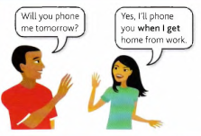

# When I do / When I've done / When and if

'*I'll phone you when I get home*' is a sentence with two parts:

| Part | Content |
| - | - |
| *the main part* | **I'll** phone you |
| *the **when**-part* | **when** I **get** home |

The time in the sentences is future (tomorrow), but we use a *present tense* (I **get**) in the **when**-part of the sentences.

We do not use **will** in the **when**-part of the sentences.

*Example*:

- **We'll go** out **when** it **stops** raining. (*not* when it will stop)

- **When** you **are** in London again, come and see us. (*not* When you will be)

- (*said to a child*) What do you want to be **when** you **grow** up? (*not* will grow)

The same thing happens after **while / before / after / as soon as / until** or **till**:

- What are you going to do **while I'm** away? (*not* while I will be)

- I'll probably go back home on Sunday. **Before I go**, I'd like to visit the museum.

- Wait here **until** (or **till**) **I come** back.

---

You can also use the present perfect (**have done**) after **when / after / until / as soon as**:

- Can I borrow that book **when** **you've finished** with it?

- Don't say anything while Ian is here. Wait **until he has gone**

If you use the present perfect, one thing must be complete before the other (so the two things do not
happen together):

- **When I've phoned** Kate, we can have dinner.

    (= First I'll phone Kate and *after that* we can have dinner.)

Do not use the present perfect if the two things happen together:

- **When I phone** Kate, I'll ask her about the party, (*not* When I've phoned)

It is often possible to use either the present simple or the present perfect:

- I'll come **as soon as I finish**.

    *or* I'll come **as soon as I’ve finished**.

- You'll feel better **after you have** something to eat.

    *or* You'll feel **better after you've had**
something to eat.

---

After **if**, we normally use the present simple (**if I do / if I see** etc.) for the future:

- It's raining hard. We'll get wet **if** we **go** out. (*not* if we will go)
- I'll be angry **if** it **happens** again, (not if it will happen)
- Hurry up! **If** we **don't** hurry, we'll be late.

---

**When** and **if**

We use **when** for things which are sure to happen:

- I'm going out later, (for sure) **When** I go out, I'll get some bread.

We use **if** (not when) for things that will *possibly* happen:

- I might go out later, (it's possible) **If** I go out, I'll get some bread.
- **If** it is raining this evening, I won't go out. (*not* When it is raining)
- Don't worry **if** I'm late tonight, (*not* when I'm late)
- **If** they don’t come soon, I'm not going to wait, (*not* When they don't come)
