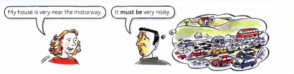
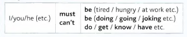
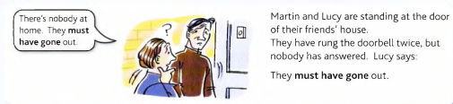
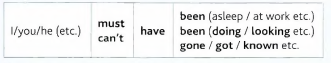

# Must and Can't

You can use **must** to say that you believe something is certain:

- You've been travelling all day. You **must be** tired. (Travelling is tiring and you’ve been
travelling all day, so you **must** be tired.)

- 'Joe is a hard worker.' ‘Joe? You **must be joking**. He doesn't do anything.'

- Louise **must get** very bored in her job. She does the same thing every day.

- I'm sure Sally gave me her address. I **must have** it somewhere.

You can use **can't** to say that you believe something is not possible:

- You've just had lunch. You **can't be** hungry already. (People are not normally hungry just
after eating a meal. You've just eaten, so you can’t be hungry.)

- They haven't lived here for very long. They **can't know** many people.

Study the structure:

---

For the past we use **must have (done)** and **can't have (done)**.

Study this example:

- ‘We used to live very near the motorway.' ‘Did you? It **must have been** noisy.'

- ‘I've lost one of my gloves.' ‘You **must have dropped** it somewhere.'

- Sarah hasn't contacted me. She **can't have got** my message.

- Tom walked into a wall. He **can't have been** looking where he was going.

Study the structure:

You can use **couldn't have** instead of **can't have**:

- Sarah **couldn't have** got my message.

- Tom **couldn't have** been looking where he was going.