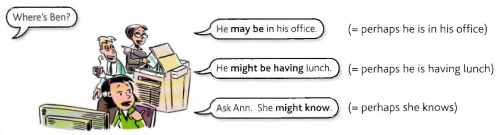
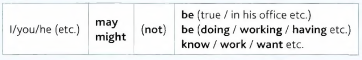
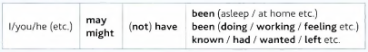
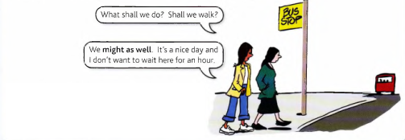

# May and Might

Study this example situation:

You are looking for Ben. Nobody is sure where he is, but you get some suggestions

We use **may** or **might** to say that something is possible. Usually you can use **may** or **might**, so you
can say:

- It **may be** true, *or* It **might be** true. (= perhaps it is true)

- She **might know**, or She **may know**.

The negative forms are **may not** and **might not** (or **mightn't**):

- It **may not be** true. (= perhaps it isn't true)

- She **might not work** here any more. (= perhaps she doesn't work here)

Study the structure:

---

For the past we use **may have (done)** or **might have (done)**:

- `A` : I wonder why Kate didn't answer her phone.

    `B` : She **may have been** asleep. (= perhaps she was asleep)

- `A` : I can't find my phone anywhere.

    `B` : You **might have left** it at work. (= perhaps you left it at work)

- `A` : Why wasn't Amy at the meeting yesterday?

    `B` : She **might not have known** about it. (= perhaps she didn't know)

- `A` : I wonder why David was in such a bad mood yesterday.

    `B` : He **may not have been** feeling well. (= perhaps he wasn't feeling well)

Study the structure:

---

**Could** is similar to **may** and **might**:

- It's a strange story, but it **could be** true. (= it is possible that it's true)

- You **could have left** your phone at work. (= it's possible that you left it there)

But **couldn't** (*negative*) is different from **may not** and **might not**. Compare:

- Sarah **couldn't have got** my message. Otherwise she would have replied.

    (= it is not possible that she got my message)

- I wonder why Sarah hasn't replied to my message. I suppose she **might not have got** it.

    (= it's possible that she didn't get it - so perhaps she did, perhaps she didn't)

---

We use **may** and **might** to talk about possible actions or happenings in the future:

- I haven't decided yet where to go on holiday. I **may go** to Ireland. (= perhaps I will go there)

- Take an umbrella with you. It **might rain** later. (= perhaps it will rain)

- The bus isn't always on time. We **might have** to wait a few minutes. (= perhaps we will
have to wait)

The negative forms are **may not** and **might not** (**mightn't**):

- Amy **may not go** out tonight. She isn't feeling well. (= perhaps she will not go out)

- There **might not be** enough time to discuss everything at the meeting. (= perhaps there will
not be enough time)

Compare **will** and **may/might**:

- **I'll be** late this evening, (for sure)

- I **may/might be** late this evening, (possible)

---

Usually you can use **may** or **might**. So you can say:

- I **may go** to Ireland.

    *or* I **might go** to Ireland.

- Jane **might be** able to help you.

    *or* Jane **may be** able to help you.

But we use only **might** (not **may**) when the situation is not real:

- If they paid me better, I **might work** harder. (not I may work)

The situation here is not real because they do not pay me well, so I'm not going to work harder

---

There is a continuous form: **may/might be -ing**. Compare this with **will be -ing**:

- Don't phone at 8.30. **I'll be watching** the football on television.

- Don't phone at 8.30. **I might be watching** (*or* **I may be watching**) the football on TV.
(= perhaps I'll be watching it)

We also use **may/might be -ing** for possible plans. Compare:

- **I'm going to** Ireland in July. (for sure)

- **I might be going** (*or* **I may be going**) to Ireland soon. (possible)

But you can also say '**I might go / I may go** ...' with little difference in meaning.

---

## Might as well

Helen and Clare have just missed the bus. The buses run every hour.

We **might as well** do something = We should do
it because there is no better alternative. There
is no reason not to do it.

**May as well** is also possible.

- `A` : What time are you going out?

    `B` : Well, I'm ready, so I **might as well** go now.

- Buses are so expensive these days, you **might as well** get a taxi. (= taxis are as good,
no more expensive)