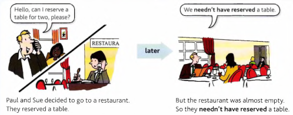

# Must, Musn't, Needn't

## Must and Musn't

You **must** do something = it is necessary that you do it:

- Don't tell anybody what I said. You **must keep** it a secret.

- We haven't got much time. We **must hurry**.

You **mustn't** do something = it is necessary that you do *not* do it (so don't do it):

- You must keep it a secret. You **mustn't tell** anyone. (= don't tell anyone)

- We must be very quiet. We **mustn't make** any noise

---

## Needn't and don't need to

You **needn't** do something = it's not necessary to do it (but you can if you like):

- We've got plenty of time. We **needn't hurry**. (= it is not necessary to hurry)

- Joe can stay here. He **needn't come** with us. (= it is not necessary for him to come)

You can also use don't/doesn't need to:

- We **don’t need to hurry**.

Remember that we say **don't need to do / doesn't need to do**, but **needn't do** (*without* to).

---

## Needn't have (done)

Study this example situation:

Compare **needn't (do)** and **needn't have (done)**:

- Everything will be OK. You **needn't worry**, (it is not necessary)

- Everything was OK. You **needn't have worried**, (you worried, but it was not necessary)

---

## **Needn't have** (done) and **didn't need to** (do)

He **needn't have done** something = he did it, but now we know that it was not necessary:

- Why did he get up at 5 o'clock? He **needn't have got** up so early. He could have stayed in
bed longer.

- He **didn't need to** do something = it was not necessary to do it. It doesn't matter whether he did it
or not:

- He **didn't need to get up** early, so he didn't.

- He **didn't need to get up** early, but it was a beautiful morning, so he did.

He **didn't have to** ... is also possible in these example.
