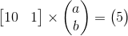
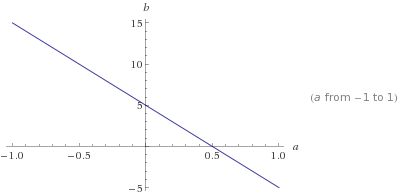
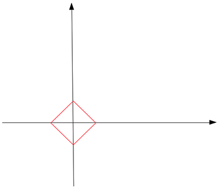
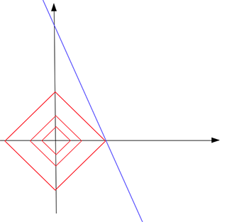
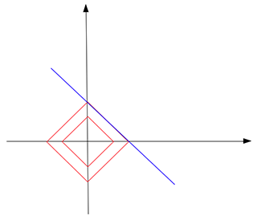
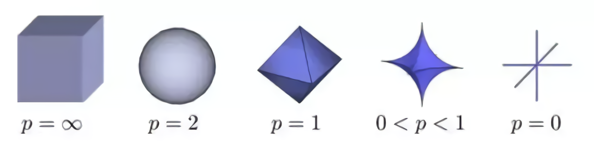

# L1 Regularization

For example: the problem of Ax = b. Suppose we want to find a line that matches a set of points in 2D space. We all know that you need at least 2 points to fix a line. But what if the training data has only one point? Then you will have infinite solutions: every line that passes through the point is a solution. Suppose the point is at [10, 5], and a line is defined as a function y = a * x + b. Then the problem is finding a solution to this equation:

Since b = 5 – 10 * a, all points on this following line b = 5 – 10 * a should be a solution:

But how to find the sparse one with L1 norm?

L1 norm is defined as the summation of absolute values of a vector’s all components. For example, if a vector is [x, y], its L1 norm is |x| + |y|.

Now if we draw all points that have a L1 norm equals to a constant c, those points should form something (in red) like this:

This shape looks like a tilted square. In high dimension space, it will be an octahedron. Notice that on this red shape, not all points are sparse. Only on the tips, points are sparse. That is, either x or y component of a point is zero. Now the way to find a sparse solution is enlarging this red shape from the origin by giving an ever-growing c to “touch” the blue solution line. The intuition is that the touch point is most likely at a tip of the shape. Since the tip is a sparse point, the solution defined by the touch point is also a sparse solution.

As an example, in this graph, the red shape grows 3 times till it touches the blue line b = 5–10 * a. The touch point, as you can see, is at a tip of the red shape. The touch point [0.5, 0] is a sparse vector. Therefore we say, by finding the solution point with the smallest L1 norm (0.5) out of all possible solutions (points on the blue line), we find a sparse solution [0.5, 0] to our problem. At the touch point, the constant c is the smallest L1 norm you could find within all possible solutions.

The intuition of using L1 norm is that the shape formed by all points whose L1 norm equals to a constant c has many tips (spikes) that happen to be sparse (lays on one of the axises of the coordinate system). Now we grow this shape to touch the solutions we find for our problem (usually a surface or a cross-section in high dimension). The probability that the touch point of the 2 shapes is at one of the “tips” or “spikes” of the L1 norm shape is very high. That’s why you want to put L1 norm into your loss function formula so that you can keep looking for a solution with a smaller c (at the “sparse” tip of the L1 norm). (So in the real loss function case, you are essentially shrinking the red shape to find a touch point, not enlarging it from the origin.)

Does L1 norm always touch the solution at a tip and find us a sparse solution? Not necessarily. Suppose we still want to find a line out of 2D points, but this time, the only training data is a point [1, 1000]. In this case, the solution line b = 1000 -a is in parallel to one of the edges of the L1 norm shape:

Eventually, they touch on an edge, not by a tip. Not only you can’t have a unique solution this time, most of your regularized solutions are still not sparse (other than the two tip points.)

But again, the probability of touching a tip is very high. I guess this is even more true for high dimension, real-world problems. As when your coordinate system has more axises, your L1 norm shape should have more spikes or tips. It must look like a cactus or a hedgehog! I can’t imagine.

If you push a person towards a cactus, the probability of he being pricked by the needles is pretty high. That’s also why they invented this pervert weapon and that’s why they want to use L1 norm.

But is the L1 norm the best kind of norm to find a sparse solution? Well, it turns out that the Lp norm when 0 <= p < 1 gives the best result. This can be explained by looking at the shapes of different norms:

As you can see, when p < 1, the shape is more “scary”, with more sharpen, outbreaking spikes. Whereas when p = 2, the shape becomes a smooth, non-threatening ball. Then why not letting p < 1? That’s because when p < 1, there are calculation difficulties.

In conclusion, over-fitting is a problem you see when your machine learning model is too large (has too many parameters) comparing to your available training data. In this case, the model tends to remember all training cases including noisy to achieve better training score. To avoid this, regularization is applied to the model to (essentially) reduce its size. One way of regularization is making sure the trained model is sparse so that the majority of it’s components are zeros. Those zeros are essentially useless, and your model size is in fact reduced.

The reason for using L1 norm to find a sparse solution is due to its special shape. It has spikes that happen to be at sparse points. Using it to touch the solution surface will very likely to find a touch point on a spike tip and thus a sparse solution.
