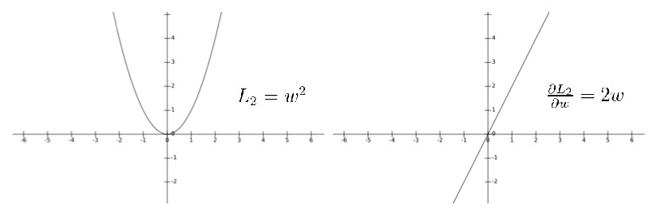

# L1 and L2 regularization

## What is regularization

In supervised machine learning, models are trained on a subset of data aka training data. The goal is to compute the target of each training example from the training data.

Now, overfitting happens when model learns signal as well as noise in the training data and wouldn’t perform well on new data on which model wasn’t trained on. In the example below, you can see underfitting in first few steps and overfitting in last few.

Now, there are few ways you can avoid overfitting your model on training data like cross-validation sampling, reducing number of features, pruning, regularization etc.

Regularization basically adds the penalty as model complexity increases. Regularization parameter (lambda) penalizes all the parameters except intercept so that model generalizes the data and won’t overfit.

In above gif as the complexity is increasing, regularization will add the penalty for higher terms. This will decrease the importance given to higher terms and will bring the model towards less complex equation.

Stay tuned for the next post which will cover the different type of regularization techniques.

## Mathematics

Consider that we have two loss functions L1 and L2 which represent L1 regularization and L2 regularization respectively.

Gradient descent is always used in optimizing neural networks. If we plot these two loss functions and their derivatives, it looks like this:

We can notice that for L1 regularization, the gradient is either 1 or -1 except when w=0, which means that L1 regularization will always move w towards zero with same step size (1 or -1) regardless of the value of w. And when w=0, the gradient becomes zero and no update will be made anymore. However, for L2 regularization things are different. L2 regularization will also move w towards zero but the step size becomes smaller and smaller which means that w will never reach zero.

This is the intuition behind L1 regularization’s sparsity. More mathematic details can be reached here.