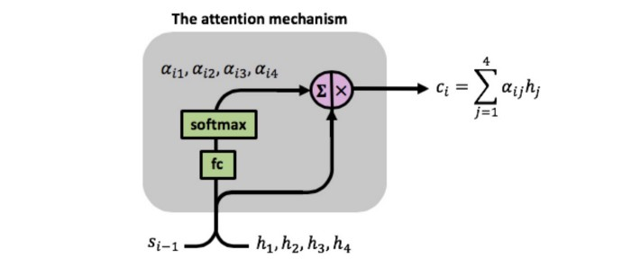
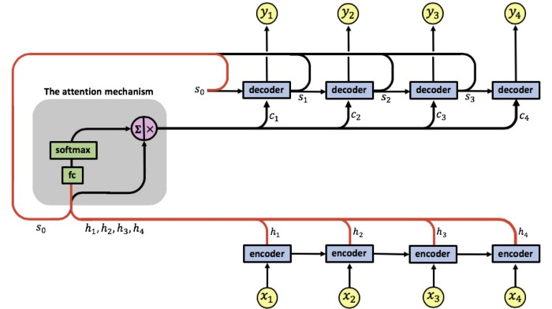
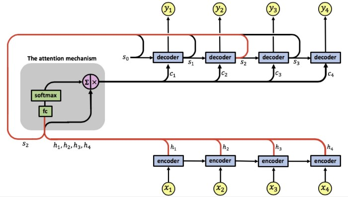

# Attention in RNNs

Attention is a mechanism combined in the RNN allowing it to focus on certain parts of the input sequence when predicting a certain part of the output sequence, enabling easier learning and of higher quality. Combination of attention mechanisms enabled improved performance in many tasks making it an integral part of modern RNN networks.

This work is based on the paper Neural machine translation by jointly learning to align and translate by Bahdanau, Cho, and Bengio.

We start by briefly going over basic RNNs. The RNN encoder-decoder architecture we will focus on looks like this:

The RNN encoder has an input sequence `x1`, `x2`, `x3`, `x4`. We denote the encoder states by `c1`, `c2`, `c3`. The encoder outputs a single output vector c which is passed as input to the decoder. Like the encoder, the decoder is also a single-layered RNN, we denote the decoder states by `s1`, `s2`, `s3` and the network’s output by `y1`, `y2`, `y3`, `y4`.

A problem with this architecture lies in the fact that the decoder needs to represent the entire input sequence `x1`, `x2`, `x3`, `x4` as a single vector `c`, which can cause information loss. Moreover, the decoder needs to decipher the passed information from this single vector, a complex task in itself.

## **RNNs with an attention mechanism**

An attention RNN looks like this:

Our attention model has a single layer RNN encoder, again with 4-time steps. We denote the encoder’s input vectors by `x1`, `x2`, `x3`, `x4` and the output vectors by `h1`, `h2`, `h3`, `h4`.

The attention mechanism is located between the encoder and the decoder, its input is composed of the encoder’s output vectors `h1`, `h2`, `h3`, `h4` and the states of the decoder `s0`, `s1`, `s2`, `s3`, the attention’s output is a sequence of vectors called context vectors denoted by `c1`, `c2`, `c3`, `c4`.

## **The context vectors**

**The context vectors enable the decoder to focus on certain parts of the input when predicting its output**. Each context vector is a weighted sum of the encoder’s output vectors `h1`, `h2`, `h3`, `h4`, each vector `hi` contains information about the whole input sequence (since it has access to the encoder states during its computation) with a strong focus on the parts surrounding the `i-th` vector of the input sequence. The vectors `h1`, `h2`, `h3`, `h4` are scaled by weights `ɑij` **capturing the degree of relevance of input** `xj` **to output at time** `i`, `yi`.

The context vectors `c1`, `c2`, `c3`, `c4` are given by:

The attention weights are learned using an additional fully-connected shallow network, denoted by `fc`, this is where the `s0`, `s1`, `s2`, `s3` part of the attention mechanism's input comes into play. Computation of the attention weights is given by:

The attention weights are learned using the attention fully-connected network and a softmax function:

As can be seen in the above image, the fully-connected network receives the concatenation of vectors `[si-1,hi]` as input at time step `i`. The network has a single fully-connected layer, the outputs of the layer, denoted by `eij`, are passed through a softmax function computing the attention weights, which lie in `[0,1]`.

Notice that we are using the same fully-connected network for all the concatenated pairs `[si-1,h1]`, `[si-1,h2]`, `[si-1,h3]`, `[si-1,h4]`, meaning there is a single network learning the attention weights.

The attention weights `αij` reflect the importance of `hj` with respect to the previous hidden state `si−1` in deciding the next state `si` and generating `yi`. **A large** `αij` **attention weight causes the RNN to focus on input** `xj` **(represented by the encoder’s output** `hj`**), when predicting the output** `yi`.

The `fc` network is trained along with the encoder and decoder using backpropagation, the RNN’s prediction error terms are backpropagated backward through the decoder, then through the `fc` attention network and from there to the encoder.

Notice that since the attention weights are learned using an additional neural network `fc`, we have an additional set of weights allowing this learning to take place, we denote this weight matrix by `Wa`.

An RNN with 4 input time steps and 4 output time steps will have the following weight matrices fine-tuned during the training process. Note the dimensions 4×4 of the attention matrix, connecting between every input to every output:

This mechanism enables the decoder to decide which parts of the input sequence to pay attention to. By letting the decoder have an attention mechanism, we relieve the encoder from having to encode all information in the input sequence into a single vector. The information can be spread throughout the sequence `h1`, `h2`, `h3`, `h4` which can be selectively retrieved by the decoder.

## **Computing the attention weights and context vectors**

Let’s go over a detailed example and see how the context vectors are computed.

The first act performed is the computation of vectors `h1`, `h2`, `h3`, `h4` by the encoder. These are then used as inputs of the attention mechanism. This is where the decoder is first involved by inputting its initial state vector `s0` and we have the first attention input sequence `[s0, h1]`, `[s0, h2]`, `[s0, h3]`, `[s0, h4]`.

The attention mechanism computes the first set of attention weights `α11`, `α12`, `α13`, `α14` enabling the computation of the first context vector `c1`. The decoder now uses `[s0,c1]` and computes the first RNN output `y1`

At the following time step the attention mechanism has as input the sequence `[s1, h1]`, `[s1, h2]`, `[s1, h3]`, `[s1, h4]`.

It computes a second set of attention weights `α21`, `α22`, `α23`, `α24` enabling the computation of the first context vector `c2`. The decoder uses `[s1,c2]` and computes the second RNN output `y2`.

At the next time step the attention mechanism has an input sequence `[s2, h1]`, `[s2, h2]`, `[s2, h3]`, `[s2, h4]`.

And computes a third set of attention weights `α31`, `α32`, `α33`, `α34` enabling the computation of the third context vector `c3`. The decoder uses `[s2,c3]` and computes the following output `y3`.

At the next time step the attention mechanism has an input sequence `[s3, h1]`, `[s3, h2]`, `[s3, h3]`, `[s3, h4]`.

It computes a fourth set of attention weights `α41`, `α42`, `α43`, `α44` enabling the computation of the fourth context vector `c4`. The decoder uses `[s3,c4]` and computes the final output `y4`.

We end with an example from the task is English-French machine translation. Below are two alignments found by the attention RNN. The x-axis and y-axis of each plot correspond to the words in the source sentence (English) and the generated translation (French), respectively.

Each pixel shows the weight `αij` of the `j-th` source word and the `i-th` target word, in grayscale (`0: black`, `1: white`).

We see how the attention mechanism allows the RNN to focus on a small part of the input sentence when outputting the translation. Notice how the larger attention parameters (given by the white pixels) connect corresponding parts of the English and French sentences enabling the network to achieve state of the art results.

## Reference

[Neural Machine Translation By Jointly Learning To Align And Translate. Dzmitry Bahdanau, KyungHyun Cho and Yoshua Bengio.](https://arxiv.org/abs/1409.0473)
