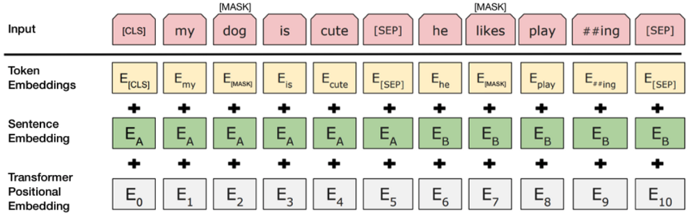

# BERT

## **Input Embedding**

BERT presents a few differences with the **Transformer** in how they handle input sequences with the objective of increasing the number of tasks the model can work on.

As you can see in image below, the components of the **Transformer** are still there: token embeddings and positional embeddings. However, this time they used pretrained token embeddings (WordPiece) and learned positional embeddings (which, as specified in Attention is All You Need, have similar performance to the positional embedding functions used in that paper). There are also some new tricks introduced by the authors:

- To be able to solve two sentence problems like question answering and next sentence prediction (Pre-training Task 2), they added a `[SEP]` token to mark the end of a sentence and added a sentence embedding (this embedding is constant for each sentence but different across two sentences). This allows the model to easily determine where one sentence ends and the other begins and to give different meanings to different sentences.

- To allow for classification tasks, the authors added a `[CLS]` token at the beginning of the input sequence, to be used only if classifying.

## **Pre-training**

The model was trained in two tasks simultaneously: **Masked Language Model** and **Next Sentence Prediction**.

### **Task 1: Masked Language Model**

The **Masked Language Model** asks the model to predict, not the next word for a sequence of words, but rather random words from within the sequence.

*How were tokens masked?*

In this specific case, 15% of the words that were fed in as input were masked. But not all tokens were masked in the same way. To explain how the tokens were masked, we will use the same example that the authors used in the paper: ‘*My dog is hairy*’. Let’s assume that this appearance of ‘*hairy*’ was among the tokens chosen to be replaced.

The tokens were replaced in the following way:

- 80% were replaced by the `<MASK>` token

    > *Example: “My dog is `<MASK>`”*

- 10% were replaced by a random token

    > *Example: “My dog is **apple”***

- 10% were left intact

    > *Example: “My dog is **hairy”***

*Why did they not use a `<MASK>` replacement token all around?*

If the model had been trained on only predicting `<MASK>` tokens and then never saw this token during fine-tuning, it would have thought that there was no need to predict anything and this would have hampered performance. Furthermore, the model would have only learned a contextual representation of the `<MASK>` token and this would have made it learn slowly (since only 15% of the input tokens are masked). By sometimes asking it to predict a word in a position that did not have a `<MASK>` token, the model needed to learn a contextual representation of all the words in the input sentence, just in case it was asked to predict them afterwards.

---
**QUESTION**: *Are not random tokens enough? Why did they leave some sentences intact?*

**ANSWER**: Well, ideally we want the model’s representation of the masked token to be better than random. By sometimes keeping the sentence intact (while still asking the model to predict the chosen token) the authors biased the model to learn a meaningful representation of the masked tokens.

**QUESTION**: *Will random tokens confuse the model?*

**ANSWER**: The model will indeed try to use the embedding of the random token to help in its prediction and it will learn that it was actually not useful once it sees the target (correct token). However, the random replacement happened in 1.5% of the tokens (10%*15%) and the authors claim that it did not affect the model’s performance.

**QUESTION**: *The model will only predict 15% of the tokens but language models predict 100% of tokens, does this mean that the model needs more iterations to achieve the same loss?*

**ANSWER**: Yes, the model does converge more slowly but the increased steps in converging are justified by an considerable improvement in downstream performance.

---

The model then attempts to predict the original value of the masked words, based on the context provided by the other, non-masked, words in the sequence. In technical terms, the prediction of the output words requires:

1. Adding a classification layer on top of the encoder output.

2. Multiplying the output vectors by the embedding matrix, transforming them into the vocabulary dimension.

3. Calculating the probability of each word in the vocabulary with softmax.

### **Task 2: Next Sentence Prediction**

This task consists on giving the model two sentences and asking it to predict if the second sentence follows the first in a corpus or not.

*Why is a second task necessary at all?*

The authors pre-trained their model in *Next Sentence Prediction* because they thought important that the model knew how to relate two different sentences to perform downstream tasks like question answering or natural language inference and the “masked language model” did not capture this knowledge. They prove that pre-training with this second task notably increases performance in both question answering and natural language inference.

*What percentage of sentences where actually next sentences?*

50% of the sentences were paired with actual adjacent sentences in the corpus and 50% of them were paired with sentences picked randomly from the corpus.

## **Pre-training procedure**

The pre-training corpus was built from BookCorpus (800M words) and English Wikipedia (2,500M words). Tokens were tokenized using 37,000 WordPiece tokens.

To generate the pre-training sequences, the authors got random samples in batches of two (50% of the time adjacent to each other) such that the combined length of the two chosen sentences was ≤512 tokens. Once each sequence was built, 15% of its tokens were masked.

To help the model distinguish between the two sentences in training, the input is processed in the following way before entering the model:

1. A `[CLS]` token is inserted at the beginning of the first sentence and a `[SEP]` token is inserted at the end of each sentence.

2. A sentence embedding indicating Sentence A or Sentence B is added to each token. Sentence embeddings are similar in concept to token embeddings with a vocabulary of 2.

3. A positional embedding is added to each token to indicate its position in the sequence. The concept and implementation of positional embedding are presented in the Transformer paper.

To predict if the second sentence is indeed connected to the first, the following steps are performed:

1. The entire input sequence goes through the Transformer model.

2. The output of the `[CLS]` token is transformed into a 2×1 shaped vector, using a simple classification layer (learned matrices of weights and biases).

3. Calculating the probability of `<IsNext>` with softmax.

When training the BERT model, Masked LM and Next Sentence Prediction are trained together, with the goal of minimizing the combined loss function of the two strategies.

An example of a pre-training sequence presented in the paper is:

> `[CLS]` the man went to `[MASK]` store `[SEP]` he bought a gallon `[MASK]` milk `[SEP]`

In this case the sentences are adjacent, so the label in `[CLS]` would be `<IsNext>` as in:

> `<IsNext>` the man went to `[MASK]` store `[SEP]` he bought a gallon `[MASK]` milk `[SEP]`

The loss was calculated as the sum of the mean masked LM likelihood and the mean next sentence prediction likelihood.

## **Fine-tuning**

The fine-tuning is straightforward since the model as described previously can handle a wide array of downstream tasks. The only difference with the pre-training architecture is related to multi-label classification.

Since the `[CLS]` token can only output one number and a multi-label classification problem needs to have an output dimension equal to the number of labels, the authors needed to transform the output to match the required dimension. They did this by adding a linear layer with a softmax activation function to the last hidden state for the first token (which corresponds to the vector in the `[CLS]` token position). If we call the hidden vector for our last token `C` with dimension `h` and our weight matrix `W` with dimensions `(k,h`) where `k` is the number of labels, then:

which has exactly the dimensions we need to perform multi-label classification.

