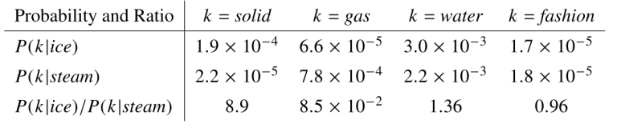
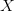
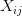
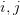
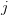
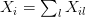

# Building GloVe, Step by step

## Date preparation

In word2vec, the vectors were learned so that they could achieve the task of predicting surrounding words in a sentence.  During training, word2vec **streams the sentences** and computes the loss for each batch of words.

In GloVe, the authors take a more principled approach. The first step is to build a **co-occurrence matrix**. GloVe also takes local context into account by computing the co-occurrence matrix using a fixed window size (words are deemed to co-occur when they appear together within a fixed window). For instance, the sentence

“The cat sat on the mat”

with a window size of  2 would be converted to the co-occurrence matrix

| | the | cat | sat | on | mat |
|-| --- | --- | --- | -- | --- |
| the | 2 | 1 | 2 | 1 | 1 |
| cat | 1 | 1 | 1 | 1 | 0 |
| sat | 2 | 1 | 1 | 1 | 0 |
| on  | 1 | 1 | 1 | 1 | 1 |
| mat | 1 | 0 | 0 | 1 | 1 |

Notice how the matrix is symmetric: this is because when the word “cat” appears in the context of “sat”, the opposite (the word “sat” appearing in the context of”cat”) also happens.

## What Should we Predict?

Now, the question is how to connect the vectors with the statistics computed above. The underlying principle behind GloVe can be stated as follows: **the co-occurrence ratios between two words in a context** are strongly connected to meaning.

This sounds difficult but the idea is really simple. Take the words “ice” and “steam”, for instance. Ice and steam differ in their state but are the same in that they are both forms of water. Therefore, we would expect words related to water (like “water” and “wet”) to appear equally in the context of “ice” and “steam”. In contrast, words like “cold” and “solid” would probably appear near “ice” but would not appear near “steam”.

The following table shows the actual statistics that show this intuition well:

The probabilities shown here are basically just counts of how often the word `k` appears when the words “ice” and “steam” are in the context, where `k`  refers to the words “solid”, “gas”, “water”, and “fashion”. As you can see, words that are related to the nature of “ice” and “steam” (“solid” and “gas” respectively) occur far more often with their corresponding words that the non-corresponding word. In contrast, words like “water” and “fashion” which are not particularly related to either have a probability ratio near 1. Note that the probability ratios can be computed easily using the co-occurrence matrix.

From here on, we’ll need a bit of mathematical notation to make the explanation easier. We’ll use  to refer to the co-occurrence matrix and   to refer to the  th element in  which is equal to the number of times word  appears in the context of word  . We’ll also define   to refer to the total number of words that have appeared in the context of . Other notation will be defined as we go along.

## Deriving the GloVe Equation