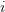
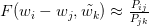

# Building GloVe, Step by step

## Date preparation

In word2vec, the vectors were learned so that they could achieve the task of predicting surrounding words in a sentence.  During training, word2vec **streams the sentences** and computes the loss for each batch of words.

In GloVe, the authors take a more principled approach. The first step is to build a **co-occurrence matrix**. GloVe also takes local context into account by computing the co-occurrence matrix using a fixed window size (words are deemed to co-occur when they appear together within a fixed window). For instance, the sentence

“The cat sat on the mat”

with a window size of  2 would be converted to the co-occurrence matrix

| | the | cat | sat | on | mat |
|-| --- | --- | --- | -- | --- |
| the | 2 | 1 | 2 | 1 | 1 |
| cat | 1 | 1 | 1 | 1 | 0 |
| sat | 2 | 1 | 1 | 1 | 0 |
| on  | 1 | 1 | 1 | 1 | 1 |
| mat | 1 | 0 | 0 | 1 | 1 |

Notice how the matrix is symmetric: this is because when the word “cat” appears in the context of “sat”, the opposite (the word “sat” appearing in the context of”cat”) also happens.

## What Should we Predict?

Now, the question is how to connect the vectors with the statistics computed above. The underlying principle behind GloVe can be stated as follows: **the co-occurrence ratios between two words in a context** are strongly connected to meaning.

This sounds difficult but the idea is really simple. Take the words “ice” and “steam”, for instance. Ice and steam differ in their state but are the same in that they are both forms of water. Therefore, we would expect words related to water (like “water” and “wet”) to appear equally in the context of “ice” and “steam”. In contrast, words like “cold” and “solid” would probably appear near “ice” but would not appear near “steam”.

The following table shows the actual statistics that show this intuition well:

The probabilities shown here are basically just counts of how often the word `k` appears when the words “ice” and “steam” are in the context, where `k`  refers to the words “solid”, “gas”, “water”, and “fashion”. As you can see, words that are related to the nature of “ice” and “steam” (“solid” and “gas” respectively) occur far more often with their corresponding words that the non-corresponding word. In contrast, words like “water” and “fashion” which are not particularly related to either have a probability ratio near 1. Note that the probability ratios can be computed easily using the co-occurrence matrix.

From here on, we’ll need a bit of mathematical notation to make the explanation easier. We’ll use  to refer to the co-occurrence matrix and   to refer to the  th element in  which is equal to the number of times word  appears in the context of word  . We’ll also define   to refer to the total number of words that have appeared in the context of . Other notation will be defined as we go along.

## Deriving the GloVe Equation

Now, it seems clear that we should be aiming to predict the co-occurrence ratios using the word vectors. For now, we’ll express the relation between the ratios with the following equation:

Here,  refers to the probability of the word  appearing in the context of , and can be computed as:

 is some unknown function that takes the embeddings for the words  as input. Notice that there are two kinds of embeddings: input and output (expressed as  and ) for the context and focus words. This is a relatively minor detail but is important to keep in mind.

Now, the question becomes what  should be.  If you recall, one of the goals of GloVe was to create vectors with meaningful dimensions that expressed meaning using simple arithmetic (addition and subtraction). We should choose  so that the vectors it leads to meet this property.

Since we want simple *arithmetic* between the vectors to have meaning, it’s only natural that we make the input to the function  also be the result of arithmetic between vectors. The simplest way to do this is by making the input to  the difference between the vectors we’re comparing:

Now, we want create a **linear relation** between  and . This can be accomplished by using the **dot product**:

Now, we’ll use two tricks to determine  and simplify this equation:

1. By taking the log of the probability ratios, we can convert the ratio into a subtraction between probabilities

2. By adding a bias term for each word, we can capture the fact that some words just occur more often than others.

These two tricks give us the following equation:

We can convert this equation into an equation over a single entry in the co-occurrence matrix.

By absorbing the final term on the right-hand side into the bias term, and adding an output bias for symmetry, we get

And here we are. This is the core equation behind GloVe.

## Weighting occurrences

There is one problem with the equation above: it weights all co-occurrences equally. Unfortunately, not all co-occurrences have the same quality of information. Co-occurrences that are i**nfrequent will tend to be noisy and unreliable**, so we want to weight frequent co-occurrences more heavily. On the other hand, we don’t want co-occurrences like “it is” dominating the loss, so we don’t want to weight too heavily based on frequency.

Through experimentation, the authors of the paper found the following weighting function to perform relatively well:

The function becomes easier to imagine when it is plotted:

Essentially, the function gradually increases with x  but does not become any larger than 1. Using this function, the loss becomes

