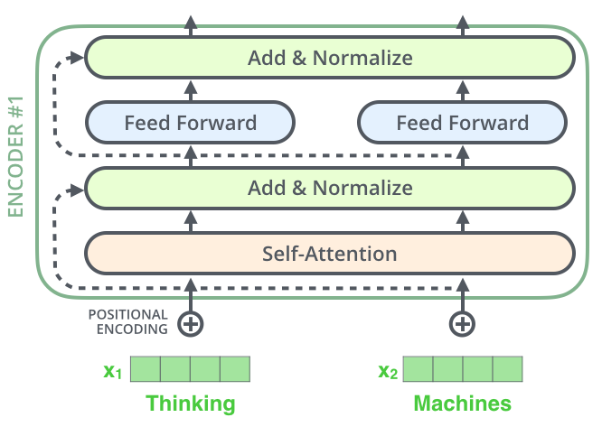

# Transformers

Let’s begin by looking at the model as a single black box. In a machine translation application, it would take a sentence in one language, and output its translation in another.

Popping open that Optimus Prime goodness, we see an encoding component, a decoding component, and connections between them.

The encoding component is a stack of encoders (the paper stacks six of them on top of each other – there’s nothing magical about the number six, one can definitely experiment with other arrangements). The decoding component is a stack of decoders of the same number.

The encoders are all identical in structure (yet they do not share weights). Each one is broken down into two sub-layers:

The encoder’s inputs first flow through a self-attention layer – a layer that helps the encoder look at other words in the input sentence as it encodes a specific word. We’ll look closer at self-attention later in the post.

The outputs of the self-attention layer are fed to a feed-forward neural network. The exact same feed-forward network is independently applied to each position.

The decoder has both those layers, but between them is an attention layer that helps the decoder focus on relevant parts of the input sentence (similar what attention does in [seq2seq models](https://jalammar.github.io/visualizing-neural-machine-translation-mechanics-of-seq2seq-models-with-attention/)).

## **Bringing The Tensors Into The Picture**

Now that we’ve seen the major components of the model, let’s start to look at the various vectors/tensors and how they flow between these components to turn the input of a trained model into an output.

As is the case in NLP applications in general, we begin by turning each input word into a vector using an [embedding algorithm](https://medium.com/deeper-learning/glossary-of-deep-learning-word-embedding-f90c3cec34ca).

Each word is embedded into a vector of size 512. We'll represent those vectors with these simple boxes.

The embedding only happens in the bottom-most encoder. The abstraction that is common to all the encoders is that they receive a list of vectors each of the size 512 – In the bottom encoder that would be the word embeddings, but in other encoders, it would be the output of the encoder that’s directly below. The size of this list is hyperparameter we can set – basically it would be the length of the longest sentence in our training dataset.

After embedding the words in our input sequence, each of them flows through each of the two layers of the encoder.

Here we begin to see one key property of the Transformer, which is that the word in each position flows through its own path in the encoder. There are dependencies between these paths in the self-attention layer. The feed-forward layer does not have those dependencies, however, and thus the various paths can be executed in parallel while flowing through the feed-forward layer.

Next, we’ll switch up the example to a shorter sentence and we’ll look at what happens in each sub-layer of the encoder.

## **Now We’re Encoding!**

As we’ve mentioned already, an encoder receives a list of vectors as input. It processes this list by passing these vectors into a `‘self-attention’` layer, then into a feed-forward neural network, then sends out the output upwards to the next encoder.

The word at each position passes through a self-attention process. Then, they each pass through a feed-forward neural network -- the exact same network with each vector flowing through it separately.

## **Self-Attention at a High Level**

Don’t be fooled by me throwing around the word “self-attention” like it’s a concept everyone should be familiar with. I had personally never came across the concept until reading the Attention is All You Need paper. Let us distill how it works.

Say the following sentence is an input sentence we want to translate:

”`The animal didn't cross the street because it was too tired`”

What does “it” in this sentence refer to? Is it referring to the street or to the animal? It’s a simple question to a human, but not as simple to an algorithm.

When the model is processing the word “it”, self-attention allows it to associate “it” with “animal”.

As the model processes each word (each position in the input sequence), self attention allows it to look at other positions in the input sequence for clues that can help lead to a better encoding for this word.

If you’re familiar with RNNs, think of how maintaining a hidden state allows an RNN to incorporate its representation of previous words/vectors it has processed with the current one it’s processing. Self-attention is the method the Transformer uses to bake the “understanding” of other relevant words into the one we’re currently processing.

As we are encoding the word "it" in encoder #5 (the top encoder in the stack), part of the attention mechanism was focusing on "The Animal", and baked a part of its representation into the encoding of "it".

Be sure to check out the [Tensor2Tensor notebook](https://colab.research.google.com/github/tensorflow/tensor2tensor/blob/master/tensor2tensor/notebooks/hello_t2t.ipynb) where you can load a Transformer model, and examine it using this interactive visualization.

## **Self-Attention in Detail**

Let’s first look at how to calculate self-attention using vectors, then proceed to look at how it’s actually implemented – using matrices.

The **first step** in calculating self-attention is to create three vectors from each of the encoder’s input vectors (in this case, the embedding of each word). So for each word, we create a Query vector, a Key vector, and a Value vector. These vectors are created by multiplying the embedding by three matrices that we trained during the training process.

Notice that these new vectors are smaller in dimension than the embedding vector. Their dimensionality is 64, while the embedding and encoder input/output vectors have dimensionality of 512. They don’t HAVE to be smaller, this is an architecture choice to make the computation of multiheaded attention (mostly) constant.

Multiplying `x1` by the `WQ` weight matrix produces `q1`, the "query" vector associated with that word. We end up creating a "query", a "key", and a "value" projection of each word in the input sentence.

What are the “query”, “key”, and “value” vectors?

They’re abstractions that are useful for calculating and thinking about attention. Once you proceed with reading how attention is calculated below, you’ll know pretty much all you need to know about the role each of these vectors plays.

The **second step** in calculating self-attention is to calculate a score. Say we’re calculating the self-attention for the first word in this example, “Thinking”. We need to score each word of the input sentence against this word. The score determines how much focus to place on other parts of the input sentence as we encode a word at a certain position.

The score is calculated by taking the dot product of the `query vector` with the `key vector` of the respective word we’re scoring. So if we’re processing the self-attention for the word in position `#1`, the first score would be the dot product of `q1` and `k1`. The second score would be the dot product of `q1` and `k2`.

The **third and forth** steps are to divide the scores by 8 (**the square root of the dimension of the key vectors used in the paper – 64**. This leads to having more stable gradients. There could be other possible values here, but this is the default), then pass the result through a softmax operation. Softmax normalizes the scores so they’re all positive and add up to 1.

This softmax score determines how much how much each word will be expressed at this position. Clearly the word at this position will have the highest softmax score, but sometimes it’s useful to attend to another word that is relevant to the current word.

The **fifth step** is to multiply each value vector by the softmax score (in preparation to sum them up). The intuition here is to keep intact the values of the word(s) we want to focus on, and drown-out irrelevant words (by multiplying them by tiny numbers like 0.001, for example).

The **sixth step** is to sum up the weighted value vectors. This produces the output of the self-attention layer at this position (for the first word).

That concludes the self-attention calculation. The resulting vector is one we can send along to the feed-forward neural network. In the actual implementation, however, this calculation is done in matrix form for faster processing. So let’s look at that now that we’ve seen the intuition of the calculation on the word level.

## **Matrix Calculation of Self-Attention**

**The first step** is to calculate the Query, Key, and Value matrices. We do that by packing our embeddings into a matrix `X`, and multiplying it by the weight matrices we’ve trained (`WQ`, `WK`, `WV`).

Every row in the `X` matrix corresponds to a word in the input sentence. We again see the difference in size of the embedding vector (512, or 4 boxes in the figure), and the q/k/v vectors (64, or 3 boxes in the figure)

**Finally**, since we’re dealing with matrices, we can condense steps two through six in one formula to calculate the outputs of the self-attention layer.

## **The Beast With Many Heads**

The paper further refined the self-attention layer by adding a mechanism called “multi-headed” attention. This improves the performance of the attention layer in two ways:

1. It expands the model’s ability to focus on different positions. Yes, in the example above, z1 contains a little bit of every other encoding, but it could be dominated by the the actual word itself. It would be useful if we’re translating a sentence like “The animal didn’t cross the street because it was too tired”, we would want to know which word “it” refers to.

2. It gives the attention layer multiple “representation subspaces”. As we’ll see next, with multi-headed attention we have not only one, but multiple sets of Query/Key/Value weight matrices (the Transformer uses eight attention heads, so we end up with eight sets for each encoder/decoder). Each of these sets is randomly initialized. Then, after training, each set is used to project the input embeddings (or vectors from lower encoders/decoders) into a different representation subspace.

With multi-headed attention, we maintain separate `Q/K/V` weight matrices for each head resulting in different `Q/K/V` matrices. As we did before, we multiply `X` by the `WQ/WK/WV` matrices to produce `Q/K/V` matrices.

If we do the same self-attention calculation we outlined above, just eight different times with different weight matrices, we end up with eight different Z matrices

This leaves us with a bit of a challenge. The feed-forward layer is not expecting eight matrices – it’s expecting a single matrix (a vector for each word). So we need a way to condense these eight down into a single matrix.

How do we do that? We concat the matrices then multiple them by an additional weights matrix `WO`.

That’s pretty much all there is to multi-headed self-attention. It’s quite a handful of matrices, I realize. Let me try to put them all in one visual so we can look at them in one place

Now that we have touched upon attention heads, let’s revisit our example from before to see where the different attention heads are focusing as we encode the word “it” in our example sentence:

As we encode the word "it", one attention head is focusing most on "the animal", while another is focusing on "tired" -- in a sense, the model's representation of the word "it" bakes in some of the representation of both "animal" and "tired".

If we add all the attention heads to the picture, however, things can be harder to interpret:

## **Representing The Order of The Sequence Using Positional Encoding**

One thing that’s missing from the model as we have described it so far is a way to account for the order of the words in the input sequence.

To address this, the transformer adds a vector to each input embedding. These vectors follow a specific pattern that the model learns, which helps it determine the position of each word, or the distance between different words in the sequence. The intuition here is that adding these values to the embeddings provides meaningful distances between the embedding vectors once they’re projected into `Q/K/V` vectors and during dot-product attention.

To give the model a sense of the order of the words, we add positional encoding vectors -- the values of which follow a specific pattern.

If we assumed the embedding has a dimensionality of 4, the actual positional encodings would look like this:

What might this pattern look like?

In the following figure, each row corresponds the a positional encoding of a vector. So the first row would be the vector we’d add to the embedding of the first word in an input sequence. Each row contains 512 values – each with a value between 1 and -1. We’ve color-coded them so the pattern is visible.

A real example of positional encoding for 20 words (rows) with an embedding size of 512 (columns). You can see that it appears split in half down the center. That's because the values of the left half are generated by one function (which uses sine), and the right half is generated by another function (which uses cosine). They're then concatenated to form each of the positional encoding vectors.

The formula for positional encoding is described in the paper. You can see the code for generating positional encodings in [`get_timing_signal_1d()`](https://github.com/tensorflow/tensor2tensor/blob/23bd23b9830059fbc349381b70d9429b5c40a139/tensor2tensor/layers/common_attention.py). This is not the only possible method for positional encoding. It, however, gives the advantage of being able to scale to unseen lengths of sequences (e.g. if our trained model is asked to translate a sentence longer than any of those in our training set).

Explaination of **positional encoding**:

## **The Residuals**

One detail in the architecture of the encoder that we need to mention before moving on, is that each sub-layer (self-attention, ffnn) in each encoder has a residual connection around it, and is followed by a [layer-normalization](https://arxiv.org/abs/1607.06450) step.

If we’re to visualize the vectors and the layer-norm operation associated with self attention, it would look like this:

This goes for the sub-layers of the decoder as well. If we’re to think of a Transformer of 2 stacked encoders and decoders, it would look something like this:

## **The Decoder Side**

Now that we’ve covered most of the concepts on the encoder side, we basically know how the components of decoders work as well. But let’s take a look at how they work together.

The encoder start by processing the input sequence. The output of the top encoder is then transformed into a set of attention vectors K and V. These are to be used by each decoder in its “encoder-decoder attention” layer which helps the decoder focus on appropriate places in the input sequence:

After finishing the encoding phase, we begin the decoding phase. Each step in the decoding phase outputs an element from the output sequence (the English translation sentence in this case).

The following steps repeat the process until a special symbol is reached indicating the transformer decoder has completed its output. The output of each step is fed to the bottom decoder in the next time step, and the decoders bubble up their decoding results just like the encoders did. And just like we did with the encoder inputs, we embed and add positional encoding to those decoder inputs to indicate the position of each word.

The self attention layers in the decoder operate in a slightly different way than the one in the encoder:

In the decoder, the self-attention layer is only allowed to attend to earlier positions in the output sequence. This is done by masking future positions (setting them to `-inf`) before the softmax step in the self-attention calculation.

The “Encoder-Decoder Attention” layer works just like multiheaded self-attention, except it creates its Queries matrix from the layer below it, and takes the Keys and Values matrix from the output of the encoder stack.

## **The Final Linear and Softmax Layer**

The decoder stack outputs a vector of floats. How do we turn that into a word? That’s the job of the final Linear layer which is followed by a Softmax Layer.

The Linear layer is a simple fully connected neural network that projects the vector produced by the stack of decoders, into a much, much larger vector called a logits vector.

Let’s assume that our model knows 10,000 unique English words (our model’s “output vocabulary”) that it’s learned from its training dataset. This would make the logits vector 10,000 cells wide – each cell corresponding to the score of a unique word. That is how we interpret the output of the model followed by the Linear layer.

The softmax layer then turns those scores into probabilities (all positive, all add up to 1.0). The cell with the highest probability is chosen, and the word associated with it is produced as the output for this time step.
