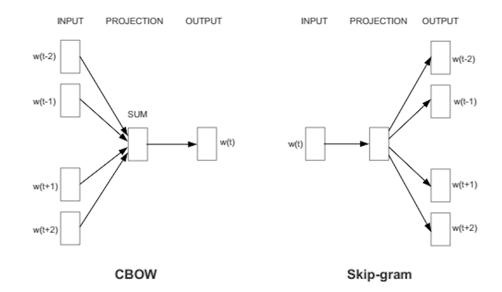

# Word Embedding

## Introduction

Word2Vec is a shallow, two-layer neural networks which is trained to reconstruct linguistic contexts of words.
It takes as its input a large corpus of words and produces a vector space, typically of several hundred dimensions, with each unique word in the corpus being assigned a corresponding vector in the space.
Word vectors are positioned in the vector space such that words that share common contexts in the corpus are located in close proximity to one another in the space.
Word2Vec is a particularly computationally-efficient predictive model for learning word embeddings from raw text.
It comes in two flavors, the Continuous Bag-of-Words (CBOW) model and the Skip-Gram model.
Algorithmically, these models are similar.

## Continuous Bag-of-Words (CBOW)

CBOW predicts target words (e.g. ‘mat’) from the surrounding context words (‘the cat sits on the’).
Statistically, it has the effect that CBOW smoothes over a lot of the distributional information (by treating an entire context as one observation). For the most part, this turns out to be a useful thing for smaller datasets.

## Skip-Gram

Skip-gram predicts surrounding context words from the target words (inverse of CBOW).
Statistically, skip-gram treats each context-target pair as a new observation, and this tends to do better when we have larger datasets.

## How does Word2Vec produce word embeddings?

Word2Vec uses a trick you may have seen elsewhere in machine learning.
Word2Vec is a simple neural network with a single hidden layer, and like all neural networks, it has weights, and during training, its goal is to adjust those weights to reduce a loss function. However, Word2Vec is not going to be used for the task it was trained on, instead, we will just take its hidden weights, use them as our word embeddings, and toss the rest of the model (this came out a little bit evil).

>Another place you may have seen this trick is in unsupervised feature learning, where an auto-encoder is trained to compress an input vector in the hidden layer and decompress it back to the original in the output layer. After it’s done training, the output layer (the decompression step) is stripped off and only the hidden layer is used since it has learned good features, it’s a trick for learning good image features without having labeled training data.

## Architecture

The architecture is similar to an autoencoder’s one, you take a large input vector, compress it down to a smaller dense vector and then instead of decompressing it back to the original input vector as you do with autoencoders, you output probabilities of target words.

First of all, we cannot feed a word as string into a neural network.
Instead, we feed words as one-hot vectors, which is basically a vector of the same length as the vocabulary, filled with zeros except at the index that represents the word we want to represent, which is assigned “1”.

The hidden layer is a standard fully-connected (Dense) layer whose weights are the word embeddings.

The output layer outputs probabilities for the target words from the vocabulary.

>The input to this network is a one-hot vector representing the input word, and the label is also a one-hot vector representing the target word, however, the network’s output is a probability distribution of target words, not necessarily a one-hot vector like the labels.

The rows of the hidden layer weight matrix, are actually the word vectors (word embeddings) we want!

The hidden layer operates as a lookup table. The output of the hidden layer is just the “word vector” for the input word.
More concretely, if you multiply a `1 x 10,000 one-hot vector` by a `10,000 x 300 matrix,` it will effectively just select the matrix row corresponding to the ‘1’.

The end goal of all of this is to learn this hidden layer weight matrix and then toss the output layer when we’re done!

The output layer is simply a softmax activation function:

Here is a high-level illustration of the architecture:

## Semantic and syntactic relationships

So how Word2Vec can help answer our questions in the beginning of the post?
Technically, If different words are similar in context, then Word2Vec should have similar outputs when these words are passed as inputs, and in-order to have a similar outputs, the computed word vectors (in the hidden layer) for these words have to be similar, thus Word2Vec is motivated to learn similar word vectors for words in similar context.

Word2Vec is able to capture multiple different degrees of similarity between words, such that semantic and syntactic patterns can be reproduced using vector arithmetic. Patterns such as “Man is to Woman as Brother is to Sister” can be generated through algebraic operations on the vector representations of these words such that the vector representation of “Brother” - ”Man” + ”Woman” produces a result which is closest to the vector representation of “Sister” in the model. Such relationships can be generated for a range of semantic relations (such as Country—Capital) as well as syntactic relations (e.g. present tense—past tense).

## Training algorithm

A Word2vec model can be trained with hierarchical softmax and/or negative sampling, usually, just negative sampling is used.

The same applies for Word2Vec, even though the network is shallow, just 2-layers, it is extremely wide, therefore, each of its training procedures provides a unique way of reducing computation.

## Hierarchical softmax

To approximate the conditional log-likelihood a model seeks to maximize, the hierarchical softmax method uses a Huffman tree to reduce calculation.
Hierarchical softmax works better for infrequent words.
Naturally, as training epochs increase, hierarchical softmax stops being useful.

## Negative sampling

Negative sampling reduces computation by sampling just `N` negative instances along with the target word instead of sampling the whole vocabulary.

Technically, negative sampling ignores most of the ‘0’ in the one-hot label word vector, and only propagates and updates the weights for the target and a few negative classes which were randomly sampled.
More concretely, negative sampling samples negative instances(words) along with the target word and minimizes the log-likelihood of the sampled negative instances while maximizing the log-likelihood of the target word.

## How the negative samples are chosen?

The negative samples are chosen using a unigram distribution.

Essentially, the probability for selecting a word as a negative sample is related to its frequency, with more frequent words being more likely to be selected as negative samples.

Specifically, each word is given a weight equal to it’s frequency (word count) raised to the 3/4 power. The probability for a selecting a word is just it’s weight divided by the sum of weights for all words.

## Practical methodology

The use of different model parameters and different corpus sizes can greatly affect the quality of a word2vec model.
Accuracy can be improved in a number of ways, including the choice of model architecture (CBOW or Skip-Gram), increasing the training data set, increasing the number of vector dimensions, and increasing the window size of words considered by the algorithm. Each of these improvements comes with the cost of increased computational complexity and therefore increased model generation time.

In models using large corpora and a high number of dimensions, the skip-gram model yields the highest overall accuracy, and consistently produces the highest accuracy on semantic relationships, as well as yielding the highest syntactic accuracy in most cases. However, the CBOW is less computationally expensive and yields similar accuracy results.

Accuracy increases overall as the number of words used increase, and as the number of dimensions increases. Doubling the amount of training data results in an equivalent increase in computational complexity as doubling the number of vector dimensions.

### Sub-sampling

Some frequent words often provide little information. Words with frequency above a certain threshold (e.g ‘a’, ‘an’ and ‘that’) may be subsampled to increase training speed and performance. Also, common word pairs or phrases may be treated as single “words” to increase training speed.

### Dimensionality

Quality of word embedding increases with higher dimensionality. However, after reaching some threshold, the marginal gain will diminish. Typically, the dimensionality of the vectors is set to be between 100 and 1,000.

### Context window

The size of the context window determines how many words before and after a given word would be included as context words of the given word. According to the authors’ note, the recommended value is 10 for skip-gram and 5 for CBOW.
Here is an example of Skip-Gram with context window of size 2:

## Reference
[Word embeddings: exploration, explanation, and exploitation](https://towardsdatascience.com/word-embeddings-exploration-explanation-and-exploitation-with-code-in-python-5dac99d5d795)