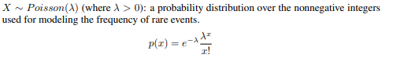
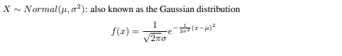

# Discrete random variables

## **Bernoulli**

- Khi tung đồng xu với xác suất `p` là mặt ngửa và `1-p` là mặt sấp

## **Binomial (Phân phối nhị thức)**

- **Phân phối nhị thức** là một phân phối xác suất rời rạc với hai tham số `n` và `p`, thể hiện số lượng lượt tung đồng xu được `k` lần mặt ngửa với xác suất là `p` trong `n` lượt thử độc lập.

- `n`: Tổng số lần thử

- `p`: Xác suất để có kết quả `HEADS`

- `k`: Số lần có kết quả là `HEADS`

## **Geometric (Phân phối hình học)**

- Là phân phối của xác suất xuất hiện lần đầu tiên của sự kiện `A` trong phép thử Béc-nu-li

## **Poisson**

- **Phân phối Poisson** là **trung bình số lần xảy ra thành công của một sự kiện trong một khoảng thời gian nhất định**. Giá trị trung bình này được gọi là lamda, ký hiệu là `λ`.

- Theo đó, nếu xem xét một biến ngẫu nhiên `N` nào đó, và đếm số lần xuất hiện (rời rạc) của nó trong một khoảng thời gian cho trước. Nếu giá trị kì vọng (hay số lần trung bình mà biến ngẫu nhiên đó xảy ra trong khoảng thời gian đó là `λ`, thì xác suất để cũng chính sự kiện đó xảy ra `x` lần (`x` là số nguyên không âm, `x` = 0, 1, 2,...) cũng được tính như công thức trên.

# Continuous random variables

## **Uniform (Phân phối đều)**

## **Exponential (Phân phối mũ)**

- **Phân phối mũ** là một lớp của các phân bố xác suất liên tục được dùng để mô hình thời gian giữa các biến cố xảy ra theo một tỷ lệ trung bình là hằng số. (biểu diễn xác suất thời gian giữa các lần một sự kiện xảy ra)

## **Normal (Phân phối chuẩn)**

