# Entropy nghĩa là gì?
Ý tưởng về Entropy ban đầu khá khó hiểu, có khá nhiều từ được dùng để mô tả nó: đó là sự hỗn loạn, không chắc chắc, độ bất định, độ bất ngờ, lượng thông tin hay những từ tương tự thế. Nếu cho đến giờ bạn vẫn chưa rõ về nó, thì bạn tới đúng nơi rồi đấy. Tôi sẽ giúp bạn hiểu rõ về Entropy.

# Ai nghĩ ra Entropy và vì lý do gì?
Năm 1948, Claude Shannon lần đầu nhắc tới khái niệm information entropy trong bài viết "“A Mathematical Theory of Communication” (information entropy: entropy thông tin, độ bất định thông tin - tuy nhiên mình nghĩ dùng từ gốc sẽ tốt hơn).

Ông đã tìm cách để truyền tin hiệu quả mà không bị mất mát thông tin. Shannon đo lường độ hiểu quả dựa trên độ dài trung bình của 1 message. Bởi vậy, ông đã nghĩ tới việc mã hóa message vào cấu trúc dữ liệu nhỏ nhất có thể trước khi được gửi đi. Đồng thời, việc mã hóa đó không được phép làm mất, sai lệch thông tin nơi nhận. Bộ giải mã nơi nhận phải có khả năng khôi phục lại thông tin giống như thông tin gốc.

    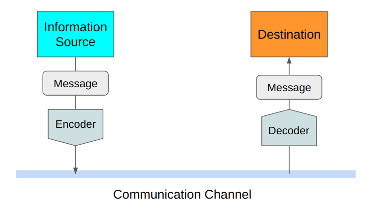

Shannon đã định nghĩa Entropy là kích cỡ (có thể hiểu là số bit) trung bình nhỏ nhất có thể để mã hóa mà không làm mất mát thông tin. Ông đã mô tả cách để tính entropy - rất hữu ích trong việc tính toán hiệu quả của kênh truyền dữ liệu. Định nghĩa trên đây có lẽ vẫn chưa rõ ràng với bạn nhỉ. Tôi sẽ mô tả vài ví dụ cho bạn hiểu.

# Cách mã hóa hiệu quả và không mất thông tin.
Giả sử bạn muốn truyền 1 message từ Tokyo tới New York với nội dung về thời tiết của Tokyo.

    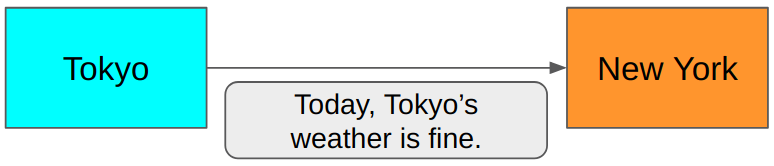

Cách ở trên có tốt không ? Giả sử cả người gửi và nhận đều biết rằng nội dung message đều nói về thời tiết của Tokyo. Vậy họ sẽ không cần phải gửi những từ như “Thời tiết”, “Tokyo”, “của” … Họ đơn giản chỉ cần nói “Fine”, “Not fine”, như vậy là đủ.

    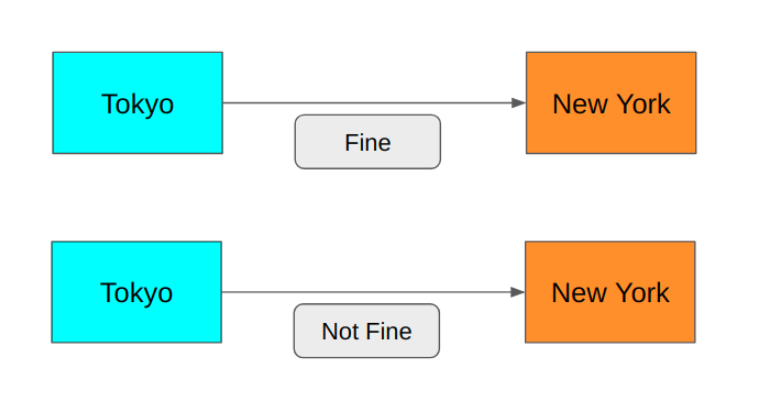

Mã hóa như vậy tốt chưa ? Chưa, bởi vì câu hỏi dạng “yes”, “no” (nhị phân), ta chỉ cần 1 bit để mã hóa: giá trị 0 cho “Fine”, 1 cho “Not fine”.

    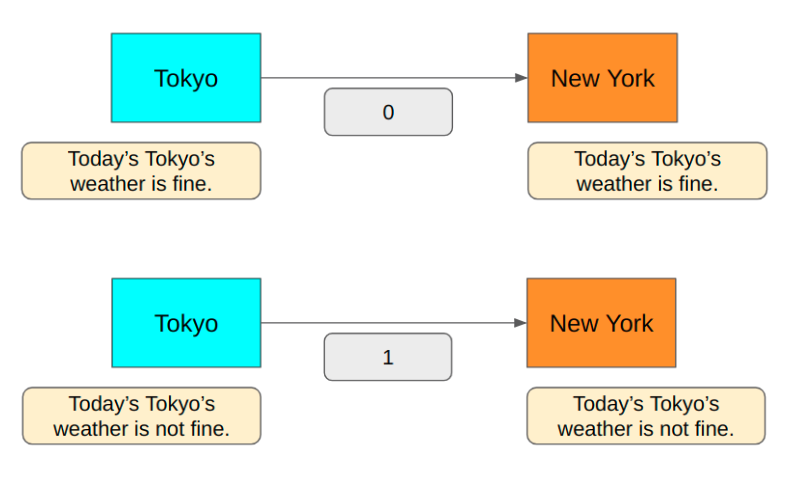

Như vậy cách mã hóa này đã đảm bảo không làm mất mát thông tin. Thế bây giờ ta muốn nói thêm về mưa, tuyết (Rainy, Cloudy) thì sao ? 1 bit sẽ không đủ để mã hóa số trường hợp đó. Thế ta thử 2 bit:

    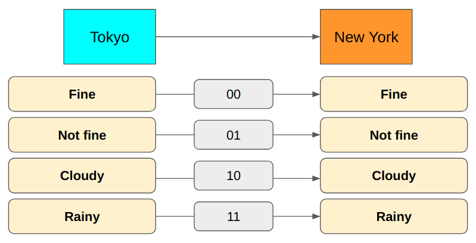

Như vậy, cách mã hóa này đã biểu diễn được cả 4 trường hợp. Tuy nhiên lại có điều gì đó sai sai ở đây: về mặt ngữ nghĩa, Cloudy và Rainy đều mang nghĩa “Not fine”. Vậy “Not fine” là thừa, ta sẽ loại nó đi.

    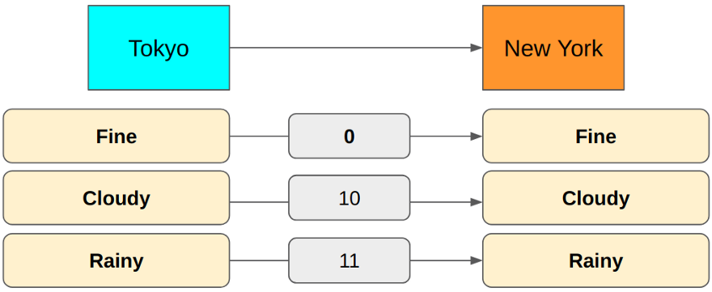

“Fine” là 00, tuy nhiên ta có thể rút gọn nó thành 0 vì 2 trường hợp còn lại đều bắt đầu bằng số 1. Tương tự như vậy, nếu thêm “Snow” vào, ta có thể mã hóa như sau:

    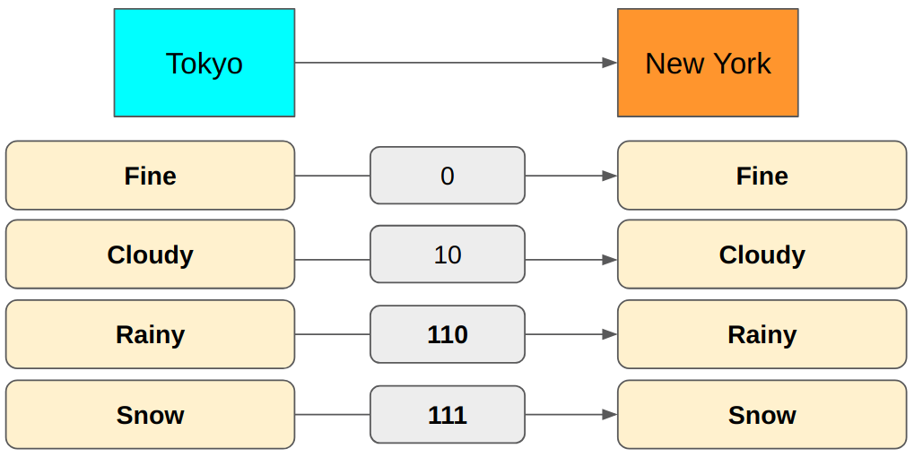

Như vậy, chúng ta đã hiểu việc mã hóa là như nào rồi nhé. Tiếp đến, chúng ta cần biết liệu cách mã hóa như trên đã đạt được kích thước trung bình nhỏ nhất hay chưa, và cả cách tính kích thước đó nữa.

# Cách để tính kích cỡ mã hóa trung bình (average encoding size).
Giả sử Tokyo liên tục gửi thông tin về thời tiết tới New York hằng giờ với cách mã hóa như đã nói trên. Sau khi thu thập, tổng hợp thông tin, ta có 1 phân phối xác suất như sau:

    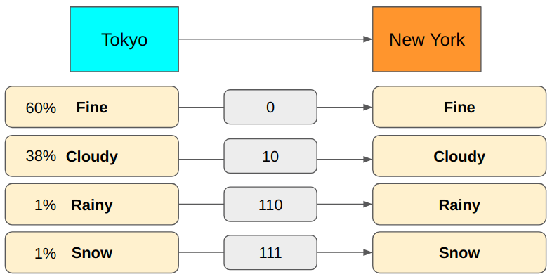

Chúng ta tính kích thước trung bình tin nhắn được gửi đi như sau:

(0.6 x 1 bit)+(0.38 x 2 bits)+(0.01 x 3 bits)+(0.01 x 3 bits)=1.42 bits

Như vậy, với cách mã hóa vừa rồi, trung bình mỗi tin nhắn gửi đi dài 1.42 bit. Như bạn có thể thấy, giá trị trung bình này phụ thuộc vào cả phân phối xác suất và cách mã hóa mỗi 1 loại tin. Ví dụ, trong trường hợp phân phối xác suất thay đổi: Fine = 10%, Cloudy = 10%, Rainy = 40%, Snow = 40%, độ dài trung bình tin nhắn là : (0.1 x 1 bit)+(0.1 x 2 bits)+(0.4 x 3 bits)+(0.4 x 3 bits) = 2.7 bits. Như vậy, với phân bố dữ liệu như này, độ dài trung bình mỗi tin nhắn gửi đi dùng 2.7 bit.

Chúng ta có thể thay đổi bảng mã hóa như dưới, độ dài trung bình này giảm xuống còn 1.8 bits.

    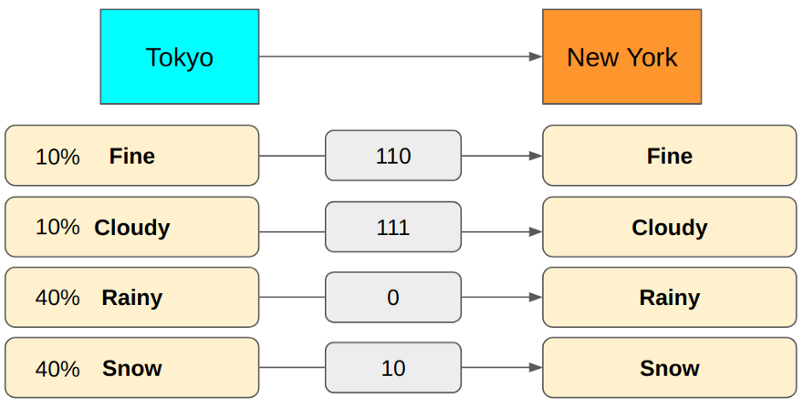

Như vậy, chúng ta đã biết cách tính độ dài mã hóa trung bình rồi, nhưng làm cách nào để biết giá trị này đã là nhỏ nhất hay chưa, nói cách khác liệu cách mã hóa của chúng ta đã hiệu quả hay chưa.

# Cách tính kích cỡ mã hóa trung bình nhỏ nhất.
Ta có thể ngồi thử nhiều lần và ngồi tính tay ra độ dài mã hóa trung bình của từng trường hợp rồi chọn xem cách nào cho độ dài nhỏ nhất… tuy nhiên cách này chắc chắn không ổn. Vậy nếu ta có 1 phân phối xác suất của dữ liệu, có cách nào để tính luôn ra độ dài trung bình nhỏ nhất hay không ? Giả sử ta có 8 kiểu tin nhắn khác nhau, mỗi 1 loại xuất hiện với xác xuất bằng nhau (p=1/8 = 12.5%). 1 bit thì mã hóa được 2 giá trị. thế 2 bit mã hóa được 4, 3 bit được 8. Như vậy ta chỉ cần 3 bit là mã hóa được, thêm 1 bit vào cũng không có thêm tác dụng gì.

Thông thường, với N giá trị, ta cần **log[2]N** bit để mã hóa. Hay với 1 loại tin nhắn xuất hiện 1 trong N lần gửi tin, công thức bên trên mô tả kích cỡ tối thiểu cần thiết để mã hóa. Và vì **P=1/N** là xác xuất của loại tin nhắn đó, phương trình có thể viết lại thành

    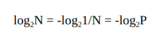

Kết hợp với công thức tính kích cỡ trung bình đã biết ở phần trước, ta được kích thước mã hóa trung bình nhỏ nhất - đây chính là entropy:

    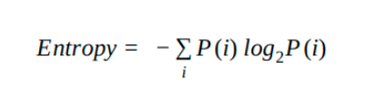

Trong đó P(i) là xác xuất của loại tin nhắn thứ i. Hãy ngồi và suy ngẫm về công thức này, chả có gì khó hiểu hay magic ở đây cả, công thức này đơn giản là sự kết hợp giữa tính kích cỡ mã hóa trung bình và kích cỡ mã hóa nhỏ nhất của từng loại tin. Thử 1 vài ví dụ:

    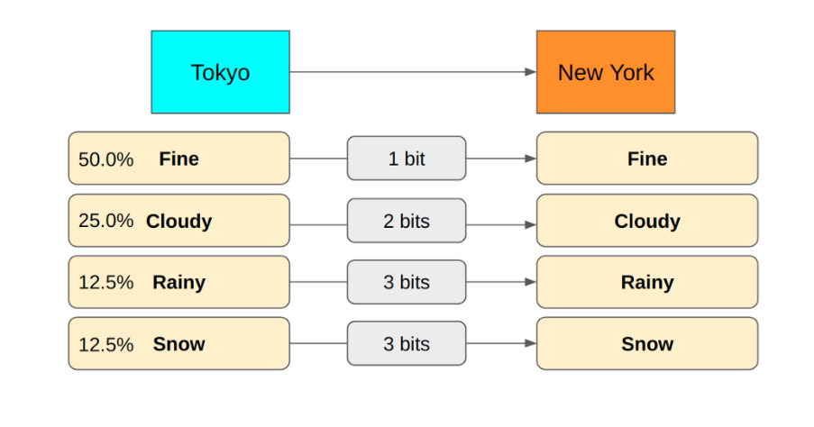

    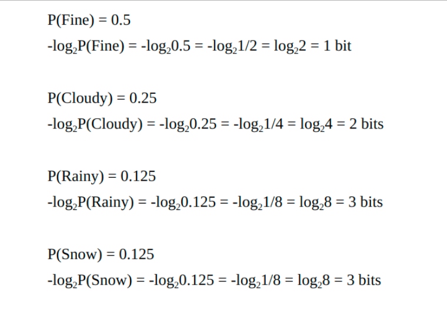

Vậy, entropy là: (0.5 x 1 bit)+(0.25 x 2 bits)+(0.125 x 3 bits)+(0.125 x 3 bits)=1.75 bits

# Tính chất của Entropy

Entropy cao đồng nghĩa với việc có rất nhiều loại thông tin với xác suất mỗi loại nhỏ. Mỗi 1 message mới xuất hiện, khả năng cao rằng message đó có nội dung khác với nội dung của message trước đó. Ta có thể gọi đó là sự bất định. Khi một loại thông tin với xác suất thấp bỗng nhiên xuất hiện, nó sẽ gây ra bất ngờ hơn so với các loại thông tin có xác suất cao khác. VD: với việc bạn chọn liều 1 trong 5 đáp án, xác suất xuất hiện là 80% sai, 20% đúng, việc bạn chọn đúng sẽ khiến bạn bất ngờ hơn nhiều so với việc chọn sai. Hay nói các khác, thông tin có xác suất càng thấp càng mang nhiều thông tin giá trị.

Hoặc 1 ví dụ khác, nếu phân phối là 90% mưa, 10% nắng thì thông tin dự báo thời tiết về 1 trận mưa sẽ không cung cấp nhiều thông tin (vì ta xác định sẵn tinh thần là trời sẽ mưa). Trong khí đó nếu phân phối là 50% mưa, 50% nắng thì thông tin về việc trời ngày hôm đó mưa hay nắng lại rất giá trị (chứa nhiều thông tin hơn).

Túm lại ta có thể hiểu entropy với các ý nghĩa sau:

- Entropy là lượng bit trung bình tối thiểu để mã hóa thông tin khi ta biết phân bố các loại thông tin trong đó.
- Entropy biểu thị cho sự hỗn độn, độ bất định, độ phức tạp của thông tin.
- Thông tin càng phức tạp càng entropy càng cao (hay công sức mã hóa càng phức tạp).
- Ta có thể dùng nó để đo lường sai khác giữa các phân bố xác suất.
- Entropy nhạy cảm với thay đổi xác suất nhỏ, khi 2 phân bố càng giống nhau thì entropy càng giống nhau và ngược lại
- Entropy thấp đồng nghĩa với việc hầu hết các lần nhận thông tin, ta có thể dự đoán dễ hơn, ít bất ngờ hơn, ít bất ổn hơn và ít thông tin hơn.

## Reference:
- [Demystifying Entropy](https://towardsdatascience.com/demystifying-entropy-f2c3221e2550)
- [Hiểu về entropy](https://forum.machinelearningcoban.com/t/hieu-ve-entropy/4443)
