# Kalman Filtering

## Model

Before we introduce the Kalman Filter, we need to detail the dynamic model in predicting motion. The equations will look scary but actually pretty simple. To simplify our illustration, we assume our car moves along the x-axis only.

### State

We first define the state of our car. For simplicity, we will use the position $p$ and the speed $v$ only.

    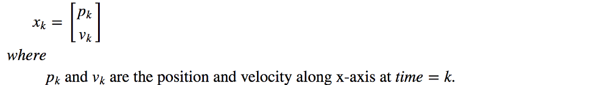

### State-transition model

Without acceleration, we can calculate the equation of motion with some simple Physics.

    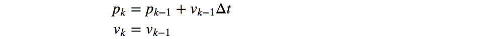

Rewrite this into a matrix form which derives states from the last previous state.

    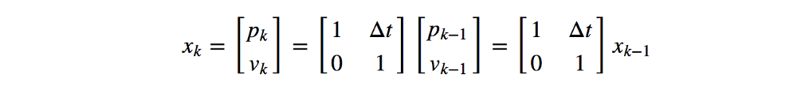

$x_k = Ax_{k-1}$

### Input controls

We have many controls on the car. For example, we control the throttle for acceleration. Let’s modify our equations:

    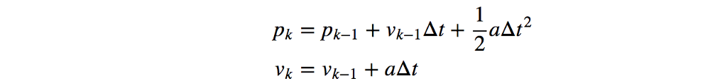

We pack all input controls into a vector u and the matrix form of motion becomes:

$x_k = Ax_{k-1} + Bu_k$

    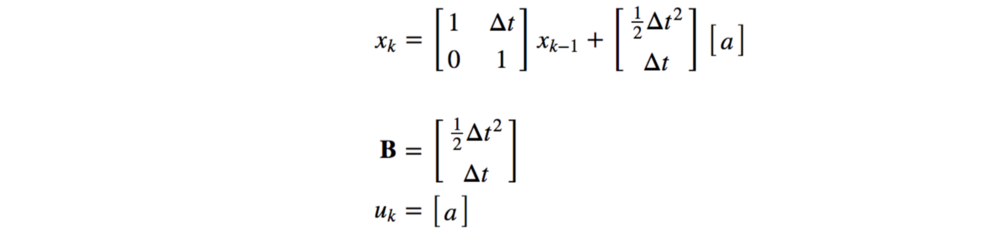

(Since we have only one control for now, $u$ has only one element $a$.)

To make our model more accurate, we add another term called process noise.

$x_k = Ax_{k-1} + Bu_k + w_k$

We use process noise $w$ to represent random factors that are difficult to model precisely, for example, the wind effect and the road condition. We assume $w$ is Gaussian distributed with a zero mean and covariance matrix $Q$. (Variance is for 1-D Gaussian distribution while covariance matrix is for n-D Gaussian distribution)

$w_k ~ \sim \mathcal{N}(0,Q)$

### Observer model (measurement model)

We also model our measurements by applying a transformation matrix C on the state of the system.

$y_k = Cx_k + v_k$

Very often, we measure the state directly (for example, the car location). Hence, C is often an identity matrix. In some case, we do not measure it directly. We need a matrix C to describe the relationship between the state and the measurement. In other cases, C performs a coordinate transformation. For example, the state of a RADAR is stored in polar coordinates. We use C to convert it to Cartesian.

$v_k ~ \sim \mathcal{N}(0,Q)$

### Putting it together

Here we have a dynamic model to predict a state and a measurement from its last previous state.

    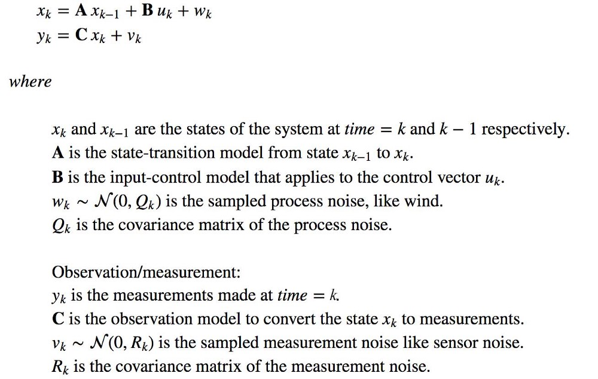

## Kalman Filter

### Real world

In the real world, we know the input control u and the measurement y. Through dynamic mechanic in Physics or experiments, it is not too hard to find A, B, and C.

    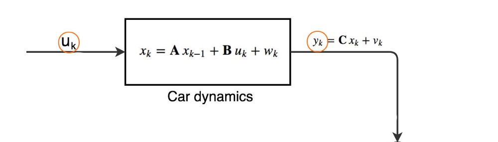

### Observer world

Now, we use this information to build a model in an observer world to resemble the real world. In the observer world, we calculate the estimated measurement ŷ with the following equations:

$\hat{x}_k = A\hat{x}_{k-1} + Bu_k$

$\hat{y}_k = C\hat{x}_k$

`Symbols with a hat, like ŷ, mean values estimated in the observer world.`

    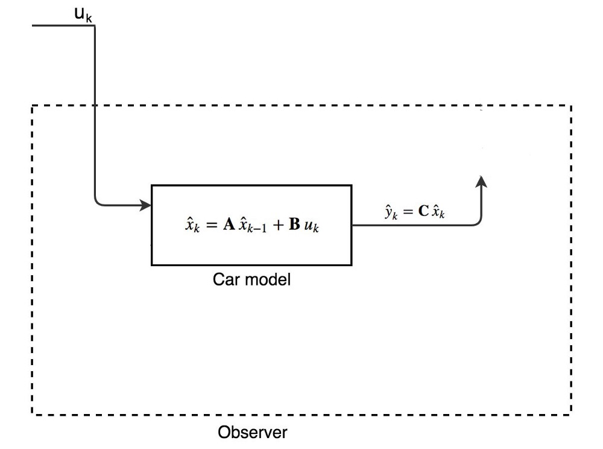

ŷ is what the car model’s estimation on the measurement. We know that ŷ will be off since our car model does not include process noise like the wind. By knowing the error (y-ŷ) between the measurement and the measurement estimate, we can refine the car model to make a better estimate for x. We just need to introduce a Kalman gain K to map the error in our measurement estimate to the error in our state estimate. Then our new x estimate will simply the old estimate plus its error. In short, we use the error in our measurement estimate to make an adjustment to the state estimate.

    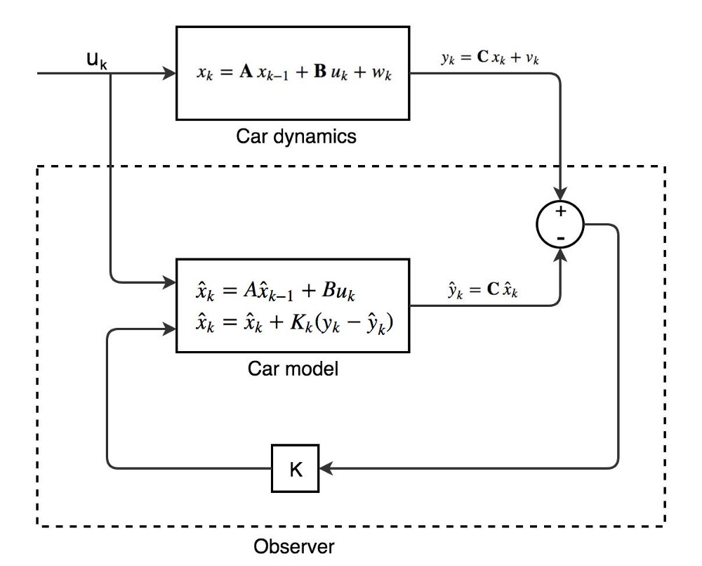

Now our model involves 2 steps. The first step is the **prediction**:

$\hat{x}_k = A\hat{x}_{k-1} + Bu_k$

The second step is the **update** of our estimated state with the error (y-ŷ):

$\hat{x}_k = \hat{x}_k + K_k(y_k - \hat{y}_k)$

Since we break the state estimation into 2 steps, there is an estimated state before the update and one after the update. To reduce confusion, we introduce the notation with a **minus** sign to indicate the **estimated state before the update**. Now our car model becomes:

    

    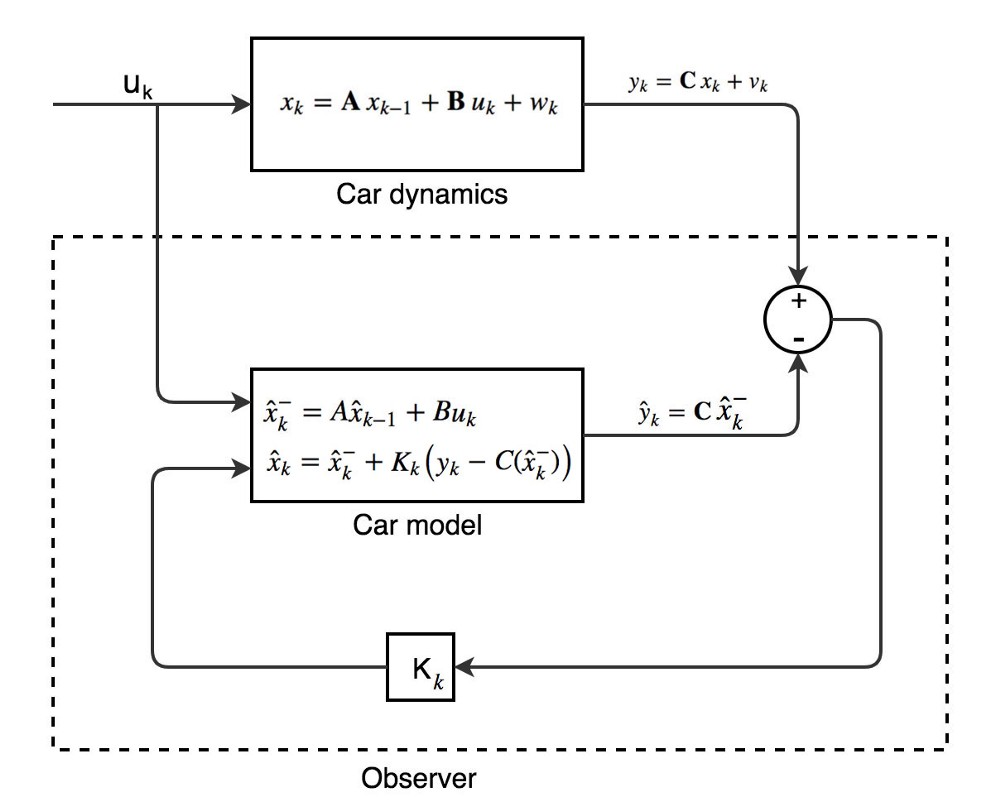

Let’s take a quick peek at how K is calculated:

    

where R quantifies the measurement noise. Let’s do an insanity check. In our location example, C is an identity matrix. If there is no noise, K becomes an identity matrix. Using our car model equation, it will output the measurement y as the estimated state. That is, when the measurement is 100% accurate, our prediction should equal the measurement.

    

### Prediction

So far, our observer world uses a deterministic model. Let’s expand it to stochastic. We assume all estimated states are **Gaussian distributed**. So we model our last estimated state with a mean x and a covariance matrix P.

    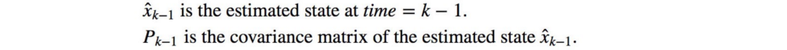

    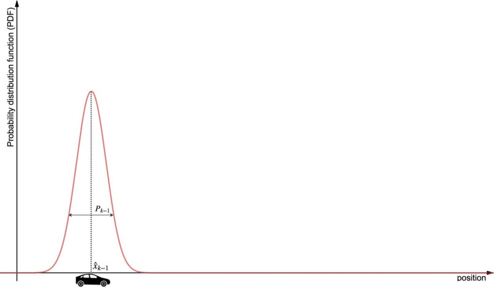

Then, we apply the car model in the observer world to make a new state estimate.

    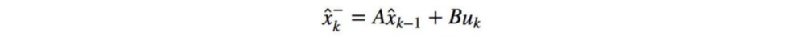

Back to linear algebra, if we apply a transformation matrix A to an input x with a covariance matrix ∑, the covariance matrix of the output (Ax) is simply:

    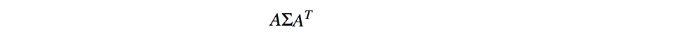

Putting the process noise back, the Gaussian model for the estimated state before the update is:

    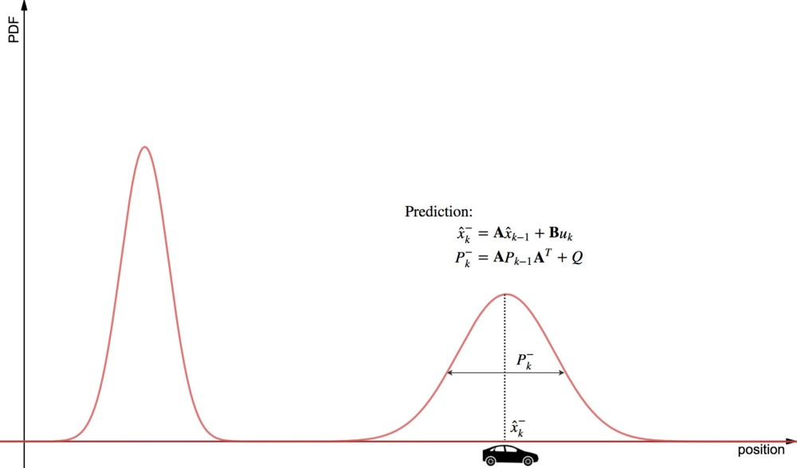

Where:

    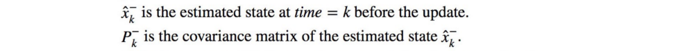

### Update

Finally, we will make the final prediction using Kalman filter. At time=k, we make a measurement y. For easier visualization, we always assume C is an identity matrix when we plot the measurement PDF in this article.

    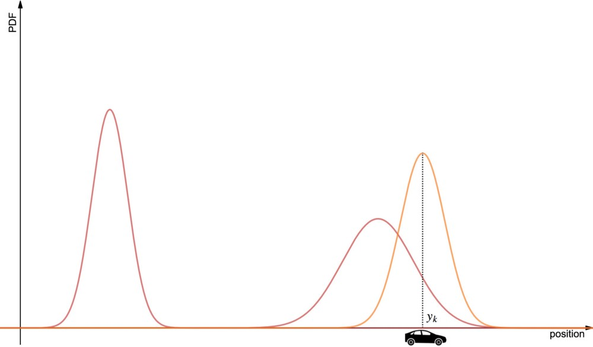

Since the estimated state (before the update) and the measurement are Gaussian distributed, the final estimated state is also Gaussian distributed. We can apply linear algebra again to compute the Gaussian model of our final prediction.

First, we calculate the Kalman gain which put the measurement noise back into the equation and map the error in the measurement estimate to the state estimate error.

    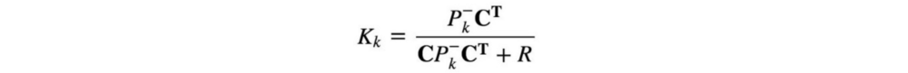

Then the Gaussian model for the new estimated state is calculated based on the Gaussian model for the state estimate before the update, the Kalman gain K, the measurement and C. Here is our updated state estimation:

    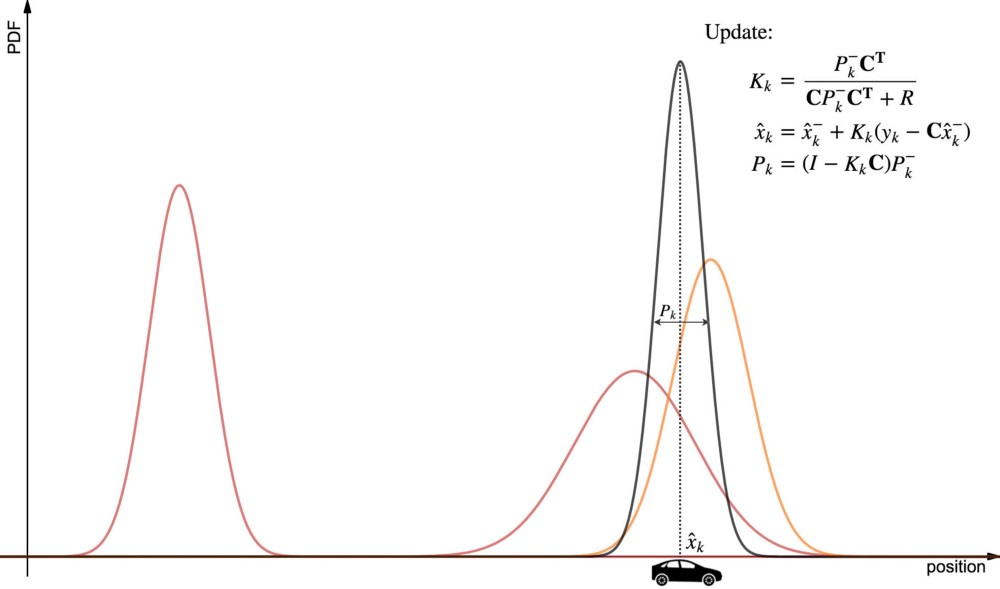

where

    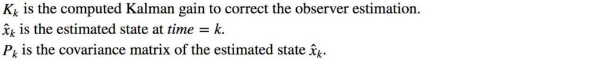

### Recap

Let’s do a recap.

- The red curve on the left: the estimated state at time=k-1.
- The red curve on the right: the estimated state before the update.
- The orange curve: the measurement.
- The black curve: the estimated state at time=k.

The diagram below shows the corresponding mean and the covariance matrix.

    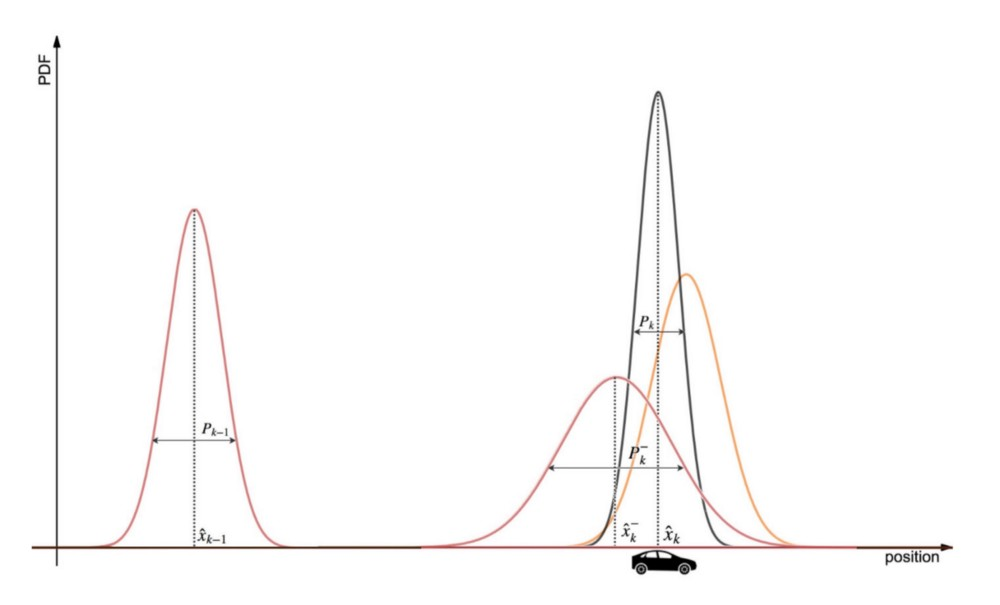

To track a moving car, we repeat a 2-step procedure below:

    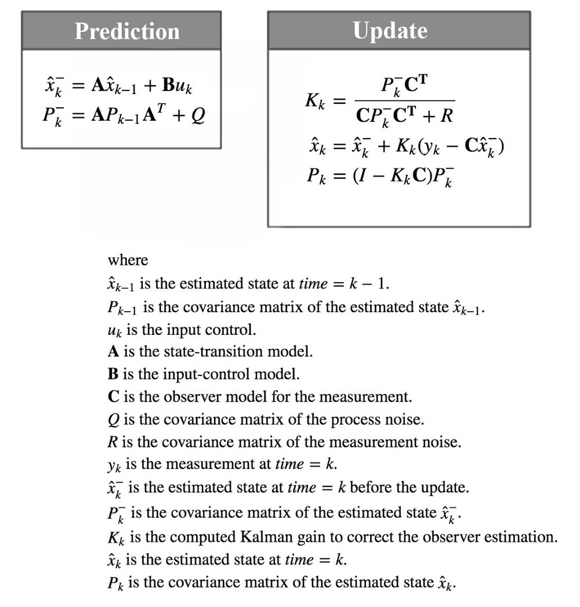

