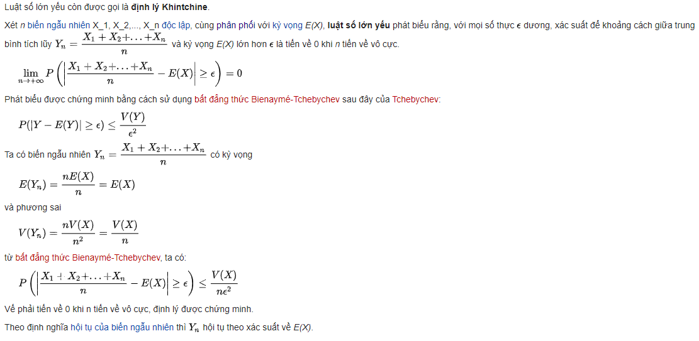
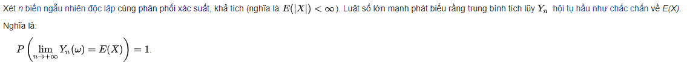

# Law of Large Numbers

**The law of large numbers** is a theorem that describes the result of performing the same experiment a large number of times. According to the law, the average of the results obtained from a large number of trials should be close to the expected value.

## **Luật số lớn yếu**

## **Luật số lớn mạnh**

