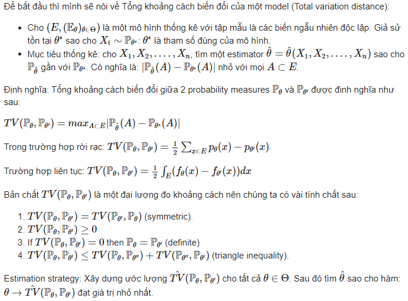
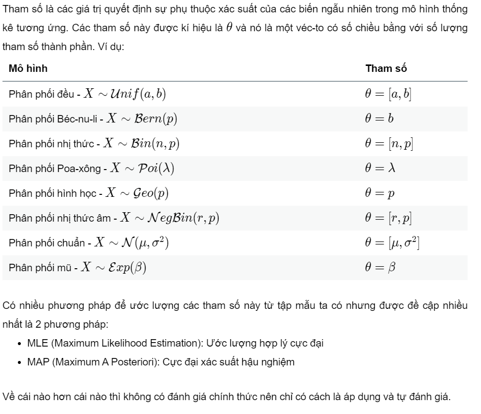

# Cách đánh giá Likelihood Function

# Mẫu thống kê và ước lượng tham số

## **1. Mẫu thống kê**

### **1.1 Mẫu ngẫu nhiên**

### **1.2 Thống kê**

### **1.3 Đặc trưng mẫu**

#### **1.3.1 Trung bình mẫu**

#### **1.3.2 Phương sai mẫu**

## **2. Ước lượng tham số**

### **2.1 Tham số**

### **2.2 MLE - Maximum Likelihood Estimation**

#### **2.2.1 Khái niệm**

#### **2.2.2 Ví dụ**

### **2.3 MAP**

#### **2.3.1 Khái niệm**

#### **2.3.2 Siêu tham số**

#### **2.3.3 Ví dụ**

