# Cross Entropy là gì?
Trong deeplearning, ta sử dụng rất nhiều hàm **Cross Entropy** trong việc tính toán giá trị *loss function* của bài toán phân lớp. Ta đã thấy cả **binary cross entropy** và **cross entropy**, chúng khác nhau như thế nào? Hãy cùng đi tìm hiểu.

# Nhắc lại về Entropy
Ta có Entropy của một phân phối xác suất rời rạc được tính theo công thức: 

    

Ta giả sử đã biết xác suất **P_i** với mỗi *i* (với mỗi *i* là một giá trị rời rạc của xác suất)

Với biến ngẫu nhiên liên tục, ta có công thức tính Entropy:

    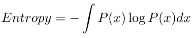

Với *x* là biến liên tục, hàm **P(x)** là hàm phân phối xác suất.

Với cả 2 trường hợp biến là liên tục và rời rạc, ta đều tính giá trị kỳ vọng (giá trị trung bình) của hàm log âm đối với phân phối xác suất tương đương với việc tìm giá trị mã hoá nhỏ nhất (minimum encoding size) của thông tin đối với thông điệp (tin nhắn) **x**.

Entropy cũng được viết dưới dạng sau:

    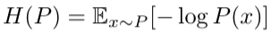

# Ước lượng Entropy
Let’s assume we are reporting Tokyo’s weather to New York, and we want to encode the message into the smallest possible size. We do not know the distribution of the weather before it happens. For the sake of discussion, let’s assume we can find it out after observing the weather in Tokyo for some time.

As we do not initially know the probability distribution of Tokyo’s weather, we estimate it as Q to calculate the encoding size for transmitting our weather report from Tokyo to New York.

Using the estimated probability distribution Q, the estimated entropy would be:

    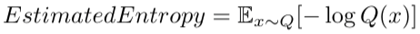

If Q is close to the real probability distribution, the above estimation tells us what the smallest average encoding size is.

However, there are two kinds of uncertainty involved in the estimation formula.

As indicated by x~Q, we are using the estimated probability distribution Q to calculate the expectation which would be different from the actual probability distribution P.

Moreover, we are estimating the minimum encoding size as -log Q which we calculate based on the estimated probability distribution Q. Hence, it will not be 100% accurate.

***As the estimated probability distribution Q affects both the expectation and encoding size estimation, the estimated entropy can be very wrong.***

Alternatively, it can be close to the real entropy by coincidence because Q affects both the expectation calculation and the encoding size estimation.

So, comparing the estimated entropy with the real entropy may not mean anything.

Like Claude Shannon, our main concern is how to make the encoding size as small as possible. So, we want to compare our encoding size with the theoretical minimum encoding size based on the entropy.

If we have the real distribution P after observing the weather in Tokyo for some period, we can calculate the realized average encoding size using the probability distribution P and the actual encoding size (based on Q) used during the weather reporting.

It is called the cross-entropy between P and Q, which we can compare with the entropy.

    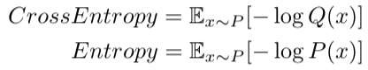

We are comparing apple to apple as we use the same true distribution for both expectation calculations. We are comparing the theoretical minimum encoding and the actual encoding used in the weather reporting.

In short, we are cross-checking the encoding size, which is what “cross” means in cross-entropy.

# Cross-entropy ≥ Entropy
Commonly, the cross-entropy is expressed using H as follows:

    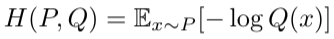

**H(P, Q)** means that we calculate the expectation using **P** and the encoding size using **Q**. As such, **H(P, Q)** and **H(Q, P)** is not necessarily the same except when **Q=P**, in which case **H(P, Q) = H(P, P) = H(P)** and it becomes the entropy itself.

This point is subtle but essential. For the expectation, we should use the true probability **P** as that tells the distribution of events. For the encoding size, we should use **Q** as that is used to encode messages.

Since the entropy is the theoretical minimum average size, the cross-entropy is higher than or equal to the entropy but not less than that.

In other words, if our estimate is perfect, **Q = P** and, hence, **H(P, Q)=H(P)**. Otherwise, **H(P, Q) > H(P)**.

By now, the connection between the entropy and the cross-entropy should be clear. Let’s talk about why we use the cross-entropy for classification loss function.

# Cross-Entropy as a Loss Function
Let’s say we have a dataset of animal images and there are five different animals. Each image has only one animal in it.

    

Each image is labeled with the corresponding animal using the one-hot encoding.

    

We can treat one hot encoding as a probability distribution for each image. Let’s see a few examples.

The probability distribution of the first image being a dog is 1.0 (=100%).

    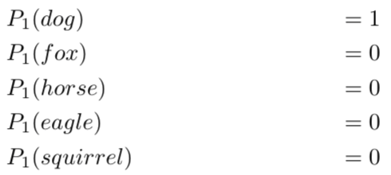

For the second image, the label tells us that it is a fox with 100% certainty.

    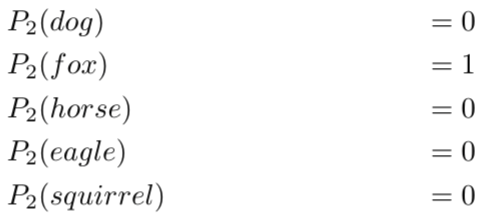

…and so on.

As such, the entropy of each image is all zero.

    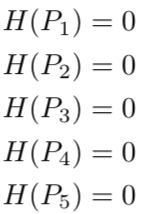

In other words, one-hot encoded labels tell us what animal each image has with 100% certainty. It is not like the first image can be a dog for 90% and a cat for 10%. It is always a dog, and there will be no surprise.

Now, let’s say we have a machine learning model that classifies those images. When we have not adequately trained the model, it may classify the first image (dog) as follows:

    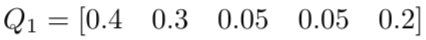

The model says the first image is 40% for a dog, 30% for a fox, 5% for a horse, 5% for an eagle and 20% for a squirrel. This estimation is not very precise or confident about what animal the first image has.

In contrast, the label gives us the exact distribution of the first image’s animal class. It tells us it is a dog with 100% certainty.

    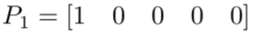

So, how well was the model’s prediction? We can calculate the cross-entropy as follows:

    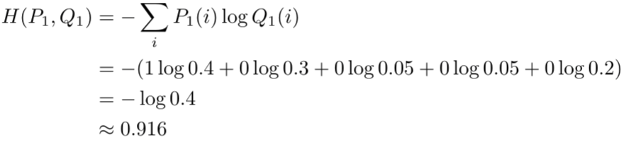

This is higher than the zero entropy of the label but we do not have an intuitive sense of what this value means. So, let’s see another cross-entropy value for comparison.

After the model is well trained, it may produce the following prediction for the first image.

    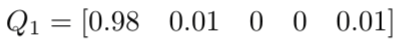

As below, the cross-entropy is much lower than before.

    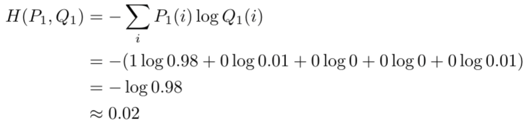

The cross-entropy compares the model’s prediction with the label which is the true probability distribution. The cross-entropy goes down as the prediction gets more and more accurate. It becomes zero if the prediction is perfect. As such, the cross-entropy can be a loss function to train a classification model.

# Notes on Nats vs. Bits
In machine learning, we use base **e** instead of **base 2** for multiple reasons (one of them being the ease of calculating the derivative).

The change of the logarithm base does not cause any problem since it changes the magnitude only.

    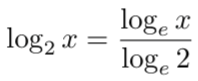

For example, using the cross-entropy as a classification cost function still makes sense as we only care about reducing it by training the model better and better.

As a side note, the information unit with the base **e** logarithm is **nats** whereas the information unit with the **base 2** logarithm is called bits. The amount of information in **1 nat** comes from an event that happens with 1/e probability.

    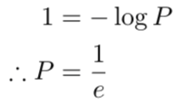

The **base e** logarithms are less intuitive than the **base 2** logarithms. The amount of information in **1 bit** comes from an event that happens with 1/2 probability. If we can encode a piece of information in 1 bit, one such message can reduce 50% uncertainty. The same analogy is not easy to make with the **base e**, which is why the **base 2** logarithm is often used to explain the information entropy concept. However, the machine learning application uses the **base e** logarithm for implementation convenience.

# Binary Cross-Entropy
We can use the binary cross-entropy for binary classification where we have yes/no answer. For example, there are only dogs or cats in images.

For the binary classifications, the cross-entropy formula contains only two probabilities:

    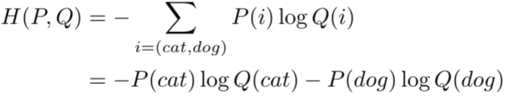

Using the following relationship

    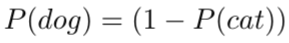

, we can write the cross-entropy as follows:

    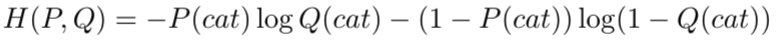

We can further simplify it by changing the symbols slightly:

    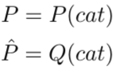

Then, the binary cross-entropy formula becomes:

    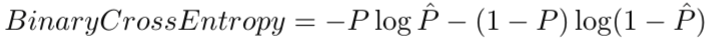

, which may look more familiar to some of us.

In short, the binary cross-entropy is a cross-entropy with two classes. Other than that, they are the same concept.

Now that we know the concepts well, the entropy of the cross-entropy concept should be zero to all of us.

## Reference
- [Demystifying Entropy](https://towardsdatascience.com/demystifying-cross-entropy-e80e3ad54a8)