# Complete guide

## Markov Property
You can think of MDP as a **framework** for RL or a **design pattern** or an **approach/process/technique** for solving RL problems.

If MDP is solved then RL problem is solved.

Before I dive into MDP, there is something you should understand which is

#### Markov Property:
“The future is independent of the past given present.”

Which means Knowing the current state of the agent helps the agent decide what action to take ( the past history can be thrown ).

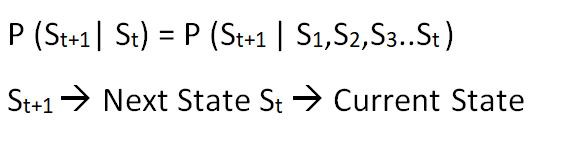

#### Wikipedia 
→ In probability theory and statistics, A stochastic process has the Markov property if the conditional probability distribution of future states of the process depends only upon the present state.

Markov decision process is a tuple of 5 components →(S,A,P,R, γ)

**S** → A set of states in the environment

**A** → A finite set of actions an agent can take in the environment

**P** → Transition Probability Matrix (for all states)

**R** →Reward component for each state

**γ** → Discount factor ( γ ∈ [0,1] )

And it follows the Markov property.

let’s relate to our problem (I made it simple to explain)

S = {“fallen”, “Stand”, “Rightlegstep”, “leftlegstep”} #think of body position

A ={“ForwardstepRight, “ForwardstepLeft”, “Fall”, “Getup”}

P = State Transition probability Matrix

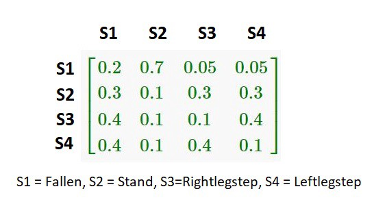

We assume for now that the transition probability is given explicitly, although in many practical circumstances we might need to estimate this from examples (e.g. supervised learning).

Let’s add some rewards. for each step the agent takes gets a candy , for falling the agent looses all the candy the agent might have, for getting up after falling 2 candies, and for finishing the task(10 continue steps) gets 10 candies.

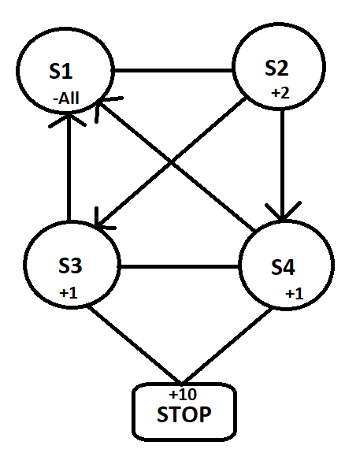

Assume there are no self loops and arrow indicates one side otherwise two sides(can be a loop) except stop(it is not a state, it is the end after 10 continues steps).

and last but not least **γ → Discount factor**

so the discount factor tells how much discount is applicable for the future rewards. It must be between 0 and 1.

γ is so and so percentage that gets multiplied with the reward for every step the agent takes so we don’t get full reward,we get discounted reward.

let’s say at time step(t=1) I got 10 candies but if γ → 0.9 then 0.9 * R → 0.9*10 =9 candies #will make sense as we go through.

The larger the gamma, the smaller the discount (so We get decent future rewards). This means the agent focuses more about the long term reward.

On the other hand, the smaller the gamma, the bigger the discount(so We get terrible future rewards). This means our agent focuses more about the short term reward.

Let’s just keep it aside for our problem so set γ → 1 (so we look for long term reward which is 10 candies).

Why **γ → Discount factor**???

well, there are few reasons as far as I know

1. It is for Math convenient(uncertainty of future rewards)
2. to avoid infinite returns in cyclic Markov process

For this problem it is set as 1, the more problems you solve the more idea you get about the γ Discount factor. #let’s ignore for a while.

**So RL Goal using MDP is to get the maximum expected cumulative reward (Gt)**

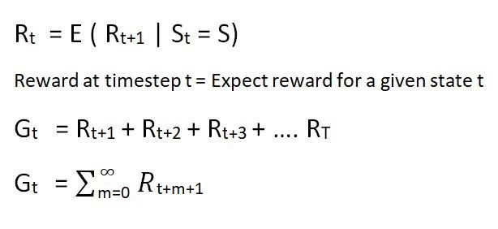

we set γ as 1. if γ value is present then the actual equation is

so far We just understood the components now let’s focus on the process and how it works / solves the problem.

Before we understand the process let me define some concepts.

## Policy (π)

You can think of policy as a strategy or agent’s behavior function

It maps from **state** to **action**. in other words, it specifies what action to take at each state.

- Deterministic policy → **a = π(s)**
- Stochastic policy → **π(a|s) = P(At=a,St=s)** → based on some probabilities

where π(a|s) is the probability of taking action **a** in state **s** under policy π

## Model

The model stands for the simulation of the dynamics of the environment

It predicts what the environment will give next

Transition probability → predicts the next state

Reward model → predicts the next reward

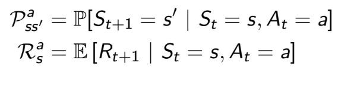

what is the **next state** based on **current state s** and **action a** and what is the **expected reward** based on the **current state s** and **action a**.

if we use policy then

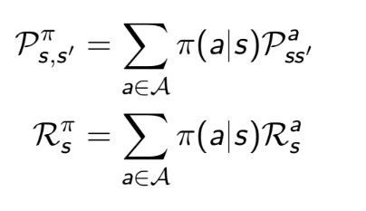

## Value function

The value function estimates the expected future reward by following the policy π for each state.

`v(s) = E [Gt | St = s]`

There are two types of value functions

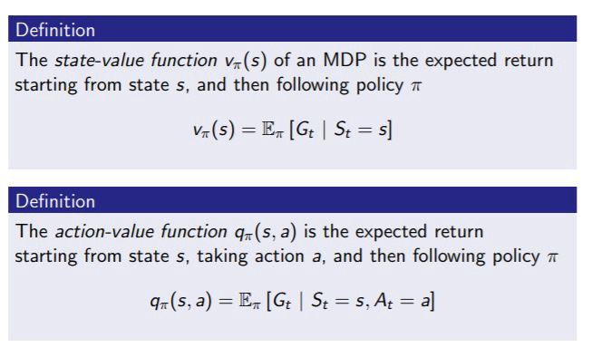

**State value function** determines how good it is for the agent to be in a given state while **Action value function** determines how good it is to perform a given action in a given state. ( How good → Expected future rewards).

## Optimal policy

The optimal policy is the policy which maximizes the expected reward for each state.

A policy π is defined to be better than or equal to a policy π 0 if its expected reward is greater than or equal to that of π 0 for all states.

In other words, π ≥ π0 if and only if vπ(s) ≥ vπ0(s) for all s ∈ S.

There is always at least one policy that is better than or equal to all other policies. This is an optimal policy.

*Note: We can have more than one optimal policy for a problem so all can be denoted π∗*

`π∗ = the policy of maximum expected reward for each state.`

so we know that expected reward means value function( state and action ) so

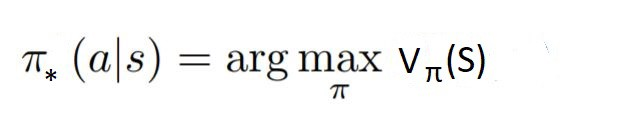

State value function

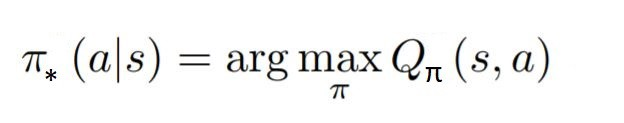

Action value function.

Okay! lets go way back, to find the **optimal policy** we need to have the **value function**, to calculate **value function** , we need to have **Gt(Total cumulative expected reward)**, to calculate the **Gt** we need to have **R ( rewards for every action) Rt+1,Rt+2,Rt+3+….**

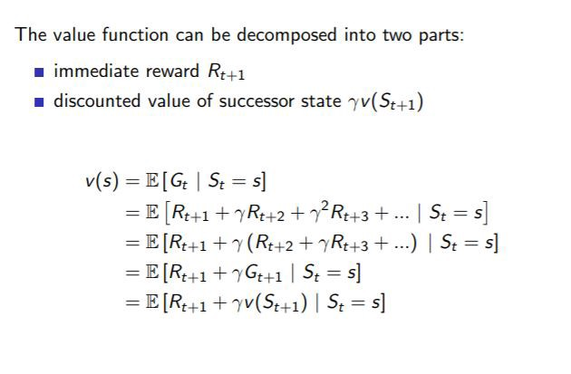

Value function = immediate reward + Value function of next state (ignore gamma)

This is called **Bellman equation**.

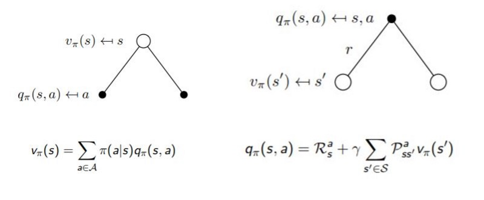
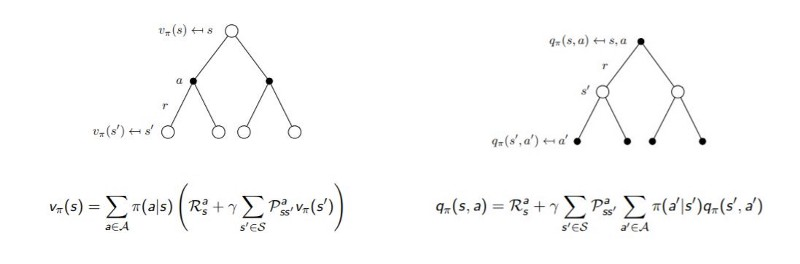

We got the value functions that’s cool. now what??

Our job is to find the optimal values for V and Q

The optimal state-value function v*(s) is the maximum value
function over all policies.

The optimal action-value function q*(s, a) is the maximum
action-value function over all policies

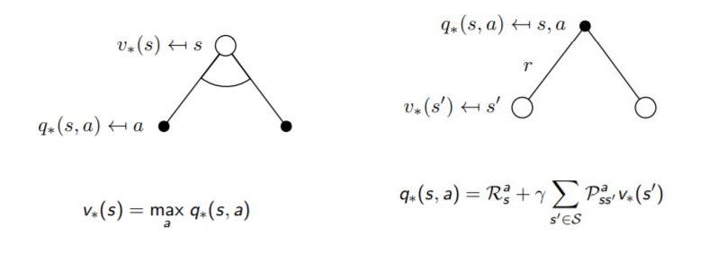
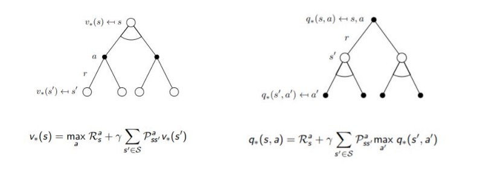

These equations are called **Bellman Optimality Equations.**

so now we can find the optimal policy as we have optimal value functions

There are few ways for this learning

1. Dynamic programming methods
2. Monte carlo learning method
3. Temporal-Difference learning

In this story I cover DP only which is a **Model based Algorithm**

## Model based Algorithms

If we remember we have transition probability **P** ( it tells us how likely to enter a specific state given current state and action)

this transition probability has to be given explicitly in Model based algorithms these work well for finite states and actions, however these are impractical as the state space and action space grows.

## Model free Algorithms

model-free algorithms rely on trial-and-error to update its knowledge. As a result, it does not require space to store all the combination of states and actions. **Q-Learning** is an example of model-free learning algorithm.

All the algorithms discussed in the next stories fall into this category.

### Dynamic programming

Our job is to find the optimal policy right!, one can try out all the policies and pick the best one #sounds simple right?? but

The no of possible policies is equal to the number of actions to the power of the number of states.

for many RL problems , the number states would be way more so it’s a problem. and this is one of main challenges in RL called

“**curse of dimensionality**” by bellman.

DP can be used to compute the value functions we can easily obtain optimal policies once we have found the optimal value functions, v∗ or q∗, which satisfy the Bellman optimality equations.

A efficient method is to incrementally find the value function for a specific policy and then use the policy which maximizes this value function for the next round. Called “Policy iteration”

### The policy iteration algorithm

This algorithm has 3 steps

1. Policy evaluation (based on policy π (initially random) ,calculate value function)
2. Policy improvement (improve the policy based on the value function)
3. Repeat 1 and 2 until π converges

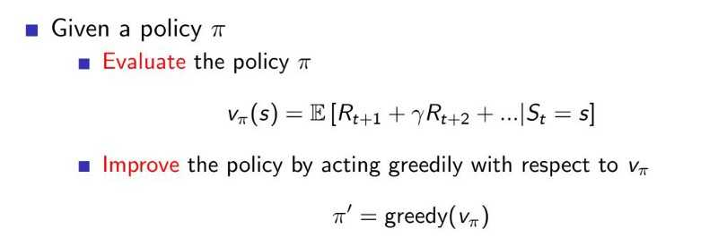

This process of policy iteration always converges to π∗

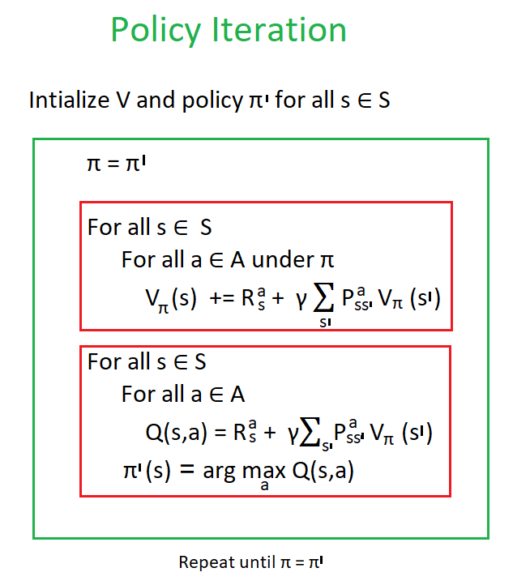

**Policy iteration = { Policy evaluation + Policy improvement }**

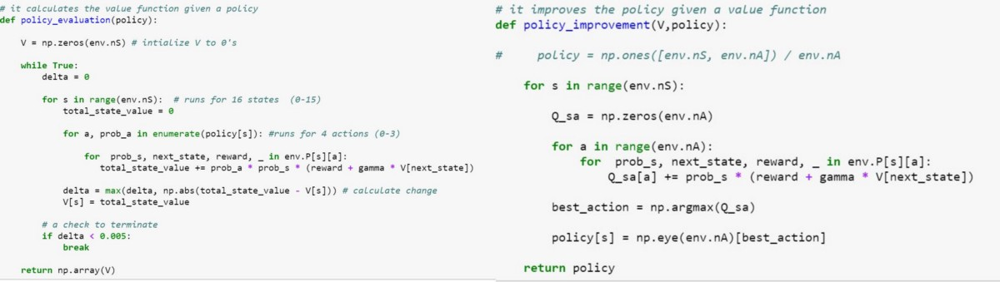

### The value iteration algorithm

This algorithm has two steps

1. it focuses on finding the optimal state value function, once the optimal state value function is found then
2. it extracts the optimal policy from it.

so how does it find the optimal value function??

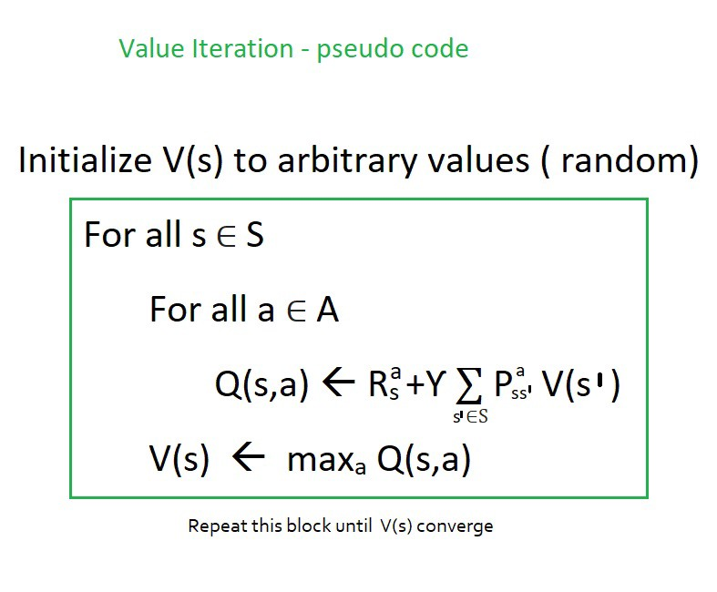

We can easily derive the optimal **policy** from the **optimal state value function**

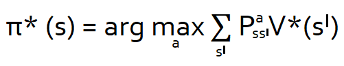

**Value iteration = optimal value function + policy extraction**

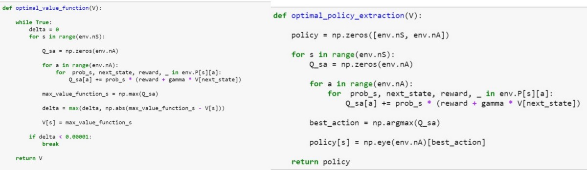
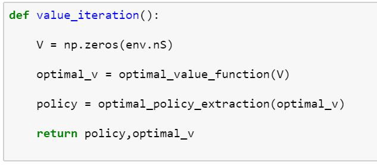