# Model Free Reinforcement Learning

## Prediction and Control

There are two types of tasks in RL

### 1. Prediction

This type of task predicts the expected total reward from any given state assuming the function **π(a|s)** is given.

( in other words) **Policy** π is given, it calculates the **Value function Vπ** with or without the model.

### 2. Control

This type of task finds the policy π(a|s) that maximizes the expected total reward from any given state.

(in other words) **Some Policy π** is given , it finds the **Optimal policy π*.**

Policy iteration is the combination of both to find the optimal policy.

Just like in supervised learning , we have regression and classification tasks, in reinforcement learning, we have prediction and control tasks.

## On policy and Off policy

There are two types of policy learning methods

### 1. On policy learning

It learns on the job. which means it evaluates or improves the policy that is used to make the decisions.

### 2. Off policy learning

It evaluates one policy ( target policy ) while following another policy ( behavior policy )

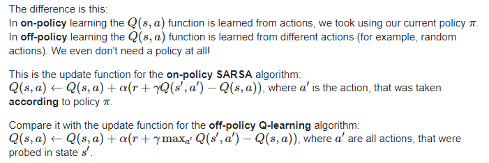

**target policy** may be deterministic ( ex: greedy ) while **behavior policy** is stochastic.


## 1. Episodic task

A task which can last a finite amount of time is called **Episodic task ( an episode )**

Ex : Playing a game of chess ( win or lose or draw )

we only get the reward at the end of the task or another option is to distribute the reward evenly across all actions taken in that episode.

Ex: you lost the queen (-10 points), you lost one of the rooks (-5 points) etc..

## 2. Continuous task

A task which never ends is called Continuous task

Ex: Trading in the cryptocurrency markets or learning Machine learning on internet.

in this, rewards may be given with discounting with a discount factor λ∈[0,1]

## Model Free Methods

In MDP , we are given all the components to solve a problem, but what if we are not given some of the components ???

what if we are not given the transition probabilities and rewards for a RL problem?? That means we are not given the dynamics of the environment.

can we solve the problem?? , if so How???

This type of learning is called model free learning

`In Model-free , we just focus on figuring out the value functions directly from the interactions with the environment`

All model free learning algorithms are gonna the learn value functions directly from the environment.

**How to figure out V for unknown MDP ( assume we get the policy)??**

There are few approaches for solving these kind of problems

1. **Monte carlo approach**
2. **Temporal-Difference approach**

## Monte carlo approach

Monte Carlo learning → it learns value functions directly from episodes of experience.

Monte Carlo learning → We only get the reward at the end of an episode

Episode = S1 A1 R1, S2 A2 R2, S3 A3 R3…… ST(Sequence of steps till the termination state)

we know the value function from the last story.

*v(s) = E [Gt | St = s] and Gt = Rt+1+ γRt+2+…*

we learn value functions from sample returns with the MDP

**what is a sample return??**

it’s like an average of bunch of numbers

{1,2,3,4} → 10/4 → 2.5

so sample return could mean average of returns(rewards) from episodes.

### Monte Carlo takes means of episodes. Period!

There are two different types in MC

`1. First visit MC`

in this, we average returns only for first time s is visited in an episode

`2. Every visit MC`

in this, we average returns for every time s is visited in an episode

let’s take a sample episode

S1 A1 R1, S2 A2 R3, S3 A3 R3, S1 A4 R4 →End

in first visit MC → we take the reward till R3

in every visit MC → we take the reward till the end of the episode

Usually the focus should be on first visit MC.

For **prediction tasks**, the algorithm for first visit MC is

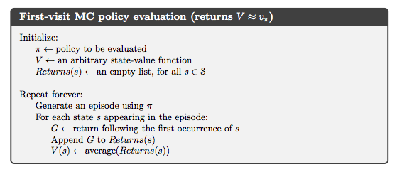

Let’s talk a bit about math proof of the equations

V(S) is the average of G

we know how to calculate the mean if we have all the values but what if we don’t have all the values ( we get values as episodes pass) ??? how to calculate the mean ???

there is an approach called **Incremental mean**

μk = the mean of K items.

For each episode

For each state St with return Gt

`N(St) ← N(St) + 1`

`V(St) ← V(St) + 1/N(St) (Gt − V(St))`

In non-stationary problems, it can be useful to track a running mean, i.e. forget old episodes.

`V(St) ← V(St) + α (Gt − V(St))`

To understand the algorithm very clearly let’s just code in python so you can see step by step how we calculate the value functions

Note: The problem I took to write the code is “Blackjack card game”, I hope/assume you know the game otherwise just get to know on google it’s an easy game to understand.

As the algorithm above says, first we focus on generating episodes using the policy then we take the average of episodes. We repeat this forever or a fixed no of times.

The following snippet generates an episode something like this

[ (S1,A1,R1), (S2,A2,R2), (S3,A3,R3), so on.. ]

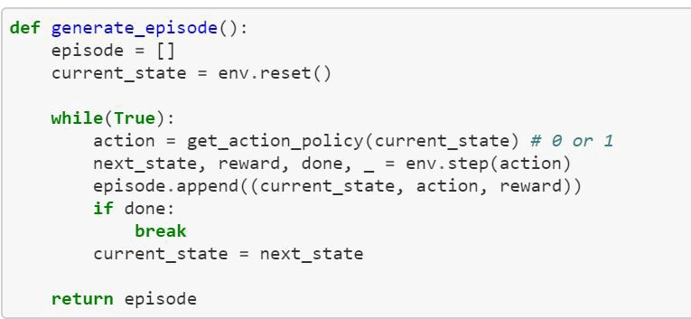

using the policy

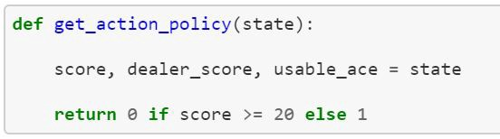

the main loop

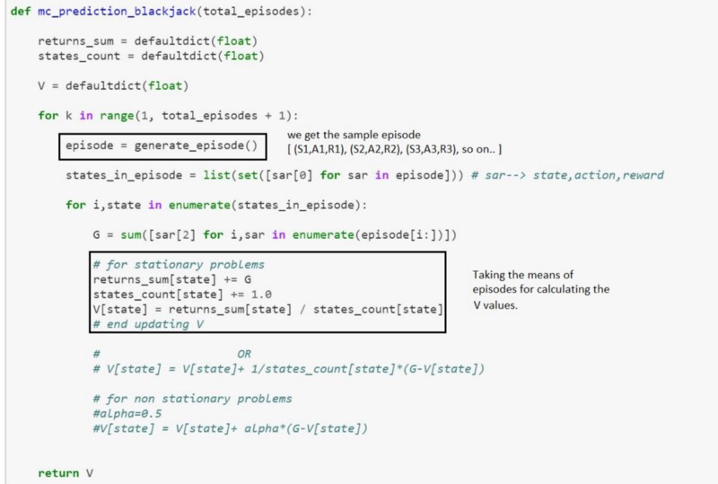

Okay so far we talked about the Monte Carlo method for prediction, let’s just talk about the Monte Carlo method for **Control tasks**.

Policy iteration( we discussed in the last story ) is used for the control tasks

it has policy evaluation and policy improvement.

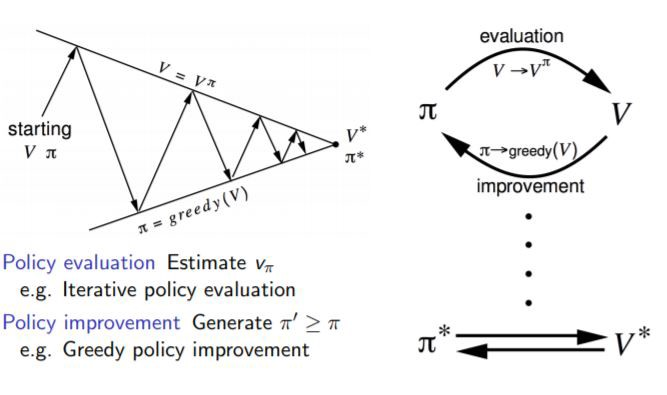

in DP we have the Transition probability P so we can improve the policy by acting greedily ( Taking the best action at every state)

We can do the same thing here as well, we can calculate the Q values taking the means of episodes ( just like we did for V)

For each state St and action At with return Gt

`N(St,At) ← N(St,At) + 1`

`Q(St,At) ← Q(St,At) + 1/N(St,At) (Gt − Q(St,At))`

In non-stationary problems, it can be useful to track a running mean, i.e. forget old episodes.

`Q(St,At) ← Q(St,At) + α (Gt − Q(St,At))`

Q(S,A) ← Expected return when starting state S, taking the action A, thereafter following policy π.

First-visit-MC for Q(S,A) →A state action pair is said to be visited in an episode if S is visited and A is taken in that episode.

if we do the same thing here, then we may get the exploration problem.

### Exploration/Exploitation trade off

This is really an important concept not just in RL but in our real life too.

in model free RL, we need to interact with the environment to find out the best strategy so we need to explore the entire the state space while figuring out best actions.

**Exploration** : is about finding more information about the environment. (in other words) exploring a lot of states and actions in the environment.

**Exploitation** : is about exploiting the known information to maximize the reward.

in our real life

it is like you go to a restaurant, ordering the item/dish you like is **exploitation** and ordering something you have never/limited tried is **exploration**.

Exploration is really required in RL problem solving

a simple example is

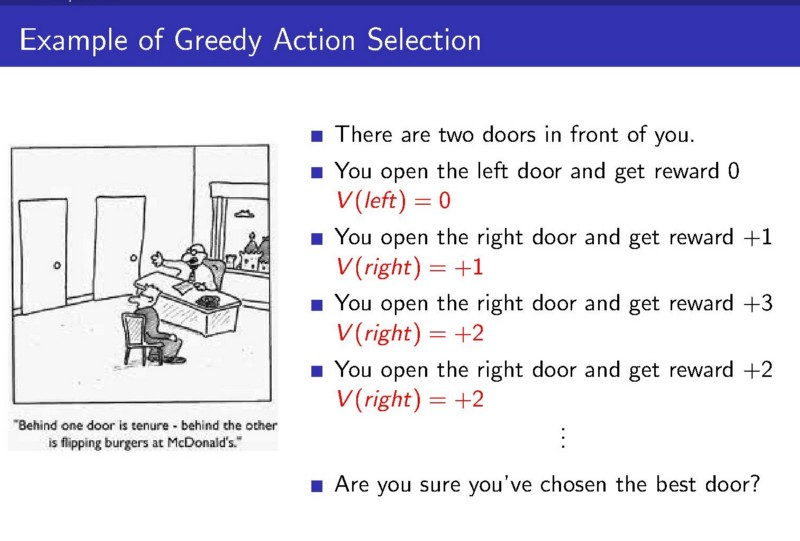

if we act greedily we end up choosing one action forever **#that’s a problem.**

if we can’t explore, we may not be able to discover bigger and better rewards

Due to exploration problem we don’t act greedily in MC to improve the policy , instead , we use the epsilon-greedy policy.

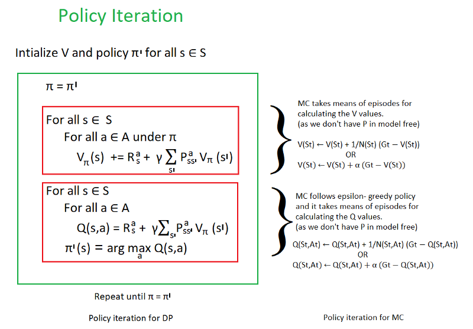

This is a comparison between from the last story policy iteration in DP and policy iteration in MC with epsilon greedy policy.

### Epsilon greedy policy

the best known action based on our experience is selected with (1-epsilon) probability and the rest of time i.e. with epsilon probability any action is selected randomly.

initially epsilon is 1 so we can explore more but as we do many iterations we slowly decrease the epsilon to 0 ( which is exploitation → choosing the best known action)

epsilon is between 0 and 1

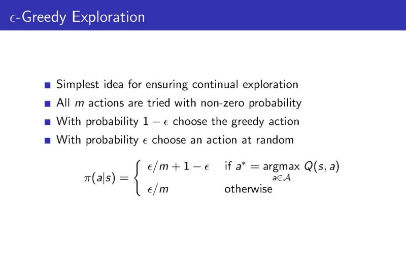

so the pseudo code for first-visit-MC-Control is

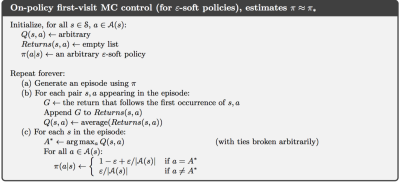

in this algorithm we are not only calculating the Q value but also improving the policy using the updated Q value.

Here is the coding part to make more sense

I took the same problem Blackjack but here we improve the policy by calculating the Q values

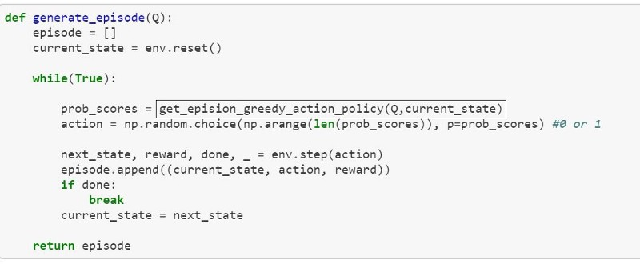

This generates the episode by following the epsilon greedy policy

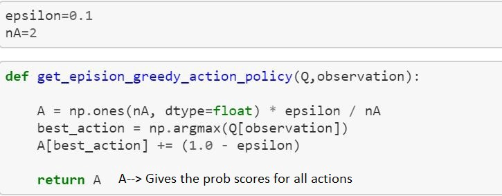

Here is the main loop

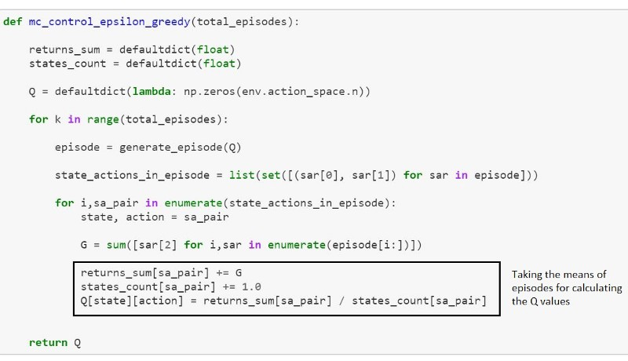

## Temporal-Difference approach

Temporal difference is the combination of **Monte Carlo** and **Dynamic Programming**

Just like Monte Carlo → TD methods learn directly from episodes of experience and model free.

Just like Dynamic Programming → TD methods boot strap , meaning it will not wait until the end of the episode to update the expected future reward estimation(V) , it will only wait until the next time step to update the value estimates.

for example

in MC

`V(s) = E [Gt | St = s] and Gt = Rt+1+ γRt+2+…`

in TD & DP

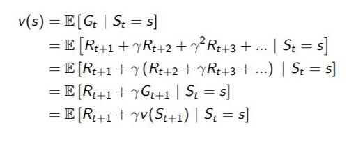

These use the bellman equation to update the estimates.

And the update of V for all three methods is like this

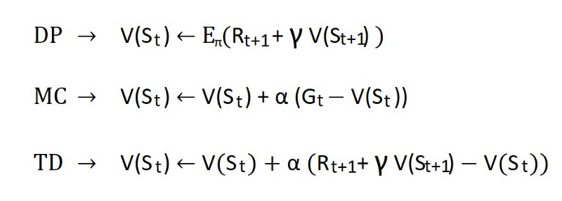

`Gt → Monte Carlo Target`

`Rt+1 + γ V(St+1) → TD target`

`Rt+1 + γ V(St+1) — V(St) → TD error`

in TD, at every time step t they immediately form a **TD target** using the observed reward Rt+1 and the current estimate V(St+1).

The simplest TD method, known as TD(0)

`V (St) ← V (St) + α (Rt+1 + γV (St+1) − V (St))`

similarly we can calculate more than one time steps TD(2) ,TD(3) so on..

here are the backup diagrams for all three methods

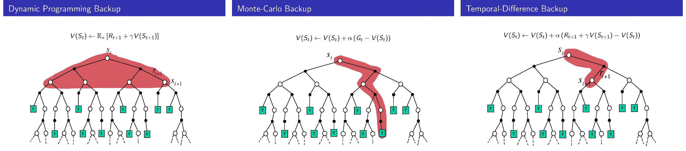

Okay I hope you get some idea about TD. Let’s just talk TD-Prediction and Control.

**TD- Prediction** is very straightforward! Here is the pseudo code

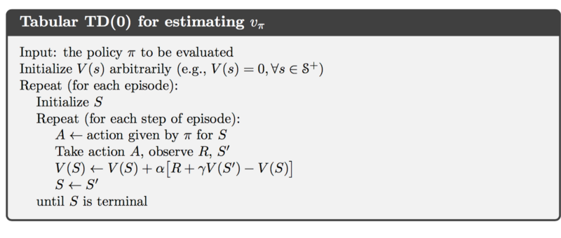

I took the same “blackjack” problem here is the python script

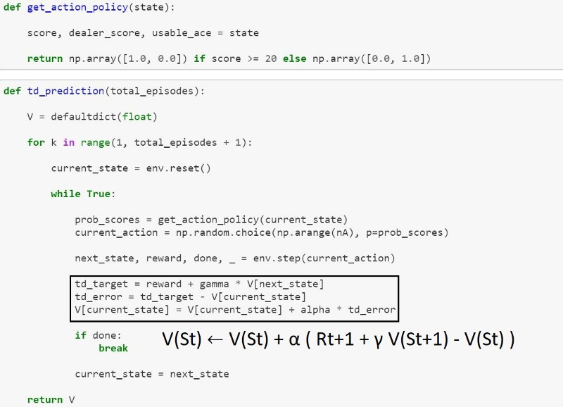

now let’s focus on **TD- Control**

Just like in Monte Carlo , we use policy iteration for TD Control

The first step is to learn an action-value function rather than a state-value function.

There are two algorithms in TD control

### 1. SARSA ( state-action-reward-state-action)


→The agent starts in S1, performs A1, and gets R1, and goes to S2

→Now the agent chooses another action A2 from S2

→Then updates the value of A1 performed in S1.

That gives the above equation.

S → current state, A → current action, R → current reward

S' → next state, A' → next action

Here TD- target is

`R + γ Q(S', A')`

TD-error is

`R + γ Q(S', A')- Q(S, A)`

if the next state S' is a terminal state then Q(S',: ) =0

Here is the pseudo code

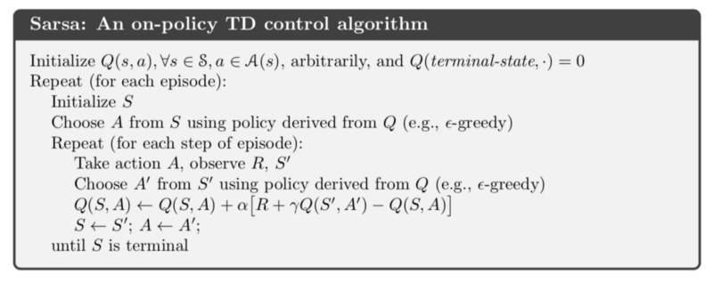

Here is the python script for SARSA

I took another environment “Windy grid world”

### Example: Windy Gridworld

The figure below is a standard grid-world, with start and goal states, but with one difference: there is a crosswind upward through the middle of the grid. The actions are the standard four — up, down,right, and left — but in the middle region the resultant next states are shifted upward by a “wind,” the strength of which varies from column to column. The strength of the wind is given below each column, in number of cells shifted upward. For example, if you are one cell to the right of the goal, then the action left takes you to the cell just above the goal. Let us treat this as an undiscounted episodic task, with constant rewards of −1 until the goal state is reached.

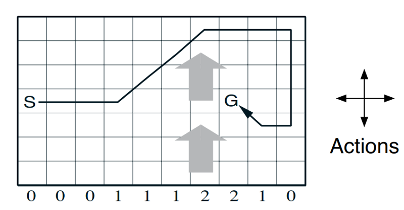

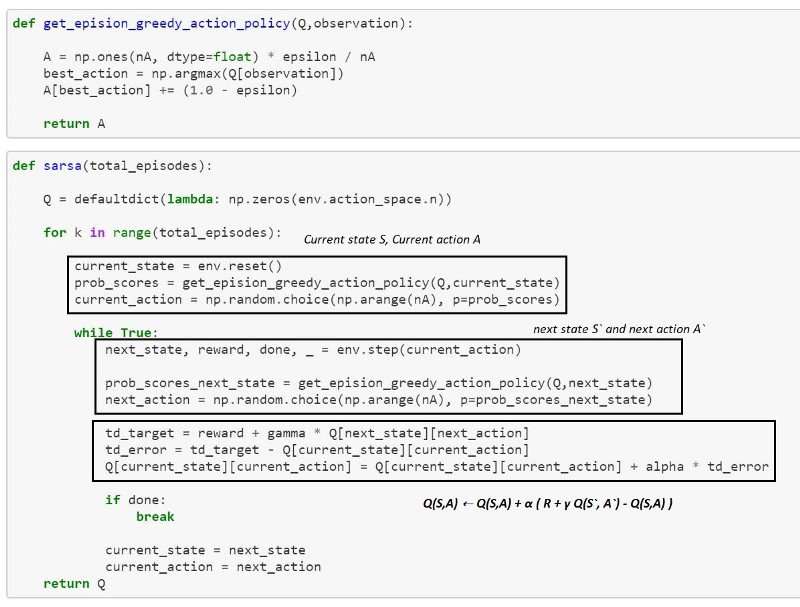

### 2. Q-learning

One of the most important breakthroughs in reinforcement learning was the development of an **off-policy TD control** algorithm known as Q-learning

Q-learning estimates a state-action value function for a **target policy** that deterministically selects the action of highest value

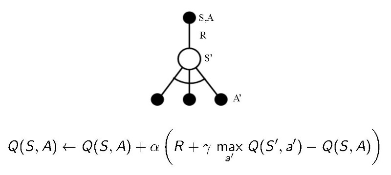

→ The agent starts in S1,performs A1, gets R1 and goes to S2 (same as sarsa)

→ Now the agent looks for the maximum possible reward for an action in S2

→Then updates the value of A1 performed in S1 (same as sarsa)

That gives the above equation

S → current state, A → current action, R → current reward

S' → next state, A' → next **best action**

Here TD- target is

`R + γ max A' Q(S', A')`

TD-error is

`R + γ max A' Q(S', A')- Q(S, A)`

if the next state S` is a terminal state then Q(S`,: ) =0

Here is the pseudo code

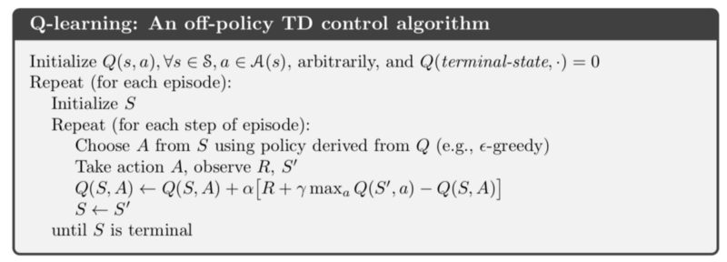

Here is the python script for Q learning

I took another environment “ Cliff Walking” you can learn more about it online or in sutton’s book .

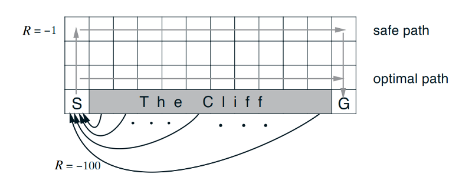

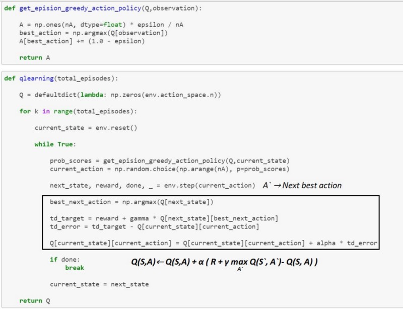

```
SARSA
→ On policy learning method , means it uses the same policy to choose the next action A`

Q-Learning
→ Off policy learning method , means, it uses the target policy (greedy) to choose the best next action A` while following the behavior policy (epsilon-greedy)
```

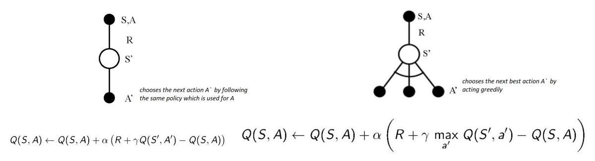

## Difference b/w MC and TD

Monte-Carlo

→ it only works for episodic tasks

→ it can only learn from complete sequences

→it has to wait until the end of the episode to get the reward

TD

→ it only for both episodic and continuous tasks

→it can learn from incomplete sequences

→ it will only wait until the next time step to update the value estimates.

## Summary

→ We use model free algorithms when Transition probability P (dynamics of the system)is not given in MDP.

→ Monte Carlo takes the means of episodes to calculate the V and Q values for both prediction and control tasks.

→ TD combines the features of both DP and MC by learning through interacting with the environment with bootstrapping.

→ We use epsilon greedy policy to avoid the exploration problem in the env.

→ Sarsa updates the Q value by choosing the current action and next action using the same policy, making it an on policy method.

→ Q-learning updates Q values by acting greedily on the environment while following another policy, making it an off policy method.