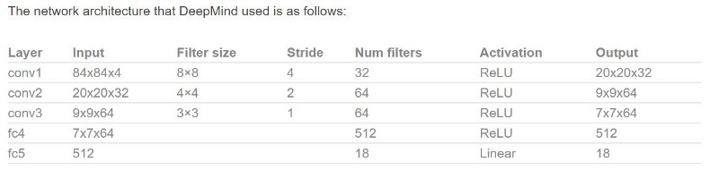
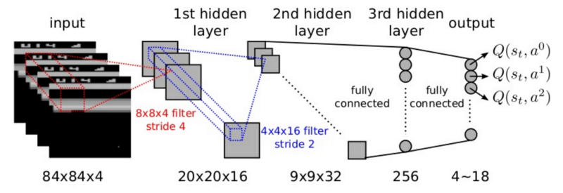
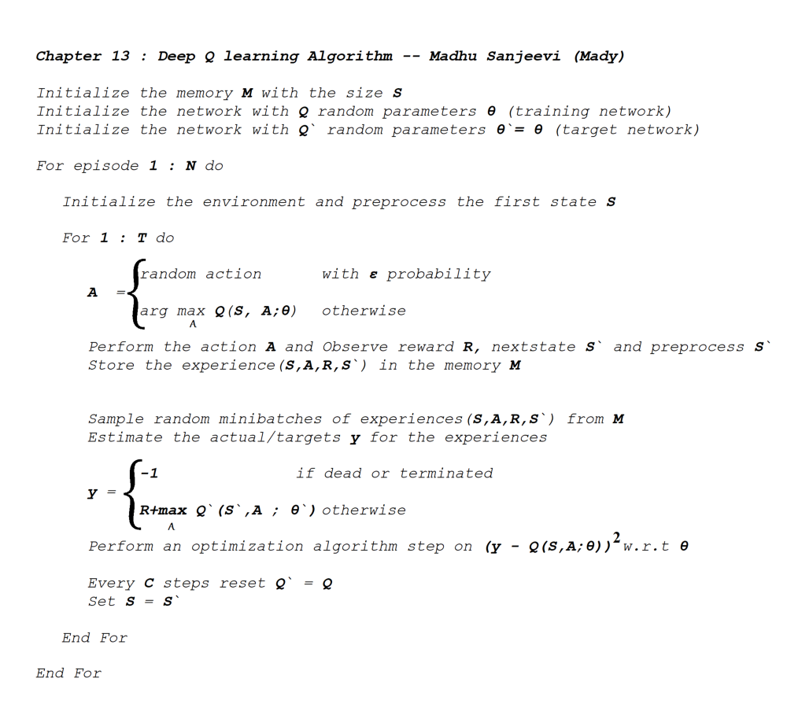
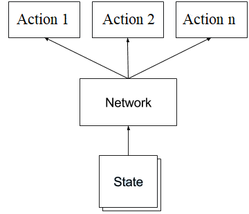
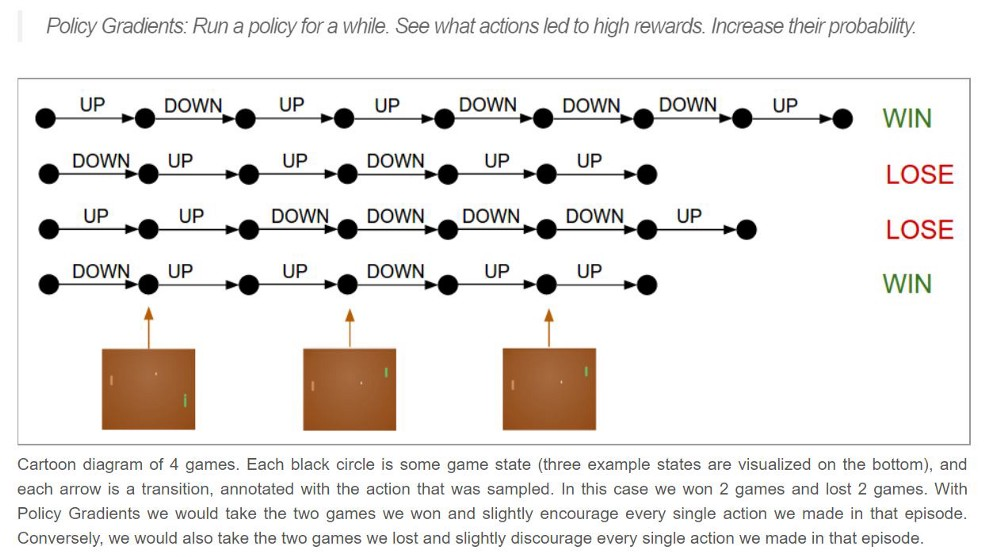
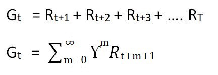
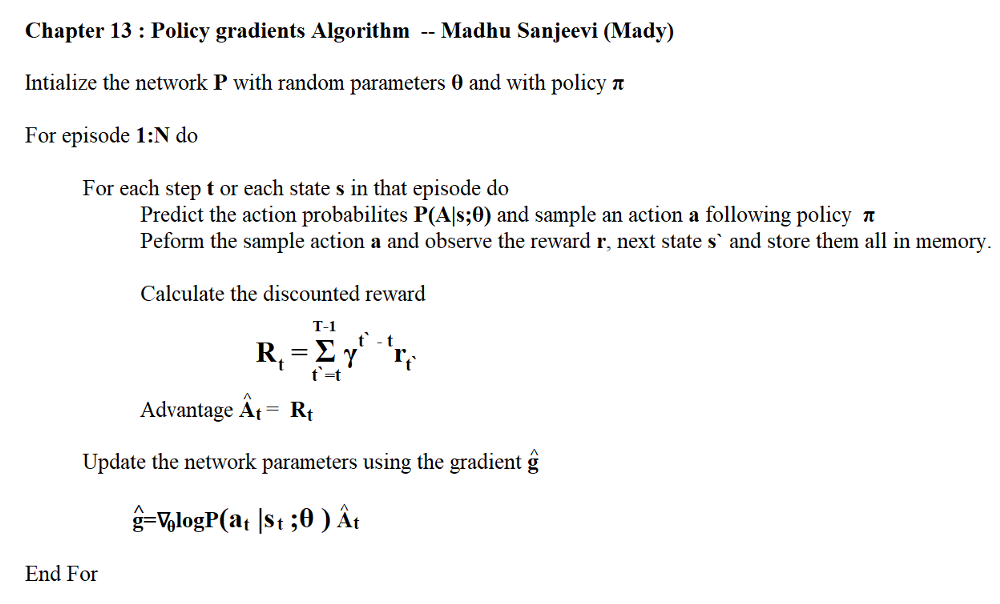

# Deep Reinforcement Learning

## Deep Q Learning

This is how neural network Q function works

The network takes a state(‘s) as the input and produces the Q-values for every action in the action space ( no of actions depends on the game/environment).

The neural network job is to learn the parameters so assume that the training is done and we got the final network ready so..

at the time of prediction, we use this trained network to predict the next best action to take in the environment so we give a input state and the network gives the Q values for all actions then we take the max Q-value to take the corresponding action in the environment.

`best_action = arg max(NN predicted Q-values )`

Which means → for this state , this is the **best action** to take in the env.

Simple right!

**Now lets talk about the training part**

This is a regression problem so we use any regression loss function to minimize the total error of the training data.

neural network loss function for predicting the Q values

`l2_loss = (predicted — actual ) **2`

assume the “**predicted**” gives the list of action values from the neural network where we take the maximum value(maximum reward).

Since we don’t know the “**actual**” as it’s a reinforcement learning ( not supervised so no labels) so we have to estimate the “actual” value

`actual= R + γ max A' Q(S', A')`

R → the current immediate reward

S' → Next state

max A' Q(S', A') → max( NN output list of Q-values)

γ → the discount factor γ → {0,1}

The reason for this is

*if you take that particular action you will know the reward R and predict the next max reward with some discount.*

*assume the next max reward predicted by the model is completely wrong because the model just started training but we still have the R reward that is 100% right so slowly we adjust network parameters to predict the reasonable predictions.*

In a sense it predicts it’s own actual value but since **R** is not biased ( when we step into the environment we observe the reward which is fully right ), the network is gonna update it’s gradients using **backprop** to converge.

so we got the inputs , labels , rewards and loss function, we can build a neural network which predicts the Q values for every action value.

which means → for this state , these are the **actual values** for all actions.

“Since we don’t have labels, we said actual= R + γ max A' Q(S', A')

but how do we get the values for R and max A' Q(S', A') from the environment for a particular state???? ”

Usually we get the reward R and Next state S' when we perform an action in the env only.

There are few tricks that I have to explain to make you understand it well,for the time being just assume that we know the action and reward R (we ll see more about it down below).

Anyway, that’s how it works , we got labels ,rewards ,losses and parameters so we can do the network training and that acts as a function approximation to estimate the Q values.

In simple terms

- Take the image, turn it to a gray scale image and crop the necessary image part.
- Apply some convolution filters and full connected layers with the output layers.
- Give that image ( we call “state”) , calculate the qvalues , find the error and backpropagate.
- Repeat this process as long as you want.

## Deep Q learning Tricks

### 1. Skipping frames

In just one frame we can’t observe the motion of the picture ex: we cant tell in a picture whether the ball is moving up or down by just seeing one frame so we use this trick called Skipping frames which skips every 4 frames to take an action.

### 2. Experience replay

earlier in this story I asked a question, how do we get the values for R and max A' Q(S', A') from the environment for a particular state???

the answer is we can take random actions to collect the data and learn from it. but the environment is a continuous state space so there is so much correlation between one frame and the subsequent frame so the network is gonna forget what it has seen long ago which makes the network very biased and bad. so…

we store every experience(current state, current action, reward, next state ) in the memory then we take a sample of batches from the memory.

in this way, we can make training better and learning is reasonable.

### 3. Fixed Target network

since we don’t have labels , we make this equation to get the labels for the training.

`actual = R + γ max A' Q(S', A')`

and max A' Q(S', A') → is the NN output list of Q-values.

here we maintain another network we call **the target network**, and we assign the actual network weights to the target network for every N = no of frames /iterations.

so now **max A' Q(S', A')** → is the target network output list of Q-values.

### 4. Reward Clipping

every game / environment has it’s own reward system, some games it might have points like 100,200,300 and so on some games might have 1,2,3 and so on. So to normalize the reward and penalty uniformly across all settings of environment, reward clipping is used.

so here is the final algorithm

## Policy Gradients

In Q learning, for a given state we calculate the Q value for every action in the action space and we pick the max value and it’s corresponding action ( so choosing actions depends on the Q value )

This method is called a **Value-based** method . and there is another method called a **Policy based** method.

There are couple of advantages using the policy gradient methods

1. It can learn the stochastic policy ( outputs the probabilities for every action ) which is useful for handling the exploration/exploitation trade off.

2. Often π is simpler than V or Q.

### How does policy gradient work?

as we know in policy gradients , we directly learn the policy function π which gives the probability distribution of actions.

**π (A|S)** → Probability of taking action A given state S.

we use function approximation ( ex: neural net) to find this policy function π

**π (A|S;θ)** → Probability of taking action A given state S with parameters θ.

The diagram is similar to DQN but this is a classification problem while DQN is a regression problem.

The network takes state as an input and produces the probability distribution of actions.

**The process in simple terms** → *we give a state ,get the action probs, take the action given by pi in the env, observe next state & reward, repeat it till the end of the game and if end, update the parameters in the network based on the rewards we collected (backprop).*

### let’s talk about the cost function

DQN is a regression problem so we have used L2 loss function as cost function and we minimize that loss during the training. but PG is a classification problem so we use log likelihood or cross entropy.

since we don’t have labels ( for a given state this is the best action ) , we have to create “fake labels” to continue with training.

**How to make the fake labels?**

we just sample the actions that need to be performed in the environment, we just label those actions as fake labels we happened to sample for given states.

`Σlogp(yt | xt ; ϴ)`

xt and yt are training examples and labels respectively.

Our goal now is → to increase the log probability for actions at the last layer.

*Policy gradients are similar to supervised learning except a change in the loss function.*

The fake labels can’t be real so we focus on the outcome ( in case of a game we focus on the final reward) to improve the fake labels to get close to the actual labels ( if we were to say).

let’s take an example of the pong game ( there is an excellent explanation by andrej karpathy on this [here](http://karpathy.github.io/2016/05/31/rl/). make sure to check it)

**Process**

1. we take a policy and roll out an episode ( a game)

There are n no of frames per second and each frame is considered as a state

2. for every state we sample an action(fake label), perform it in the environment and observe the reward & next state

3. if end, if the reward is positive( it tells us the actions we took in the episode are good) so we push up the probabilities for all the actions taken in that episode , if the reward is negative( the actions we took in that episode are kinda bad) so we push down the probabilities for all the actions taken in that episode.

so our final loss function should look like this

`Σlogp(yt | xt ; ϴ) * At`

`At = Rt ( reward at time step t)`

our goal now is → to increase the log probability for actions that worked and decrease it for those that didn’t with an advantage A .

We can use the reward as the advantage , cause if we get the positive reward we push up the probabilities, if we get the negative reward we push down the probabilities.

but there is a problem here

lets say we lost the game and we get the negative reward so we are about to push down the probabilities for all actions that we took in that episode, some actions may be super good in that episode but at the end we got negative reward so we blame that action also which is bad.

blaming all the actions equally is not a good idea, so we slightly modify the actual reward.

at each time step/state we get the reward so we use discounted reward ( remember from last stories??) with a little change in notation .

Gt is the total reward, γ being the discount factor.

### let’s talk about the training!

so we got our labels, loss function, discounted rewards and gradients

1. Setup the network architecture ( based on the game/environment).
2. Run a policy π (A|S;θ) to predict the actions (it includes net output and action picking choice).
3. Take those actions ,observe the reward and next state , calculate the loss and gradient and store them all in memory till the end of the episode.
4. At the end, calculated the discounted reward and calculate the gradient w . r. t θ and update the network weights using any optimization algorithm.
5. Repeat 2–4 as long as you want.

The policy gradients algorithm is

