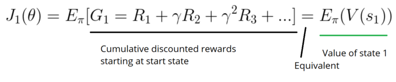
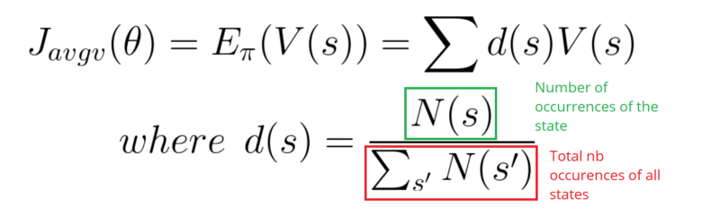
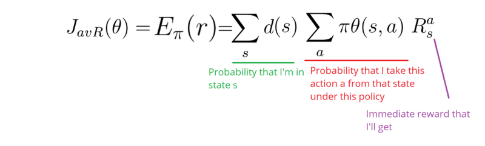
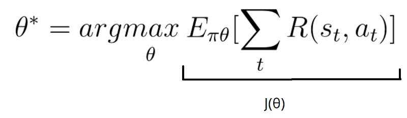
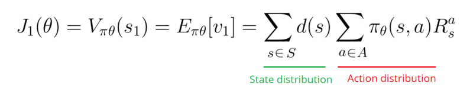
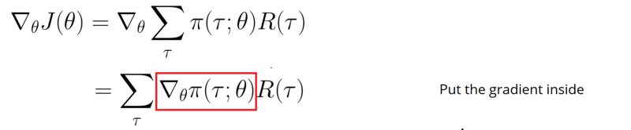
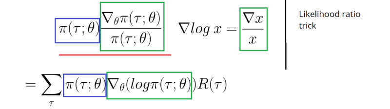
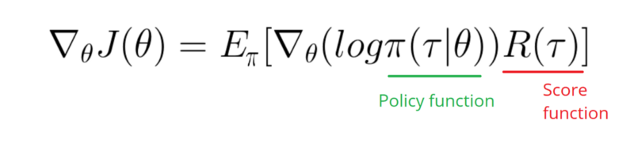
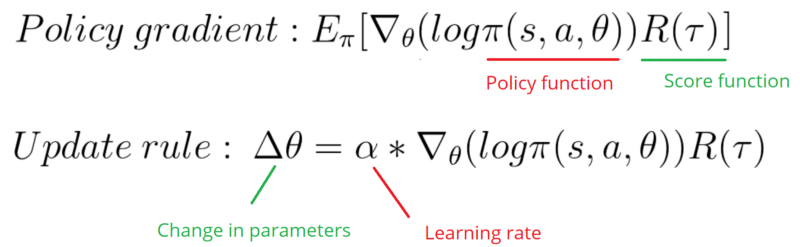

# Policy Gradients

## Policy Search

We have our policy π that has a parameter θ. This π outputs a probability distribution of actions.

Awesome! But how do we know if our policy is good?

Remember that policy can be seen as an optimization problem. We must find the best parameters (θ) to maximize a score function, J(θ).

There are two steps:

- Measure the quality of a π (policy) with a policy score function J(θ)
- Use policy gradient ascent to find the best parameter θ that improves our π.

The main idea here is that J(θ) will tell us how good our π is. Policy gradient ascent will help us to find the best policy parameters to maximize the sample of good actions.

## First Step: the Policy Score function J(θ)

To measure how good our policy is, we use a function called the objective function (or Policy Score Function) that calculates the expected reward of policy.

Three methods work equally well for optimizing policies. The choice depends only on the environment and the objectives you have.

First, in an episodic environment, we can use the start value. Calculate the mean of the return from the first time step (G1). This is the cumulative discounted reward for the entire episode.

In a continuous environment, we can use the average value, because we can’t rely on a specific start state.

Each state value is now weighted (because some happen more than others) by the probability of the occurrence of the respected state.

Third, we can use the average reward per time step. The idea here is that we want to get the most reward per time step.

## Second step: Policy gradient ascent

Why gradient ascent and not gradient descent? Because we use gradient descent when we have an error function that we want to minimize.

But, the score function is not an error function! It’s a score function, and because we want to maximize the score, we need gradient ascent.

The idea is to find the gradient to the current policy π that updates the parameters in the direction of the greatest increase, and iterate.

Okay, now let’s implement that mathematically. This part is a bit hard, but it’s fundamental to understand how we arrive at our gradient formula.

We want to find the best parameters θ*, that maximize the score:

Our score function can be defined as:

Which is the total summation of expected reward given policy.

Now, because we want to do gradient ascent, we need to differentiate our score function J(θ).

Our score function J(θ) can be also defined as:

As a consequence, we face a problem: how do we estimate the ∇ (gradient) with respect to policy θ, when the gradient depends on the unknown effect of policy changes on the state distribution?

The solution will be to use the Policy Gradient Theorem. This provides an analytic expression for the gradient ∇ of J(θ) (performance) with respect to policy θ that does not involve the differentiation of the state distribution.

So let’s calculate:

Remember, we’re in a situation of stochastic policy. This means that our policy outputs a probability distribution π(τ ; θ). It outputs the probability of taking these series of steps (s0, a0, r0…), given our current parameters θ.

But, differentiating a probability function is hard, unless we can transform it into a logarithm. This makes it much simpler to differentiate.

Here we’ll use the likelihood ratio trick that replaces the resulting fraction into log probability.

Now let’s convert the summation back to an expectation:

As you can see, we only need to compute the derivative of the log policy function.

Now that we’ve done that, and it was a lot, we can conclude about policy gradients:

This Policy gradient is telling us how we should shift the policy distribution through changing parameters θ if we want to achieve an higher score.

R(tau) is like a scalar value score:

- If R(tau) is high, it means that on average we took actions that lead to high rewards. We want to push the probabilities of the actions seen (increase the probability of taking these actions).
- On the other hand, if R(tau) is low, we want to push down the probabilities of the actions seen.

This policy gradient causes the parameters to move most in the direction that favors actions that has the highest return.

## Monte Carlo Policy Gradients

We use Monte Carlo because our tasks can be divided into episodes.

`Initialize θ: For each episode τ = S0, A0, R1, S1, …, ST:    for t = 1 to T-1:        Δθ = α ∇theta(log π(St, At, θ)) Gt        θ = θ + Δθ`

`For each episode:    At each time step within that episode:         Compute the log probabilities produced by our policy function. Multiply it by the score function.         Update the weights`

But we face a problem with this algorithm. Because we only calculate R at the end of the episode, we average all actions. Even if some of the actions taken were very bad, if our score is quite high, we will average all the actions as good.

So to have a correct policy, we need a lot of samples… which results in slow learning.
