# An intro to Advantage Actor Critic methods

We’ve studied two different reinforcement learning methods:

- Value based methods (Q-learning, Deep Q-learning): where we learn a value function that will map each state action pair to a value. Thanks to these methods, we find the best action to take for each state — the action with the biggest value. This works well when you have a finite set of actions.
- Policy based methods (REINFORCE with Policy Gradients): where we directly optimize the policy without using a value function. This is useful when the action space is continuous or stochastic. The main problem is finding a good score function to compute how good a policy is. We use total rewards of the episode.

But both of these methods have big drawbacks. That’s why, today, we’ll study a new type of Reinforcement Learning method which we can call a “hybrid method”: Actor Critic. We’ll using two neural networks:

- a Critic that measures how good the action taken is (value-based)
- an Actor that controls how our agent behaves (policy-based)

Mastering this architecture is essential to understanding state of the art algorithms such as Proximal Policy Optimization (aka PPO). PPO is based on Advantage Actor Critic.

## The problem with Policy Gradients

The Policy Gradient method has a big problem. We are in a situation of Monte Carlo, waiting until the end of episode to calculate the reward. We may conclude that if we have a high reward **R(t)**, all actions that we took were good, even if some were really bad.

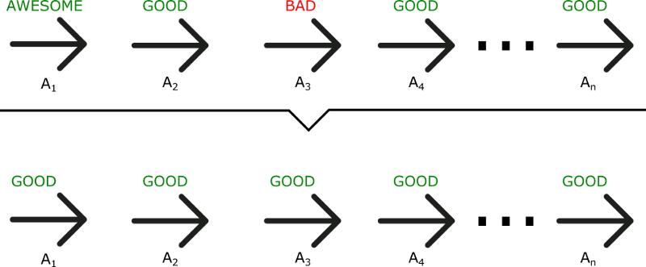

As we can see in this example, even if A3 was a bad action (led to negative rewards), **all the actions will be averaged as good because the total reward was important.**

As a consequence, to have an optimal policy, we need a lot of samples. This produces slow learning, because it takes a lot of time to converge.

**What if, instead, we can do an update at each time step?**

## Introducing Actor Critic

The Actor Critic model is a better score function. Instead of waiting until the end of the episode as we do in Monte Carlo REINFORCE, **we make an update at each step (TD Learning).**

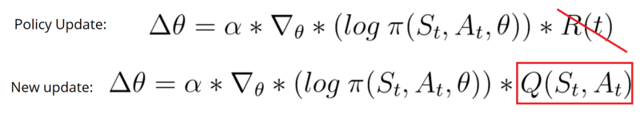

Because we do an update at each time step, we can’t use the total rewards R(t). Instead, we need to train a Critic model **that approximates the value function** (remember that value function calculates what is the maximum expected future reward given a state and an action). This value function replaces the reward function in policy gradient that calculates the rewards only at the end of the episode.

## How Actor Critic works

Imagine you play a video game with a friend that provides you some feedback. You’re the Actor and your friend is the Critic.

At the beginning, you don’t know how to play, so you try some action randomly. The Critic observes your action and provides feedback.

Learning from this feedback, **you’ll update your policy and be better at playing that game.**

On the other hand, your friend (Critic) will also update their own way to provide feedback so it can be better next time.

As we can see, the idea of Actor Critic is to have two neural networks. We estimate both:

- **ACTOR** : A policy function, controls how our agent acts.

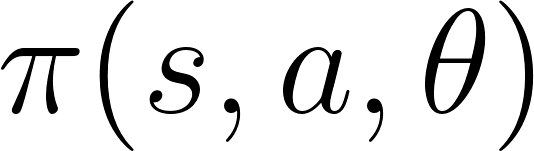

- **CRITIC** : A value function, measures how good these actions are.

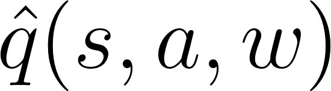

Both run in parallel.

Because we have two models (Actor and Critic) that must be trained, it means that we have two set of weights (𝜃 for our action and w for our Critic) **that must be optimized separately:**

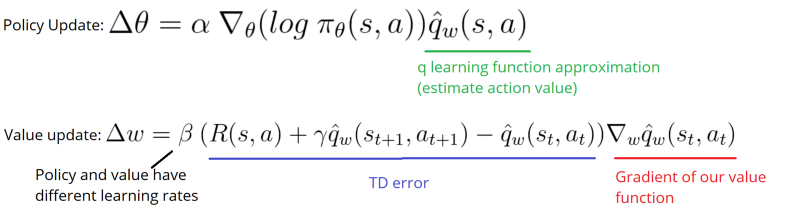

## The Actor Critic Process

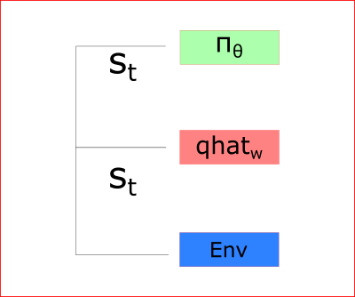

At each time-step t, we take the current state (St) from the environment and pass it as an input through our Actor and our Critic.

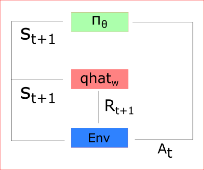

Our Policy takes the state, outputs an action (At), and receives a new state (St+1) and a reward (Rt+1).

Thanks to that:

- the Critic computes the value of taking that action at that state
- the Actor updates its policy parameters (weights) using this q value

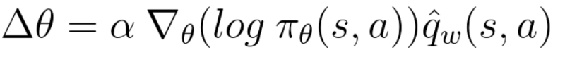

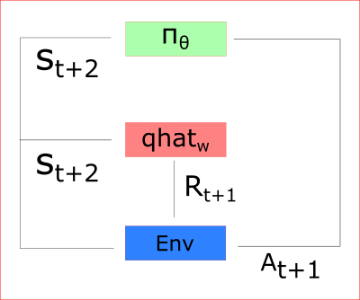

Thanks to its updated parameters, the Actor produces the next action to take at At+1 given the new state St+1. The Critic then updates its value parameters:

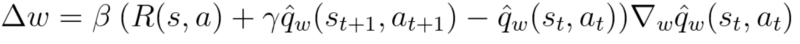

## A2C and A3C
### Introducing the Advantage function to stabilize learning

As we saw in the article about improvements in Deep Q Learning, value-based methods have high variability.

To reduce this problem, we spoke about using the advantage function instead of the value function.

The advantage function is defined like this:

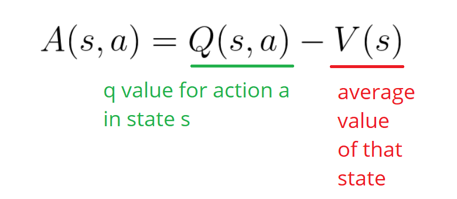

This function will tell us **the improvement compared to the average the action taken at that state is**. In other words, this function calculates the extra reward I get if I take this action. The extra reward is that beyond the expected value of that state.

- If A(s,a) > 0: our gradient is pushed in that direction.

- If A(s,a) < 0 (our action does worse than the average value of that state) our gradient is pushed in the opposite direction.

The problem of implementing this advantage function is that is requires two value functions — Q(s,a) and V(s). Fortunately, **we can use the TD error as a good estimator of the advantage function.**

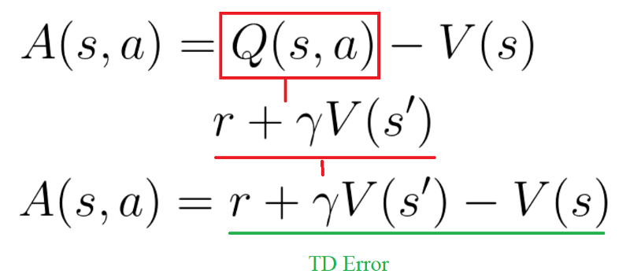

